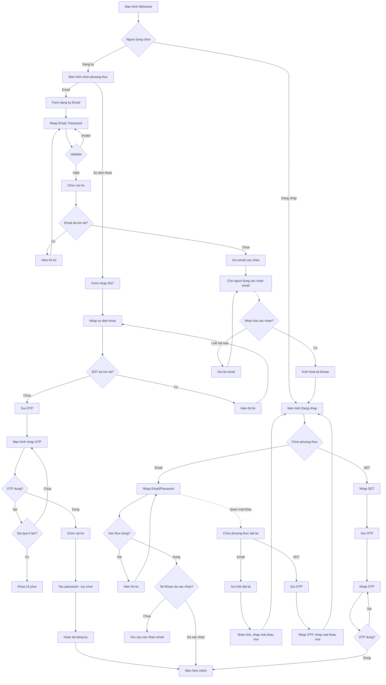

# F01: Dang ky va Xac thuc Nguoi dung

## Mo ta Tong quan

Tinh nang nay cho phep nguoi dung moi dang ky tai khoan va nguoi dung cu dang nhap vao ung dung. He thong ho tro 2 phuong thuc xac thuc: Email/Password va OTP qua so dien thoai. Khi dang ky, nguoi dung phai chon 1 trong 3 vai tro: Chu san, Nguoi choi, hoac Huan luyen vien (HLV). Vai tro nay khong the thay doi sau khi dang ky.

## Actors (Nguoi tham gia)

- **Nguoi dung moi**: Nguoi chua co tai khoan, muon dang ky
- **Nguoi dung cu**: Nguoi da co tai khoan, muon dang nhap
- **He thong**: Xu ly xac thuc, gui OTP/email

---

## LUONG 1: DANG KY BANG EMAIL/PASSWORD

### Luong Chinh (Happy Path)

#### Buoc 1: Mo man hinh Dang ky
- **Actor**: Nguoi dung moi
- **Action**: Tu man hinh Welcome, nhan nut "Dang ky"
- **System Response**: Hien thi man hinh chon phuong thuc dang ky (Email hoac So dien thoai)
- **Result**: Man hinh chon phuong thuc hien thi

#### Buoc 2: Chon phuong thuc Email
- **Actor**: Nguoi dung moi
- **Action**: Nhan chon "Dang ky bang Email"
- **System Response**: Hien thi form dang ky Email voi cac truong: Email, Mat khau, Xac nhan mat khau
- **Result**: Form dang ky Email hien thi

#### Buoc 3: Nhap thong tin dang ky
- **Actor**: Nguoi dung moi
- **Action**: Nhap Email, Mat khau, Xac nhan mat khau
- **System Response**: Validate realtime:
  - Email dung dinh dang
  - Mat khau >= 8 ky tu, co chu va so
  - Xac nhan mat khau khop
- **Result**: Hien thi trang thai valid/invalid cho tung truong

#### Buoc 4: Chon vai tro
- **Actor**: Nguoi dung moi
- **Action**: Chon 1 trong 3 vai tro: Chu san / Nguoi choi / HLV
- **System Response**: Highlight vai tro duoc chon, hien thi mo ta ngan ve vai tro
- **Result**: Vai tro duoc chon

#### Buoc 5: Gui form dang ky
- **Actor**: Nguoi dung moi
- **Action**: Nhan nut "Dang ky"
- **System Response**:
  - Hien thi loading indicator
  - Kiem tra email chua ton tai trong he thong
  - Tao tai khoan moi (trang thai: Chua xac nhan)
  - Gui email xac nhan chua link xac thuc
- **Result**: Hien thi man hinh thong bao "Vui long kiem tra email de xac nhan tai khoan"

#### Buoc 6: Xac nhan email
- **Actor**: Nguoi dung moi
- **Action**: Mo email, nhan vao link xac nhan
- **System Response**:
  - Xac thuc token trong link
  - Cap nhat trang thai tai khoan thanh "Da xac nhan"
  - Redirect nguoi dung ve ung dung
- **Result**: Tai khoan duoc kich hoat, chuyen den man hinh Dang nhap hoac tu dong dang nhap

### Decision Points (Diem Ra quyet dinh)

#### Decision 1: Email da ton tai?
- **Condition**: Kiem tra email trong database
- **Path A (Da ton tai)**: Hien thi loi "Email nay da duoc dang ky. Vui long dang nhap hoac su dung email khac"
- **Path B (Chua ton tai)**: Tiep tuc luong dang ky

#### Decision 2: Mat khau hop le?
- **Condition**: Mat khau >= 8 ky tu, co it nhat 1 chu va 1 so
- **Path A (Hop le)**: Cho phep tiep tuc
- **Path B (Khong hop le)**: Hien thi loi cu the (VD: "Mat khau phai co it nhat 8 ky tu")

#### Decision 3: Link xac nhan het han?
- **Condition**: Token trong link con hieu luc (thuong 24 gio)
- **Path A (Con hieu luc)**: Kich hoat tai khoan
- **Path B (Het han)**: Hien thi loi "Link xac nhan da het han" + nut "Gui lai email xac nhan"

### Alternative Flows (Luong Phu)

#### Alt Flow 1: Gui lai email xac nhan
- **Trigger**: Nguoi dung khong nhan duoc email hoac link het han
- **Steps**:
  1. Nguoi dung nhan "Gui lai email xac nhan"
  2. Nhap lai email da dang ky
  3. He thong gui email moi voi link moi
  4. Quay lai Buoc 6

#### Alt Flow 2: Quay lai chon phuong thuc khac
- **Trigger**: Nguoi dung muon doi sang dang ky bang So dien thoai
- **Steps**:
  1. Nguoi dung nhan nut Back
  2. Quay lai man hinh chon phuong thuc
  3. Chuyen sang Luong 2 (Dang ky bang OTP)

---

## LUONG 2: DANG KY BANG SO DIEN THOAI (OTP)

### Luong Chinh (Happy Path)

#### Buoc 1: Mo man hinh Dang ky
- **Actor**: Nguoi dung moi
- **Action**: Tu man hinh Welcome, nhan nut "Dang ky"
- **System Response**: Hien thi man hinh chon phuong thuc dang ky
- **Result**: Man hinh chon phuong thuc hien thi

#### Buoc 2: Chon phuong thuc So dien thoai
- **Actor**: Nguoi dung moi
- **Action**: Nhan chon "Dang ky bang So dien thoai"
- **System Response**: Hien thi form nhap so dien thoai
- **Result**: Form nhap so dien thoai hien thi

#### Buoc 3: Nhap so dien thoai
- **Actor**: Nguoi dung moi
- **Action**: Nhap so dien thoai (VD: 0901234567)
- **System Response**: Validate format so dien thoai Viet Nam (10 so, bat dau bang 0)
- **Result**: Hien thi trang thai valid/invalid

#### Buoc 4: Yeu cau gui OTP
- **Actor**: Nguoi dung moi
- **Action**: Nhan nut "Gui ma OTP"
- **System Response**:
  - Kiem tra so dien thoai chua ton tai
  - Tao ma OTP 6 chu so
  - Gui SMS chua ma OTP
  - Bat dau dem nguoc 5 phut
- **Result**: Hien thi man hinh nhap OTP voi dong ho dem nguoc

#### Buoc 5: Nhap ma OTP
- **Actor**: Nguoi dung moi
- **Action**: Nhap 6 chu so OTP tu SMS
- **System Response**: Xac thuc ma OTP
- **Result**: Chuyen sang man hinh chon vai tro

#### Buoc 6: Chon vai tro
- **Actor**: Nguoi dung moi
- **Action**: Chon 1 trong 3 vai tro: Chu san / Nguoi choi / HLV
- **System Response**: Highlight vai tro duoc chon
- **Result**: Vai tro duoc chon

#### Buoc 7: Tao mat khau (tuy chon)
- **Actor**: Nguoi dung moi
- **Action**: Nhap mat khau moi (de dang nhap sau bang password)
- **System Response**: Validate mat khau
- **Result**: Mat khau duoc luu (hoac bo qua, chi dung OTP de dang nhap)

#### Buoc 8: Hoan tat dang ky
- **Actor**: Nguoi dung moi
- **Action**: Nhan nut "Hoan tat"
- **System Response**:
  - Tao tai khoan moi (trang thai: Da xac nhan - vi da xac thuc OTP)
  - Tu dong dang nhap
  - Chuyen den man hinh Hoan thien ho so (F02)
- **Result**: Nguoi dung da dang ky thanh cong va dang nhap

### Decision Points (Diem Ra quyet dinh)

#### Decision 1: So dien thoai da ton tai?
- **Condition**: Kiem tra so dien thoai trong database
- **Path A (Da ton tai)**: Hien thi loi "So dien thoai nay da duoc dang ky. Vui long dang nhap"
- **Path B (Chua ton tai)**: Tiep tuc gui OTP

#### Decision 2: OTP dung va con hieu luc?
- **Condition**: Ma OTP khop va trong vong 5 phut
- **Path A (Dung va con han)**: Xac thuc thanh cong
- **Path B (Sai hoac het han)**: Hien thi loi tuong ung

#### Decision 3: Nguoi dung muon tao mat khau?
- **Condition**: Nguoi dung chon tao mat khau hay bo qua
- **Path A (Tao mat khau)**: Hien thi form nhap mat khau
- **Path B (Bo qua)**: Chi dung OTP de dang nhap sau nay

---

## LUONG 3: DANG NHAP BANG EMAIL/PASSWORD

### Luong Chinh (Happy Path)

#### Buoc 1: Mo man hinh Dang nhap
- **Actor**: Nguoi dung cu
- **Action**: Tu man hinh Welcome, nhan nut "Dang nhap"
- **System Response**: Hien thi form dang nhap voi 2 tab: Email va So dien thoai
- **Result**: Form dang nhap Email duoc hien thi (mac dinh)

#### Buoc 2: Nhap thong tin dang nhap
- **Actor**: Nguoi dung cu
- **Action**: Nhap Email va Mat khau
- **System Response**: Validate format email
- **Result**: Truong nhap lieu san sang

#### Buoc 3: Gui yeu cau dang nhap
- **Actor**: Nguoi dung cu
- **Action**: Nhan nut "Dang nhap"
- **System Response**:
  - Hien thi loading
  - Xac thuc email va password
  - Tao session/JWT token
- **Result**: Dang nhap thanh cong, chuyen den man hinh chinh (tuy theo vai tro)

### Decision Points (Diem Ra quyet dinh)

#### Decision 1: Tai khoan ton tai?
- **Condition**: Kiem tra email trong database
- **Path A (Ton tai)**: Tiep tuc xac thuc password
- **Path B (Khong ton tai)**: Hien thi loi "Email hoac mat khau khong dung"

#### Decision 2: Mat khau dung?
- **Condition**: So sanh password hash
- **Path A (Dung)**: Dang nhap thanh cong
- **Path B (Sai)**: Hien thi loi "Email hoac mat khau khong dung" + dem so lan sai

#### Decision 3: Tai khoan da xac nhan?
- **Condition**: Trang thai tai khoan = "Da xac nhan"
- **Path A (Da xac nhan)**: Dang nhap thanh cong
- **Path B (Chua xac nhan)**: Hien thi "Tai khoan chua duoc xac nhan. Vui long kiem tra email" + nut "Gui lai email xac nhan"

---

## LUONG 4: DANG NHAP BANG OTP

### Luong Chinh (Happy Path)

#### Buoc 1: Mo man hinh Dang nhap
- **Actor**: Nguoi dung cu
- **Action**: Tu man hinh Welcome, nhan nut "Dang nhap"
- **System Response**: Hien thi form dang nhap
- **Result**: Form dang nhap hien thi

#### Buoc 2: Chon tab So dien thoai
- **Actor**: Nguoi dung cu
- **Action**: Nhan tab "So dien thoai"
- **System Response**: Hien thi form nhap so dien thoai
- **Result**: Form nhap so dien thoai hien thi

#### Buoc 3: Nhap so dien thoai va yeu cau OTP
- **Actor**: Nguoi dung cu
- **Action**: Nhap so dien thoai, nhan "Gui ma OTP"
- **System Response**:
  - Kiem tra so dien thoai da dang ky
  - Gui SMS chua OTP
  - Bat dau dem nguoc 5 phut
- **Result**: Man hinh nhap OTP hien thi

#### Buoc 4: Nhap OTP va dang nhap
- **Actor**: Nguoi dung cu
- **Action**: Nhap 6 chu so OTP
- **System Response**:
  - Xac thuc OTP
  - Tao session/JWT token
- **Result**: Dang nhap thanh cong

---

## LUONG 5: QUEN MAT KHAU

### Luong Chinh (Happy Path)

#### Buoc 1: Truy cap Quen mat khau
- **Actor**: Nguoi dung cu
- **Action**: Tu man hinh Dang nhap, nhan link "Quen mat khau?"
- **System Response**: Hien thi man hinh chon phuong thuc dat lai mat khau (Email hoac So dien thoai)
- **Result**: Man hinh chon phuong thuc hien thi

#### Buoc 2a: Dat lai bang Email
- **Actor**: Nguoi dung cu
- **Action**: Chon Email, nhap email da dang ky
- **System Response**: Gui email chua link dat lai mat khau (hieu luc 1 gio)
- **Result**: Thong bao "Vui long kiem tra email"

#### Buoc 2b: Dat lai bang OTP
- **Actor**: Nguoi dung cu
- **Action**: Chon So dien thoai, nhap so da dang ky
- **System Response**: Gui OTP qua SMS
- **Result**: Man hinh nhap OTP hien thi

#### Buoc 3: Xac thuc va nhap mat khau moi
- **Actor**: Nguoi dung cu
- **Action**: Nhan link trong email hoac nhap OTP, sau do nhap mat khau moi
- **System Response**:
  - Validate mat khau moi
  - Cap nhat mat khau trong database
- **Result**: Thong bao "Dat lai mat khau thanh cong" + chuyen den Dang nhap

---

## Error Handling

### Error 1: Mat ket noi mang
- **Condition**: Khong co ket noi internet khi gui request
- **System Response**: Hien thi thong bao "Khong co ket noi mang. Vui long kiem tra va thu lai"
- **User Action**: Kiem tra mang va nhan "Thu lai"

### Error 2: OTP sai qua 5 lan
- **Condition**: Nguoi dung nhap sai OTP >= 5 lan
- **System Response**:
  - Khoa tinh nang OTP cho so dien thoai nay trong 15 phut
  - Hien thi thong bao "Ban da nhap sai OTP qua nhieu lan. Vui long thu lai sau 15 phut"
- **User Action**: Cho 15 phut hoac su dung phuong thuc khac

### Error 3: So dien thoai khong hop le
- **Condition**: So dien thoai khong dung format Viet Nam
- **System Response**: Hien thi loi "So dien thoai khong hop le. Vui long nhap so dien thoai Viet Nam (10 so)"
- **User Action**: Nhap lai so dien thoai dung format

### Error 4: Email khong hop le
- **Condition**: Email khong dung format
- **System Response**: Hien thi loi "Dia chi email khong hop le"
- **User Action**: Nhap lai email dung format

### Error 5: Server error
- **Condition**: He thong gap loi khong xac dinh
- **System Response**: Hien thi thong bao "Da co loi xay ra. Vui long thu lai sau"
- **User Action**: Thu lai sau hoac lien he ho tro

---

## Validation Rules

1. **Email**:
   - Phai dung format email (xxx@xxx.xxx)
   - Khong chua ky tu dac biet bat hop le

2. **Mat khau**:
   - Toi thieu 8 ky tu
   - Chua it nhat 1 chu cai
   - Chua it nhat 1 chu so
   - Khong qua 50 ky tu

3. **So dien thoai**:
   - Chinh xac 10 ky tu so
   - Bat dau bang so 0
   - Chi chua so (0-9)

4. **OTP**:
   - Chinh xac 6 ky tu so
   - Hieu luc trong 5 phut
   - Toi da 5 lan nhap sai

5. **Vai tro**:
   - Bat buoc chon 1 trong 3: Chu san, Nguoi choi, HLV
   - Khong the thay doi sau khi dang ky

---

## Dependencies

- Khong phu thuoc tinh nang nao khac (Day la tinh nang nen tang)

---

## Activity Diagram (Mermaid)

---

## Notes

1. **Bao mat**:
   - Khong bao gio luu password dang plain text
   - Su dung bcrypt de hash password
   - JWT token het han sau 7 ngay, refresh token het han sau 30 ngay

2. **UX Considerations**:
   - Hien thi mat khau bang icon "mat" de nguoi dung kiem tra truoc khi gui
   - Cho phep paste OTP tu SMS (auto-fill tren iOS/Android)
   - Hien thi dem nguoc thoi gian OTP con lai
   - Disable nut "Gui lai OTP" trong 60 giay dau tien

3. **Edge Cases**:
   - Nguoi dung dong app giua chung qua trinh dang ky -> luu trang thai draft
   - OTP gui cham do mang nha mang -> cho phep gui lai sau 60 giay
   - Nguoi dung dang ky tren nhieu thiet bi cung luc -> chi cho phep 1 session

4. **Sau khi dang ky thanh cong**:
   - Nguoi choi: Chuyen den man hinh hoan thien ho so (F02)
   - Chu san: Chuyen den man hinh tao san dau tien (F03)
   - HLV: Chuyen den man hinh tao ho so HLV (F12)
