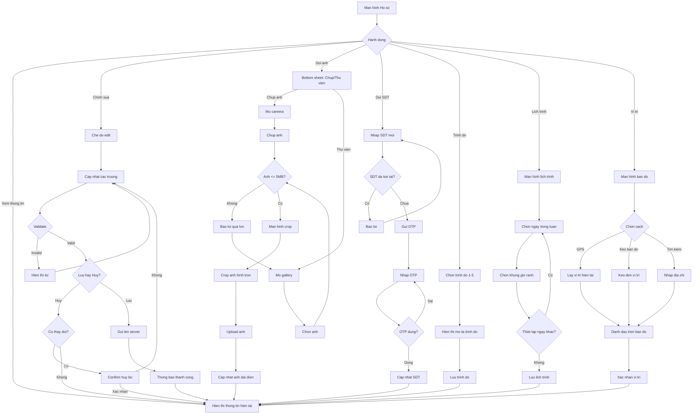

# F02: Quan ly Ho so Nguoi dung

## Mo ta Tong quan

Tinh nang nay cho phep nguoi dung quan ly thong tin ca nhan cua minh. Nguoi dung co the cap nhat thong tin co ban (ho ten, anh dai dien, ngay sinh, gioi tinh, so dien thoai). Rieng nguoi choi co the khai bao them trinh do choi (1-5) va lich trinh ranh de he thong ghep doi chinh xac hon.

## Actors (Nguoi tham gia)

- **Nguoi dung (tat ca vai tro)**: Cap nhat thong tin co ban
- **Nguoi choi**: Cap nhat them trinh do va lich trinh ranh
- **He thong**: Luu tru va validate du lieu

---

## LUONG 1: XEM VA CAP NHAT THONG TIN CO BAN

### Luong Chinh (Happy Path)

#### Buoc 1: Truy cap Ho so
- **Actor**: Nguoi dung
- **Action**: Tu man hinh chinh, nhan vao tab "Ho so" hoac icon profile tren navigation
- **System Response**: Hien thi man hinh Ho so voi thong tin hien tai cua nguoi dung
- **Result**: Man hinh Ho so hien thi

#### Buoc 2: Xem thong tin hien tai
- **Actor**: Nguoi dung
- **Action**: Xem cac thong tin: Anh dai dien, Ho ten, Ngay sinh, Gioi tinh, So dien thoai, Email
- **System Response**: Hien thi tat ca thong tin voi trang thai read-only
- **Result**: Nguoi dung thay duoc thong tin cua minh

#### Buoc 3: Chuyen sang che do chinh sua
- **Actor**: Nguoi dung
- **Action**: Nhan nut "Chinh sua" hoac icon but chi
- **System Response**: Chuyen cac truong sang che do editable, hien thi nut "Luu" va "Huy"
- **Result**: Form chinh sua san sang

#### Buoc 4: Cap nhat thong tin
- **Actor**: Nguoi dung
- **Action**: Thay doi cac truong mong muon (VD: doi ho ten, cap nhat ngay sinh)
- **System Response**: Validate realtime tung truong khi nguoi dung nhap
- **Result**: Cac truong duoc cap nhat voi indicator valid/invalid

#### Buoc 5: Luu thay doi
- **Actor**: Nguoi dung
- **Action**: Nhan nut "Luu"
- **System Response**:
  - Validate toan bo form
  - Gui request cap nhat len server
  - Hien thi loading indicator
  - Thong bao "Cap nhat thanh cong"
- **Result**: Thong tin duoc luu, quay lai che do xem

### Decision Points (Diem Ra quyet dinh)

#### Decision 1: Thong tin hop le?
- **Condition**: Tat ca truong bat buoc da dien va dung format
- **Path A (Hop le)**: Luu thong tin thanh cong
- **Path B (Khong hop le)**: Hien thi loi cu the cho tung truong

#### Decision 2: Nguoi dung huy chinh sua?
- **Condition**: Nguoi dung nhan nut "Huy" hoac back
- **Path A (Co thay doi)**: Hien thi confirm dialog "Huy bo cac thay doi?"
- **Path B (Khong thay doi)**: Quay lai che do xem truc tiep

---

## LUONG 2: THAY DOI ANH DAI DIEN

### Luong Chinh (Happy Path)

#### Buoc 1: Bat dau thay anh
- **Actor**: Nguoi dung
- **Action**: Nhan vao anh dai dien hoac icon camera tren anh
- **System Response**: Hien thi bottom sheet voi 2 lua chon: "Chup anh" va "Chon tu thu vien"
- **Result**: Bottom sheet hien thi

#### Buoc 2: Chon nguon anh
- **Actor**: Nguoi dung
- **Action**: Chon "Chon tu thu vien"
- **System Response**: Mo thu vien anh cua thiet bi
- **Result**: Thu vien anh hien thi

#### Buoc 3: Chon anh
- **Actor**: Nguoi dung
- **Action**: Chon 1 anh tu thu vien
- **System Response**:
  - Kiem tra kich thuoc anh (<= 5MB)
  - Hien thi man hinh crop anh (hinh tron)
- **Result**: Man hinh crop anh hien thi

#### Buoc 4: Crop anh
- **Actor**: Nguoi dung
- **Action**: Keo va zoom de can chinh vung anh muon su dung
- **System Response**: Hien thi preview anh trong khung tron
- **Result**: Anh da duoc can chinh

#### Buoc 5: Xac nhan anh
- **Actor**: Nguoi dung
- **Action**: Nhan nut "Xac nhan" hoac "Su dung anh nay"
- **System Response**:
  - Nen anh ve kich thuoc toi uu (400x400 px)
  - Upload anh len server
  - Hien thi loading tren anh dai dien
  - Cap nhat anh dai dien moi
- **Result**: Anh dai dien moi duoc hien thi

### Alternative Flows (Luong Phu)

#### Alt Flow 1: Chup anh moi
- **Trigger**: Nguoi dung chon "Chup anh"
- **Steps**:
  1. Yeu cau quyen truy cap camera
  2. Mo camera truoc (selfie mode)
  3. Nguoi dung chup anh
  4. Chuyen sang man hinh crop (Buoc 4)

#### Alt Flow 2: Anh qua lon
- **Trigger**: Anh chon > 5MB
- **Steps**:
  1. Hien thi thong bao "Anh qua lon. Vui long chon anh nho hon 5MB"
  2. Quay lai thu vien anh de chon anh khac

---

## LUONG 3: CAP NHAT SO DIEN THOAI

### Luong Chinh (Happy Path)

#### Buoc 1: Bat dau thay doi SDT
- **Actor**: Nguoi dung
- **Action**: Trong che do chinh sua, nhan vao truong So dien thoai
- **System Response**: Hien thi thong bao "Thay doi so dien thoai can xac thuc OTP"
- **Result**: Nguoi dung biet can xac thuc

#### Buoc 2: Nhap so dien thoai moi
- **Actor**: Nguoi dung
- **Action**: Nhap so dien thoai moi
- **System Response**: Validate format so dien thoai
- **Result**: So dien thoai hop le

#### Buoc 3: Gui OTP
- **Actor**: Nguoi dung
- **Action**: Nhan nut "Gui ma OTP"
- **System Response**:
  - Kiem tra so dien thoai moi chua duoc dang ky boi nguoi khac
  - Gui SMS OTP den so moi
- **Result**: Man hinh nhap OTP hien thi

#### Buoc 4: Xac thuc OTP
- **Actor**: Nguoi dung
- **Action**: Nhap ma OTP 6 chu so
- **System Response**:
  - Xac thuc OTP
  - Cap nhat so dien thoai moi trong ho so
- **Result**: So dien thoai duoc cap nhat thanh cong

### Decision Points (Diem Ra quyet dinh)

#### Decision 1: So dien thoai moi da duoc su dung?
- **Condition**: Kiem tra trong database
- **Path A (Da su dung)**: Hien thi loi "So dien thoai nay da duoc dang ky boi nguoi dung khac"
- **Path B (Chua su dung)**: Tiep tuc gui OTP

---

## LUONG 4: KHAI BAO TRINH DO (CHI NGUOI CHOI)

### Luong Chinh (Happy Path)

#### Buoc 1: Truy cap phan Trinh do
- **Actor**: Nguoi choi
- **Action**: Trong man hinh Ho so, cuon xuong phan "Thong tin choi bong"
- **System Response**: Hien thi phan Trinh do voi thanh truot hoac cac muc 1-5
- **Result**: Phan trinh do hien thi

#### Buoc 2: Chon trinh do
- **Actor**: Nguoi choi
- **Action**: Keo thanh truot hoac chon muc trinh do (1-5)
- **System Response**:
  - Cap nhat gia tri trinh do
  - Hien thi mo ta trinh do tuong ung:
    - 1: Moi bat dau - Chua biet luat, can hoc co ban
    - 2: Co ban - Biet luat, danh duoc nhung chua on dinh
    - 3: Trung binh - Danh on dinh, biet chien thuat co ban
    - 4: Kha - Danh tot, co ky thuat va chien thuat
    - 5: Chuyen nghiep - Trinh do thi dau, rat gioi
- **Result**: Trinh do duoc cap nhat

#### Buoc 3: Luu trinh do
- **Actor**: Nguoi choi
- **Action**: Trinh do tu dong luu hoac nhan "Luu"
- **System Response**: Cap nhat trinh do trong database
- **Result**: Trinh do duoc luu thanh cong

---

## LUONG 5: THIET LAP LICH TRINH RANH (CHI NGUOI CHOI)

### Luong Chinh (Happy Path)

#### Buoc 1: Truy cap phan Lich trinh
- **Actor**: Nguoi choi
- **Action**: Trong man hinh Ho so, nhan vao "Lich trinh ranh"
- **System Response**: Hien thi man hinh thiet lap lich trinh voi 7 ngay trong tuan
- **Result**: Man hinh lich trinh hien thi

#### Buoc 2: Chon ngay trong tuan
- **Actor**: Nguoi choi
- **Action**: Nhan vao ngay muon thiet lap (VD: Thu 2)
- **System Response**: Hien thi danh sach khung gio trong ngay (sang, trua, chieu, toi)
- **Result**: Cac khung gio hien thi

#### Buoc 3: Chon khung gio ranh
- **Actor**: Nguoi choi
- **Action**: Tick vao cac khung gio ranh:
  - Sang: 6:00 - 11:00
  - Trua: 11:00 - 14:00
  - Chieu: 14:00 - 18:00
  - Toi: 18:00 - 22:00
- **System Response**: Danh dau khung gio duoc chon
- **Result**: Khung gio ranh duoc danh dau

#### Buoc 4: Lap lai cho cac ngay khac
- **Actor**: Nguoi choi
- **Action**: Thiet lap tuong tu cho cac ngay con lai trong tuan
- **System Response**: Luu lich trinh cho moi ngay
- **Result**: Lich trinh toan tuan duoc thiet lap

#### Buoc 5: Luu lich trinh
- **Actor**: Nguoi choi
- **Action**: Nhan nut "Luu" hoac quay lai
- **System Response**:
  - Luu lich trinh vao database
  - Thong bao "Lich trinh da duoc cap nhat"
- **Result**: Lich trinh duoc luu

### Alternative Flows (Luong Phu)

#### Alt Flow 1: Sao chep lich ngay nay sang ngay khac
- **Trigger**: Nguoi choi muon ap dung lich giong nhau cho nhieu ngay
- **Steps**:
  1. Thiet lap lich cho 1 ngay (VD: Thu 2)
  2. Nhan nut "Sao chep"
  3. Chon cac ngay muon ap dung (VD: Thu 4, Thu 6)
  4. Xac nhan sao chep
  5. Lich duoc ap dung cho cac ngay da chon

#### Alt Flow 2: Xoa tat ca lich
- **Trigger**: Nguoi choi muon reset lich trinh
- **Steps**:
  1. Nhan nut "Xoa tat ca"
  2. Xac nhan xoa
  3. Tat ca khung gio duoc bo chon

---

## LUONG 6: CAP NHAT VI TRI UU TIEN (CHI NGUOI CHOI)

### Luong Chinh (Happy Path)

#### Buoc 1: Truy cap phan Vi tri
- **Actor**: Nguoi choi
- **Action**: Trong man hinh Ho so, nhan vao "Vi tri uu tien"
- **System Response**: Hien thi ban do voi vi tri hien tai (neu co) hoac vi tri luu truoc
- **Result**: Man hinh ban do hien thi

#### Buoc 2: Chon vi tri
- **Actor**: Nguoi choi
- **Action**:
  - Option A: Nhan "Su dung vi tri hien tai" de lay GPS
  - Option B: Keo ban do den vi tri mong muon
  - Option C: Nhap dia chi vao o tim kiem
- **System Response**: Danh dau vi tri tren ban do
- **Result**: Vi tri duoc chon

#### Buoc 3: Xac nhan vi tri
- **Actor**: Nguoi choi
- **Action**: Nhan nut "Xac nhan"
- **System Response**: Luu toa do vi tri vao ho so
- **Result**: Vi tri uu tien duoc cap nhat

### Decision Points (Diem Ra quyet dinh)

#### Decision 1: Quyen GPS da duoc cap?
- **Condition**: Kiem tra quyen truy cap vi tri
- **Path A (Da cap)**: Lay vi tri GPS hien tai
- **Path B (Chua cap)**: Yeu cau cap quyen, giai thich ly do can vi tri

---

## Error Handling

### Error 1: Upload anh that bai
- **Condition**: Mang yeu hoac server loi khi upload
- **System Response**: Hien thi "Khong the tai anh len. Vui long thu lai"
- **User Action**: Thu lai hoac chon anh khac

### Error 2: Mat ket noi khi luu
- **Condition**: Mat mang khi dang luu thong tin
- **System Response**:
  - Luu thay doi vao local storage
  - Hien thi "Mat ket noi. Thay doi se duoc luu khi co mang"
- **User Action**: Cho ket noi mang de dong bo

### Error 3: Khong lay duoc vi tri GPS
- **Condition**: GPS tat hoac thiet bi khong ho tro
- **System Response**: Hien thi "Khong the lay vi tri. Vui long nhap dia chi thu cong"
- **User Action**: Nhap dia chi vao o tim kiem

### Error 4: Dinh dang anh khong ho tro
- **Condition**: Anh khong phai JPG, PNG, hoac HEIC
- **System Response**: Hien thi "Dinh dang anh khong duoc ho tro. Vui long chon anh JPG hoac PNG"
- **User Action**: Chon anh khac voi dinh dang phu hop

---

## Validation Rules

1. **Ho ten**:
   - Bat buoc
   - Toi thieu 2 ky tu
   - Toi da 50 ky tu
   - Chi chua chu cai, dau cach, dau ngoac

2. **Ngay sinh**:
   - Bat buoc
   - Phai > 13 tuoi
   - Khong duoc la tuong lai

3. **Gioi tinh**:
   - Bat buoc
   - 1 trong 3: Nam, Nu, Khac

4. **So dien thoai**:
   - Bat buoc
   - Chinh xac 10 chu so
   - Bat dau bang 0
   - Phai xac thuc OTP khi thay doi

5. **Anh dai dien**:
   - Khong bat buoc
   - Toi da 5MB
   - Dinh dang: JPG, PNG, HEIC
   - Tu dong crop thanh hinh tron

6. **Trinh do (Nguoi choi)**:
   - Khong bat buoc
   - Gia tri 1-5
   - Mac dinh: khong chon

7. **Lich trinh (Nguoi choi)**:
   - Khong bat buoc
   - Moi ngay co 4 khung gio
   - Co the chon nhieu khung gio

8. **Vi tri (Nguoi choi)**:
   - Khong bat buoc
   - Luu duoi dang toa do (lat, lng)

---

## Dependencies

- **F01**: Nguoi dung phai dang ky va dang nhap truoc khi quan ly ho so

---

## Activity Diagram (Mermaid)

---

## Notes

1. **Trinh do choi**:
   - Trinh do tu khai bao, khong co co che xac thuc
   - Trong tuong lai (ngoai scope v1) co the them tinh nang verify trinh do qua ket qua thi dau

2. **Lich trinh ranh**:
   - Lich trinh nay dung de he thong goi y ghep doi
   - Nguoi choi co lich giong nhau se duoc uu tien ghep
   - Lich trinh khong phai la lich dat san cu the

3. **Vi tri uu tien**:
   - Dung de tim san va nguoi choi gan
   - Nguoi dung co the dat vi tri khac vi tri hien tai (VD: vi tri noi lam viec)

4. **Privacy**:
   - Thong tin ho so chi hien thi cho nguoi da ghep doi
   - So dien thoai va email khong hien thi cong khai
   - Vi tri chi dien thi khoang cach, khong hien thi toa do cu the

5. **UX Tips**:
   - Tu dong luu thay doi nho (toggle, slider)
   - Yeu cau xac nhan cho thay doi lon (SDT, xoa anh)
   - Hien thi % hoan thien ho so de khuyen khich nguoi dung dien day du

6. **Nguoi choi moi**:
   - Sau khi dang ky, huong dan nguoi dung hoan thien ho so
   - Bat buoc dien: Ho ten, Ngay sinh, Gioi tinh
   - Khuyen khich dien: Trinh do, Lich trinh, Vi tri, Anh dai dien
