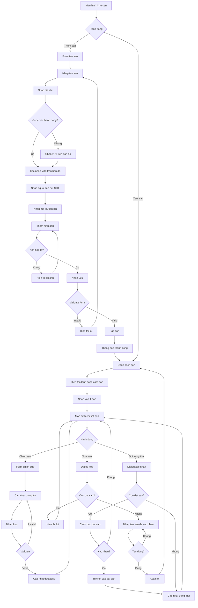

# F03: Quan ly San

## Mo ta Tong quan

Tinh nang nay cho phep Chu san tao va quan ly thong tin san pickleball cua minh. San o day la "san cha" - co so vat chat chinh chua cac san con ben trong. Chu san co the them thong tin chi tiet nhu: ten san, dia chi, nguoi lien he, so dien thoai, mo ta, hinh anh, tien ich. Chu san cung co the tam dong/mo lai hoac xoa san.

## Actors (Nguoi tham gia)

- **Chu san**: Quan ly thong tin san cua minh
- **He thong**: Luu tru du lieu, chuyen doi dia chi thanh toa do GPS

---

## LUONG 1: TAO SAN MOI

### Luong Chinh (Happy Path)

#### Buoc 1: Truy cap chuc nang tao san
- **Actor**: Chu san
- **Action**: Tu man hinh chinh, nhan nut "Them san" hoac "+"
- **System Response**: Hien thi man hinh tao san moi voi form trong
- **Result**: Form tao san hien thi

#### Buoc 2: Nhap thong tin co ban
- **Actor**: Chu san
- **Action**: Nhap cac thong tin:
  - Ten san (bat buoc)
  - Dia chi (bat buoc)
  - Nguoi lien he (bat buoc)
  - So dien thoai lien he (bat buoc)
- **System Response**: Validate realtime tung truong
- **Result**: Thong tin co ban duoc nhap

#### Buoc 3: Xac nhan dia chi tren ban do
- **Actor**: Chu san
- **Action**: Sau khi nhap dia chi, xem vi tri tren ban do preview
- **System Response**:
  - Chuyen dia chi thanh toa do GPS (geocoding)
  - Hien thi marker tren ban do mini
- **Result**: Vi tri san duoc hien thi tren ban do

#### Buoc 4: Nhap thong tin bo sung
- **Actor**: Chu san
- **Action**: Nhap cac thong tin tuy chon:
  - Mo ta san (text dai)
  - Tien ich co san (chon tu danh sach: Do xe, WC, Nuoc uong, Quan cafe, Wifi, Den chieu sang...)
- **System Response**: Luu thong tin bo sung
- **Result**: Thong tin bo sung duoc nhap

#### Buoc 5: Them hinh anh
- **Actor**: Chu san
- **Action**: Nhan "Them anh" de chon anh tu thu vien hoac chup anh
- **System Response**:
  - Cho phep chon toi da 10 anh
  - Validate kich thuoc moi anh <= 5MB
  - Hien thi preview cac anh da chon
- **Result**: Anh duoc chon va hien thi preview

#### Buoc 6: Luu san
- **Actor**: Chu san
- **Action**: Nhan nut "Luu" hoac "Tao san"
- **System Response**:
  - Validate toan bo form
  - Upload hinh anh len server
  - Tao ban ghi san moi trong database
  - Trang thai mac dinh: "Hoat dong"
  - Hien thi loading, sau do thong bao "Tao san thanh cong"
- **Result**: San moi duoc tao, chuyen den man hinh quan ly san

### Decision Points (Diem Ra quyet dinh)

#### Decision 1: Dia chi hop le?
- **Condition**: He thong co the chuyen doi dia chi thanh toa do GPS
- **Path A (Hop le)**: Hien thi vi tri tren ban do
- **Path B (Khong hop le)**: Hien thi loi "Khong tim thay dia chi. Vui long nhap chi tiet hon hoac chinh sua tren ban do"

#### Decision 2: Nguoi dung muon chinh sua vi tri tren ban do?
- **Condition**: Vi tri geocode khong chinh xac
- **Path A (Co chinh sua)**: Mo ban do full screen, cho phep keo marker den vi tri dung
- **Path B (Vi tri dung)**: Tiep tuc nhap thong tin khac

#### Decision 3: Co anh nao qua lon?
- **Condition**: Kich thuoc anh > 5MB
- **System Response**: Hien thi loi cho anh cu the, yeu cau chon anh khac
- **Path A (Thay anh khac)**: Chon anh moi
- **Path B (Nen anh)**: Tu dong nen anh xuong (neu he thong ho tro)

---

## LUONG 2: XEM DANH SACH SAN

### Luong Chinh (Happy Path)

#### Buoc 1: Truy cap danh sach san
- **Actor**: Chu san
- **Action**: Tu man hinh chinh cua Chu san, xem tab "San cua toi"
- **System Response**: Hien thi danh sach tat ca san cua chu san
- **Result**: Danh sach san hien thi

#### Buoc 2: Xem thong tin tong quan
- **Actor**: Chu san
- **Action**: Xem danh sach card san voi thong tin:
  - Anh dai dien san
  - Ten san
  - Dia chi (rut gon)
  - Trang thai (Hoat dong/Tam dong)
  - So san con
  - So don dat san hom nay
- **System Response**: Hien thi danh sach card
- **Result**: Chu san thay tong quan cac san

#### Buoc 3: Xem chi tiet san
- **Actor**: Chu san
- **Action**: Nhan vao 1 card san
- **System Response**: Chuyen den man hinh chi tiet san
- **Result**: Man hinh chi tiet san hien thi

---

## LUONG 3: CAP NHAT THONG TIN SAN

### Luong Chinh (Happy Path)

#### Buoc 1: Truy cap chinh sua san
- **Actor**: Chu san
- **Action**: Tu man hinh chi tiet san, nhan nut "Chinh sua"
- **System Response**: Chuyen sang che do chinh sua voi cac truong editable
- **Result**: Form chinh sua san hien thi

#### Buoc 2: Cap nhat thong tin
- **Actor**: Chu san
- **Action**: Thay doi cac thong tin mong muon:
  - Sua ten san
  - Sua dia chi
  - Sua nguoi lien he, SDT
  - Sua mo ta
  - Them/xoa tien ich
  - Them/xoa hinh anh
- **System Response**: Validate realtime
- **Result**: Thong tin duoc cap nhat trong form

#### Buoc 3: Luu thay doi
- **Actor**: Chu san
- **Action**: Nhan nut "Luu"
- **System Response**:
  - Validate toan bo form
  - Upload anh moi (neu co)
  - Cap nhat database
  - Thong bao "Cap nhat thanh cong"
- **Result**: San duoc cap nhat

### Alternative Flows (Luong Phu)

#### Alt Flow 1: Thay doi dia chi
- **Trigger**: Chu san sua truong dia chi
- **Steps**:
  1. Nhap dia chi moi
  2. He thong geocode dia chi moi
  3. Hien thi ban do de xac nhan vi tri
  4. Chu san xac nhan hoac chinh sua tren ban do
  5. Luu vi tri moi

#### Alt Flow 2: Quan ly hinh anh
- **Trigger**: Chu san muon thay doi hinh anh
- **Steps**:
  1. Xem danh sach anh hien tai (grid view)
  2. Nhan "X" tren anh de xoa anh
  3. Nhan "+" de them anh moi
  4. Keo tha de sap xep thu tu anh
  5. Anh dau tien = anh dai dien

---

## LUONG 4: THAY DOI TRANG THAI SAN

### Luong Chinh (Happy Path)

#### Buoc 1: Truy cap thay doi trang thai
- **Actor**: Chu san
- **Action**: Tu man hinh chi tiet san, nhan vao toggle "Trang thai" hoac nut "Tam dong san"
- **System Response**: Hien thi confirm dialog
- **Result**: Dialog xac nhan hien thi

#### Buoc 2: Xac nhan thay doi trang thai
- **Actor**: Chu san
- **Action**: Xac nhan trong dialog
- **System Response**:
  - Neu chuyen sang "Tam dong":
    - Kiem tra con dat san dang cho hay khong
    - Cap nhat trang thai san
    - San se khong hien thi trong ket qua tim kiem cua nguoi choi
  - Neu chuyen sang "Hoat dong":
    - Cap nhat trang thai san
    - San bat dau hien thi trong ket qua tim kiem
- **Result**: Trang thai san duoc cap nhat

### Decision Points (Diem Ra quyet dinh)

#### Decision 1: Con dat san dang cho khi tam dong?
- **Condition**: Kiem tra co booking voi status "Cho xac nhan" hoac "Da xac nhan" trong tuong lai
- **Path A (Co dat san)**:
  - Hien thi canh bao "San con X don dat san dang cho. Ban co chac muon tam dong?"
  - Liet ke cac don dat san
  - Neu xac nhan: Tu dong tu choi tat ca don dat dang cho, gui thong bao cho nguoi dat
- **Path B (Khong co dat san)**: Tam dong binh thuong

---

## LUONG 5: XOA SAN

### Luong Chinh (Happy Path)

#### Buoc 1: Yeu cau xoa san
- **Actor**: Chu san
- **Action**: Tu man hinh chi tiet san, nhan nut "Xoa san" (thuong o cuoi trang, mau do)
- **System Response**: Hien thi confirm dialog nghiem tuc
- **Result**: Dialog xac nhan xoa hien thi

#### Buoc 2: Xac nhan xoa
- **Actor**: Chu san
- **Action**: Nhap ten san de xac nhan (de tranh xoa nham)
- **System Response**:
  - Kiem tra khong co dat san dang cho
  - Xoa san va tat ca du lieu lien quan (san con, khung gio)
  - Hien thi thong bao "San da duoc xoa"
- **Result**: San bi xoa, quay lai danh sach san

### Decision Points (Diem Ra quyet dinh)

#### Decision 1: Con dat san dang cho?
- **Condition**: Kiem tra booking trong tuong lai
- **Path A (Co dat san)**: Hien thi loi "Khong the xoa san khi con dat san dang cho. Vui long huy hoac hoan tat cac dat san truoc"
- **Path B (Khong co dat san)**: Cho phep xoa

#### Decision 2: Ten nhap dung?
- **Condition**: Ten nguoi dung nhap khop voi ten san
- **Path A (Khop)**: Cho phep xoa
- **Path B (Khong khop)**: Nut xoa bi disable

---

## Error Handling

### Error 1: Geocoding that bai
- **Condition**: Khong the chuyen doi dia chi thanh toa do
- **System Response**:
  - Hien thi ban do de chu san tu chon vi tri
  - Thong bao "Khong tim thay dia chi. Vui long chon vi tri tren ban do"
- **User Action**: Keo marker den vi tri san tren ban do

### Error 2: Upload anh that bai
- **Condition**: Mang yeu hoac server loi
- **System Response**:
  - Hien thi anh nao loi
  - Cho phep thu lai tung anh
- **User Action**: Thu lai upload hoac bo qua anh loi

### Error 3: Trung ten san
- **Condition**: Chu san da co san khac cung ten
- **System Response**: Hien thi canh bao "Ban da co san khac ten nay. Tiep tuc tao?"
- **User Action**: Doi ten hoac xac nhan tao

### Error 4: Mat ket noi khi luu
- **Condition**: Mat mang giua qua trinh luu
- **System Response**:
  - Luu ban nhap vao local storage
  - Hien thi "Mat ket noi. Du lieu da duoc luu nhap, se tu dong dong bo khi co mang"
- **User Action**: Cho ket noi mang

---

## Validation Rules

1. **Ten san**:
   - Bat buoc
   - 2-100 ky tu
   - Khong chua ky tu dac biet ngoai tru dau cach, dau gach ngang

2. **Dia chi**:
   - Bat buoc
   - 10-200 ky tu
   - Nen chi tiet de geocoding chinh xac

3. **Toa do (location)**:
   - Bat buoc (tu geocoding hoac chon tay tren ban do)
   - Latitude: -90 den 90
   - Longitude: -180 den 180

4. **Nguoi lien he**:
   - Bat buoc
   - 2-50 ky tu

5. **So dien thoai lien he**:
   - Bat buoc
   - 10-11 chu so
   - Bat dau bang 0

6. **Mo ta**:
   - Khong bat buoc
   - Toi da 1000 ky tu

7. **Hinh anh**:
   - Khong bat buoc
   - Toi da 10 anh
   - Moi anh <= 5MB
   - Dinh dang: JPG, PNG

8. **Tien ich**:
   - Khong bat buoc
   - Chon tu danh sach co san

9. **Trang thai**:
   - Bat buoc
   - 1 trong 2: Hoat dong, Tam dong
   - Mac dinh: Hoat dong

---

## Dependencies

- **F01**: Chu san phai dang nhap truoc
- **F04 (downstream)**: Sau khi tao san, chu san co the tao san con
- **F05 (downstream)**: San con tao xong moi co the tao khung gio

---

## Activity Diagram (Mermaid)

---

## Notes

1. **Geocoding Service**:
   - Su dung Google Maps Geocoding API hoac tuong duong
   - Ket qua geocoding co the khong chinh xac 100%, can cho phep chinh sua thu cong
   - Cache ket qua geocoding de giam chi phi API

2. **Hinh anh**:
   - Anh dau tien trong danh sach la anh dai dien (thumbnail)
   - Nen anh ve kich thuoc toi uu truoc khi upload (1200x800 px)
   - Tao thumbnail (400x300) de hien thi trong danh sach
   - Su dung CDN de phan phoi anh

3. **Trang thai san**:
   - "Tam dong" khong xoa du lieu, chi an khoi ket qua tim kiem
   - Chu san van co the xem thong ke, dat san cu khi san tam dong
   - Thuong dung khi san bao tri, sua chua

4. **Multi-location**:
   - 1 Chu san co the co nhieu san o nhieu dia diem
   - Moi san co trang thai doc lap
   - Quan ly tat ca san tu 1 tai khoan

5. **Sau khi tao san**:
   - He thong goi y tao san con (F04)
   - Sau khi co san con, goi y tao khung gio (F05)
   - Huong dan theo trinh tu: San -> San con -> Khung gio

6. **UX Tips**:
   - Cho phep luu nhap (draft) de chu san quay lai hoan thien sau
   - Hien thi progress bar khi upload nhieu anh
   - Preview san nhu nguoi choi se nhin thay truoc khi publish
