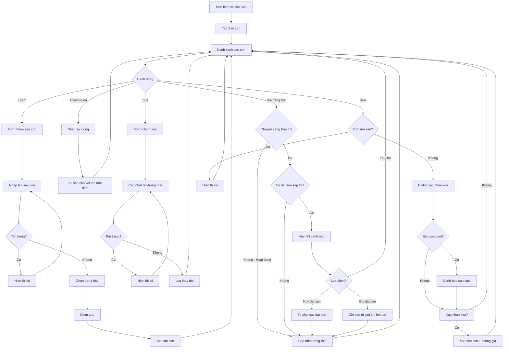

# F04: Quan ly San con

## Mo ta Tong quan

Tinh nang nay cho phep Chu san quan ly cac san con trong 1 san lon (san cha). Moi san lon co the co nhieu san con (VD: San A, San B, San C hoac San 1, San 2...). Nguoi choi se dat san cu the tren tung san con nay. Chu san co the them, sua, xoa san con va dat trang thai cho tung san (Hoat dong/Bao tri).

## Actors (Nguoi tham gia)

- **Chu san**: Quan ly cac san con trong san cua minh
- **He thong**: Luu tru du lieu, kiem tra rang buoc

---

## LUONG 1: XEM DANH SACH SAN CON

### Luong Chinh (Happy Path)

#### Buoc 1: Truy cap quan ly san con
- **Actor**: Chu san
- **Action**: Tu man hinh chi tiet san (F03), nhan vao tab "San con" hoac section "Quan ly san con"
- **System Response**: Hien thi danh sach tat ca san con cua san nay
- **Result**: Danh sach san con hien thi

#### Buoc 2: Xem thong tin san con
- **Actor**: Chu san
- **Action**: Xem danh sach voi thong tin moi san con:
  - Ten san con (VD: San A)
  - Trang thai (Hoat dong / Bao tri)
  - So khung gio da thiet lap
  - So dat san hom nay
- **System Response**: Hien thi danh sach card hoac list item
- **Result**: Chu san thay tong quan cac san con

---

## LUONG 2: THEM SAN CON MOI

### Luong Chinh (Happy Path)

#### Buoc 1: Bat dau them san con
- **Actor**: Chu san
- **Action**: Nhan nut "Them san con" hoac "+"
- **System Response**: Hien thi form them san con (don gian)
- **Result**: Form them san con hien thi

#### Buoc 2: Nhap ten san con
- **Actor**: Chu san
- **Action**: Nhap ten san con (VD: "San A", "San 1", "San ngoai troi")
- **System Response**: Validate ten san con:
  - Khong trung voi san con khac trong cung san cha
  - Do dai hop le
- **Result**: Ten san con duoc nhap

#### Buoc 3: Chon trang thai ban dau
- **Actor**: Chu san
- **Action**: Chon trang thai: "Hoat dong" (mac dinh) hoac "Bao tri"
- **System Response**: Ghi nhan trang thai
- **Result**: Trang thai duoc chon

#### Buoc 4: Luu san con
- **Actor**: Chu san
- **Action**: Nhan nut "Luu" hoac "Them"
- **System Response**:
  - Tao ban ghi san con moi lien ket voi san cha
  - Thong bao "Them san con thanh cong"
  - Cap nhat danh sach san con
- **Result**: San con moi duoc tao

### Alternative Flows (Luong Phu)

#### Alt Flow 1: Them nhieu san con cung luc
- **Trigger**: Chu san muon them nhieu san 1 lan
- **Steps**:
  1. Nhan "Them nhieu san con"
  2. Nhap so luong san con (VD: 4)
  3. He thong tao cac san con voi ten mac dinh: San 1, San 2, San 3, San 4
  4. Chu san co the doi ten tung san sau

---

## LUONG 3: CAP NHAT SAN CON

### Luong Chinh (Happy Path)

#### Buoc 1: Chon san con can sua
- **Actor**: Chu san
- **Action**: Nhan vao san con trong danh sach hoac nhan icon "Sua"
- **System Response**: Hien thi form chinh sua san con
- **Result**: Form chinh sua hien thi

#### Buoc 2: Cap nhat thong tin
- **Actor**: Chu san
- **Action**: Thay doi ten san con hoac trang thai
- **System Response**: Validate thong tin moi
- **Result**: Thong tin duoc cap nhat trong form

#### Buoc 3: Luu thay doi
- **Actor**: Chu san
- **Action**: Nhan nut "Luu"
- **System Response**:
  - Cap nhat database
  - Thong bao "Cap nhat thanh cong"
- **Result**: San con duoc cap nhat

---

## LUONG 4: THAY DOI TRANG THAI SAN CON

### Luong Chinh (Happy Path)

#### Buoc 1: Thay doi trang thai
- **Actor**: Chu san
- **Action**: Toggle trang thai san con tu "Hoat dong" sang "Bao tri" hoac nguoc lai
- **System Response**: Hien thi dialog xac nhan (neu co dat san lien quan)
- **Result**: Dialog hien thi (neu can)

#### Buoc 2: Xac nhan thay doi
- **Actor**: Chu san
- **Action**: Xac nhan trong dialog
- **System Response**:
  - Neu chuyen sang "Bao tri":
    - Kiem tra co dat san sap toi hay khong
    - Neu co: Canh bao va liet ke cac dat san
    - Cap nhat trang thai san con
    - Cac khung gio cua san con nay se khong hien thi cho nguoi dat
  - Neu chuyen sang "Hoat dong":
    - Cap nhat trang thai
    - Khung gio bat dau hien thi lai
- **Result**: Trang thai san con duoc cap nhat

### Decision Points (Diem Ra quyet dinh)

#### Decision 1: Co dat san trong tuong lai?
- **Condition**: Kiem tra booking voi status "Cho xac nhan" hoac "Da xac nhan"
- **Path A (Co dat san)**:
  - Hien thi canh bao: "San con nay co X dat san sap toi. Chuyen sang Bao tri se khien nguoi dat khong the su dung san"
  - Lua chon 1: Huy cac dat san (tu dong tu choi, gui thong bao)
  - Lua chon 2: Giu nguyen dat san (san bao tri sau khi het dat san)
  - Lua chon 3: Huy bo thao tac
- **Path B (Khong co dat san)**: Thay doi trang thai binh thuong

---

## LUONG 5: XOA SAN CON

### Luong Chinh (Happy Path)

#### Buoc 1: Yeu cau xoa san con
- **Actor**: Chu san
- **Action**: Nhan icon "Xoa" hoac vuot trai tren san con (swipe to delete)
- **System Response**: Hien thi dialog xac nhan xoa
- **Result**: Dialog xac nhan hien thi

#### Buoc 2: Xac nhan xoa
- **Actor**: Chu san
- **Action**: Nhan "Xoa" trong dialog
- **System Response**:
  - Kiem tra khong co dat san dang cho
  - Xoa san con va tat ca khung gio lien quan
  - Cap nhat so luong san con tren san cha
  - Thong bao "Xoa san con thanh cong"
- **Result**: San con bi xoa

### Decision Points (Diem Ra quyet dinh)

#### Decision 1: Con dat san dang cho?
- **Condition**: Kiem tra booking trong tuong lai
- **Path A (Co dat san)**: Hien thi loi "Khong the xoa san con khi con dat san dang cho. Vui long huy cac dat san truoc"
- **Path B (Khong co dat san)**: Cho phep xoa

#### Decision 2: Day la san con cuoi cung?
- **Condition**: San cha chi con 1 san con
- **System Response**: Hien thi canh bao "Day la san con cuoi cung. San se khong the nhan dat san neu xoa"
- **Path A (Xac nhan xoa)**: Xoa san con
- **Path B (Huy)**: Giu lai san con

---

## Error Handling

### Error 1: Trung ten san con
- **Condition**: Ten san con da ton tai trong san cha
- **System Response**: Hien thi loi "Ten san con da ton tai. Vui long chon ten khac"
- **User Action**: Nhap ten khac

### Error 2: Xoa san con co khung gio
- **Condition**: San con co khung gio da thiet lap
- **System Response**:
  - Neu khong co dat san: Hien thi canh bao "San con co X khung gio. Xoa san con se xoa tat ca khung gio"
  - Neu co dat san: Khong cho xoa
- **User Action**: Xac nhan xoa hoac huy bo

### Error 3: Chua tao san cha
- **Condition**: Truy cap quan ly san con khi chua co san cha
- **System Response**: Hien thi thong bao "Vui long tao san truoc khi them san con"
- **User Action**: Quay lai tao san (F03)

---

## Validation Rules

1. **Ten san con**:
   - Bat buoc
   - 1-50 ky tu
   - Khong trung voi san con khac trong cung san cha
   - Cho phep: chu cai, so, dau cach, dau gach ngang

2. **Trang thai**:
   - Bat buoc
   - 1 trong 2: Hoat dong, Bao tri
   - Mac dinh: Hoat dong

3. **San cha (court_id)**:
   - Bat buoc
   - Phai la san cua chu san hien tai

---

## Dependencies

- **F03**: Phai co san (san cha) truoc khi tao san con
- **F05 (downstream)**: San con la tien de de tao khung gio
- **F07 (downstream)**: Nguoi choi dat san dua tren san con

---

## Activity Diagram (Mermaid)

---

## Notes

1. **Ten san con**:
   - Nen dat ten de phan biet: San A, San B hoac San 1, San 2
   - Co the dat ten mo ta: San ngoai troi, San co mai che
   - He thong khong gioi han cach dat ten

2. **Trang thai Bao tri**:
   - San con o trang thai "Bao tri" se:
     - Khong hien thi khung gio trong danh sach cho nguoi dat
     - Van hien thi trong quan ly cua chu san
     - Dat san cu (da xac nhan) van hop le neu chu san chon giu
   - Thuong dung khi:
     - San can sua chua
     - San tam ngung hoat dong
     - Kiem tra, bao duong dinh ky

3. **So luong san con**:
   - Khong gioi han so luong san con trong 1 san cha
   - Thuong thay: 2-8 san con moi san lon
   - Hien thi so san con tren thong tin san cha

4. **Quan ly khung gio**:
   - Moi san con co khung gio rieng biet
   - Xoa san con se xoa tat ca khung gio cua san do
   - Chuyen sang Bao tri khong xoa khung gio, chi an khoi nguoi dat

5. **UX Tips**:
   - Ho tro keo tha de sap xep thu tu san con (tuy chon)
   - Hien thi so luot dat san tren moi san con de chu san biet san nao pho bien
   - Cho phep sao chep khung gio tu san con nay sang san con khac

6. **Sau khi tao san con**:
   - He thong goi y tao khung gio cho san con (F05)
   - San con khong co khung gio se khong the nhan dat san
