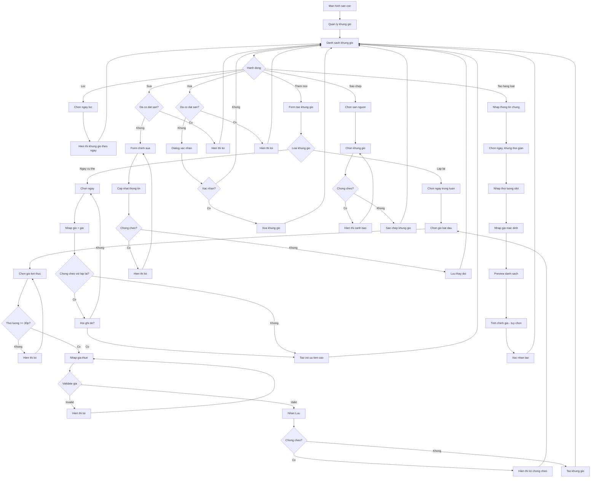

# F05: Quan ly Khung gio

## Mo ta Tong quan

Tinh nang nay cho phep Chu san tao va quan ly cac khung gio cho thue cho tung san con. Moi khung gio co thoi gian bat dau, ket thuc va gia thue. Chu san co the tao khung gio lap lai theo ngay trong tuan (VD: Thu 2-Thu 6, 6h-7h sang) hoac khung gio cho ngay cu the. He thong dam bao khong co khung gio chong cheo tren cung 1 san con.

## Actors (Nguoi tham gia)

- **Chu san**: Tao va quan ly khung gio
- **He thong**: Kiem tra chong cheo, luu tru du lieu

---

## LUONG 1: XEM DANH SACH KHUNG GIO

### Luong Chinh (Happy Path)

#### Buoc 1: Truy cap quan ly khung gio
- **Actor**: Chu san
- **Action**: Tu man hinh san con, nhan "Quan ly khung gio" hoac chon san con can quan ly
- **System Response**: Hien thi man hinh quan ly khung gio cua san con
- **Result**: Man hinh khung gio hien thi

#### Buoc 2: Xem danh sach khung gio
- **Actor**: Chu san
- **Action**: Xem danh sach khung gio hien co, phan loai theo:
  - Khung gio lap lai (theo ngay trong tuan)
  - Khung gio ngay cu the
- **System Response**: Hien thi danh sach voi thong tin:
  - Thoi gian (VD: 6:00 - 7:00)
  - Ngay ap dung (VD: Thu 2, 4, 6 hoac 25/12/2025)
  - Gia thue (VD: 150,000 VND)
  - Trang thai (Con trong / Da dat)
- **Result**: Chu san thay tong quan cac khung gio

#### Buoc 3: Loc theo ngay
- **Actor**: Chu san
- **Action**: Chon 1 ngay cu the tren lich hoac chon ngay trong tuan
- **System Response**: Hien thi cac khung gio ap dung cho ngay do
- **Result**: Danh sach khung gio da loc

---

## LUONG 2: TAO KHUNG GIO LAP LAI (THEO NGAY TRONG TUAN)

### Luong Chinh (Happy Path)

#### Buoc 1: Bat dau tao khung gio
- **Actor**: Chu san
- **Action**: Nhan nut "Them khung gio" hoac "+"
- **System Response**: Hien thi form tao khung gio voi 2 tab: "Lap lai" va "Ngay cu the"
- **Result**: Form tao khung gio hien thi (tab "Lap lai" mac dinh)

#### Buoc 2: Chon ngay trong tuan
- **Actor**: Chu san
- **Action**: Chon cac ngay ap dung: CN, T2, T3, T4, T5, T6, T7 (co the chon nhieu ngay)
- **System Response**: Danh dau cac ngay duoc chon
- **Result**: Ngay trong tuan duoc chon

#### Buoc 3: Chon thoi gian bat dau
- **Actor**: Chu san
- **Action**: Chon gio bat dau tu time picker (VD: 6:00)
- **System Response**: Luu gio bat dau, tu dong goi y gio ket thuc (+1 gio)
- **Result**: Gio bat dau duoc chon

#### Buoc 4: Chon thoi gian ket thuc
- **Actor**: Chu san
- **Action**: Chon gio ket thuc tu time picker (VD: 7:00)
- **System Response**:
  - Validate: Gio ket thuc > Gio bat dau
  - Validate: Thoi luong >= 30 phut
- **Result**: Gio ket thuc duoc chon

#### Buoc 5: Nhap gia thue
- **Actor**: Chu san
- **Action**: Nhap gia thue cho khung gio nay (VD: 150000 VND)
- **System Response**: Validate gia la so duong
- **Result**: Gia thue duoc nhap

#### Buoc 6: Luu khung gio
- **Actor**: Chu san
- **Action**: Nhan nut "Luu"
- **System Response**:
  - Kiem tra khong chong cheo voi khung gio da co
  - Tao khung gio moi cho moi ngay da chon
  - Thong bao "Tao khung gio thanh cong"
- **Result**: Khung gio moi duoc tao

### Decision Points (Diem Ra quyet dinh)

#### Decision 1: Khung gio chong cheo?
- **Condition**: Kiem tra khung gio moi co trung voi khung gio da ton tai khong
- **Path A (Chong cheo)**: Hien thi loi "Khung gio nay chong cheo voi khung gio X. Vui long chon gio khac"
- **Path B (Khong chong cheo)**: Tao khung gio thanh cong

#### Decision 2: Thoi luong qua ngan?
- **Condition**: Gio ket thuc - Gio bat dau < 30 phut
- **Path A (Qua ngan)**: Hien thi loi "Khung gio toi thieu la 30 phut"
- **Path B (Hop le)**: Tiep tuc

---

## LUONG 3: TAO KHUNG GIO CHO NGAY CU THE

### Luong Chinh (Happy Path)

#### Buoc 1: Bat dau tao khung gio
- **Actor**: Chu san
- **Action**: Nhan nut "Them khung gio", chon tab "Ngay cu the"
- **System Response**: Hien thi form voi date picker
- **Result**: Form tao khung gio ngay cu the hien thi

#### Buoc 2: Chon ngay
- **Actor**: Chu san
- **Action**: Chon ngay cu the tu lich (VD: 25/12/2025)
- **System Response**: Ghi nhan ngay duoc chon
- **Result**: Ngay cu the duoc chon

#### Buoc 3: Chon thoi gian va gia
- **Actor**: Chu san
- **Action**: Nhap gio bat dau, gio ket thuc, gia thue (tuong tu luong 2)
- **System Response**: Validate cac truong
- **Result**: Thong tin khung gio duoc nhap

#### Buoc 4: Luu khung gio
- **Actor**: Chu san
- **Action**: Nhan nut "Luu"
- **System Response**:
  - Kiem tra khong chong cheo (ca voi khung gio lap lai va khung gio ngay cu the khac)
  - Tao khung gio cho ngay cu the
  - Thong bao thanh cong
- **Result**: Khung gio ngay cu the duoc tao

### Alternative Flows (Luong Phu)

#### Alt Flow 1: Ghi de khung gio lap lai
- **Trigger**: Chu san tao khung gio ngay cu the trung voi ngay co khung gio lap lai
- **Steps**:
  1. Hien thi canh bao "Ngay nay da co khung gio lap lai. Ban muon ghi de?"
  2. Neu dong y: Khung gio ngay cu the se uu tien hon khung gio lap lai trong ngay do
  3. Khung gio lap lai van con hieu luc cho cac tuan tiep theo

---

## LUONG 4: TAO NHIEU KHUNG GIO CUNG LUC

### Luong Chinh (Happy Path)

#### Buoc 1: Chon che do tao hang loat
- **Actor**: Chu san
- **Action**: Nhan "Tao nhieu khung gio" hoac chon che do "Bulk"
- **System Response**: Hien thi form tao hang loat
- **Result**: Form tao hang loat hien thi

#### Buoc 2: Nhap thong tin chung
- **Actor**: Chu san
- **Action**:
  - Chon ngay trong tuan ap dung (VD: T2-T6)
  - Chon khung thoi gian hoat dong (VD: 6:00 - 22:00)
  - Nhap thoi luong moi slot (VD: 1 gio)
  - Nhap gia mac dinh (VD: 150,000 VND)
- **System Response**: Tinh toan so khung gio se duoc tao
- **Result**: Preview danh sach khung gio

#### Buoc 3: Tinh chinh (tuy chon)
- **Actor**: Chu san
- **Action**: Chinh sua gia cho tung khung gio neu can (VD: gio vang gia cao hon)
- **System Response**: Cap nhat gia trong preview
- **Result**: Gia da duoc tinh chinh

#### Buoc 4: Xac nhan tao
- **Actor**: Chu san
- **Action**: Nhan "Tao tat ca"
- **System Response**:
  - Tao tat ca khung gio
  - Thong bao "Da tao X khung gio"
- **Result**: Tat ca khung gio duoc tao

---

## LUONG 5: CAP NHAT KHUNG GIO

### Luong Chinh (Happy Path)

#### Buoc 1: Chon khung gio can sua
- **Actor**: Chu san
- **Action**: Nhan vao khung gio trong danh sach
- **System Response**: Hien thi form chinh sua khung gio
- **Result**: Form chinh sua hien thi

#### Buoc 2: Cap nhat thong tin
- **Actor**: Chu san
- **Action**: Thay doi gio bat dau, gio ket thuc, hoac gia thue
- **System Response**: Validate thong tin moi
- **Result**: Thong tin duoc cap nhat trong form

#### Buoc 3: Luu thay doi
- **Actor**: Chu san
- **Action**: Nhan nut "Luu"
- **System Response**:
  - Kiem tra khong chong cheo voi khung gio khac
  - Kiem tra khung gio chua co ai dat
  - Cap nhat database
  - Thong bao thanh cong
- **Result**: Khung gio duoc cap nhat

### Decision Points (Diem Ra quyet dinh)

#### Decision 1: Khung gio da co nguoi dat?
- **Condition**: Kiem tra co booking cho khung gio nay
- **Path A (Da co dat)**: Hien thi loi "Khong the sua khung gio da co nguoi dat"
- **Path B (Chua co dat)**: Cho phep sua

---

## LUONG 6: XOA KHUNG GIO

### Luong Chinh (Happy Path)

#### Buoc 1: Yeu cau xoa
- **Actor**: Chu san
- **Action**: Nhan icon "Xoa" tren khung gio hoac swipe to delete
- **System Response**: Hien thi dialog xac nhan
- **Result**: Dialog xac nhan hien thi

#### Buoc 2: Xac nhan xoa
- **Actor**: Chu san
- **Action**: Nhan "Xoa" trong dialog
- **System Response**:
  - Kiem tra khung gio chua co dat san
  - Xoa khung gio
  - Thong bao "Xoa khung gio thanh cong"
- **Result**: Khung gio bi xoa

### Decision Points (Diem Ra quyet dinh)

#### Decision 1: Khung gio da co nguoi dat?
- **Condition**: Kiem tra booking cho khung gio nay
- **Path A (Da co dat)**: Hien thi loi "Khong the xoa khung gio da co nguoi dat"
- **Path B (Chua co dat)**: Cho phep xoa

---

## LUONG 7: SAO CHEP KHUNG GIO TU SAN CON KHAC

### Luong Chinh (Happy Path)

#### Buoc 1: Chon sao chep
- **Actor**: Chu san
- **Action**: Nhan "Sao chep tu san khac"
- **System Response**: Hien thi danh sach san con khac cung san cha
- **Result**: Danh sach san con hien thi

#### Buoc 2: Chon san nguon
- **Actor**: Chu san
- **Action**: Chon san con muon sao chep khung gio
- **System Response**: Hien thi danh sach khung gio cua san nguon
- **Result**: Danh sach khung gio nguon hien thi

#### Buoc 3: Chon khung gio can sao chep
- **Actor**: Chu san
- **Action**: Chon tat ca hoac tung khung gio muon sao chep
- **System Response**: Danh dau cac khung gio duoc chon
- **Result**: Khung gio duoc chon

#### Buoc 4: Xac nhan sao chep
- **Actor**: Chu san
- **Action**: Nhan "Sao chep"
- **System Response**:
  - Kiem tra khong chong cheo
  - Tao cac khung gio moi cho san con hien tai
  - Thong bao thanh cong
- **Result**: Khung gio duoc sao chep

---

## Error Handling

### Error 1: Khung gio chong cheo
- **Condition**: Khung gio moi trung voi khung gio da co
- **System Response**: Hien thi loi cu the:
  - "Khung gio 6:00-7:00 chong cheo voi khung gio 6:30-7:30 da ton tai"
  - Highlight khung gio bi chong cheo
- **User Action**: Dieu chinh gio bat dau hoac ket thuc

### Error 2: Gio ket thuc truoc gio bat dau
- **Condition**: end_time <= start_time
- **System Response**: Hien thi loi "Gio ket thuc phai sau gio bat dau"
- **User Action**: Chon lai gio ket thuc

### Error 3: Gia khong hop le
- **Condition**: Gia <= 0 hoac khong phai so
- **System Response**: Hien thi loi "Gia thue phai la so duong"
- **User Action**: Nhap lai gia hop le

### Error 4: Khong co san con
- **Condition**: Truy cap quan ly khung gio khi chua co san con
- **System Response**: Hien thi thong bao "Vui long tao san con truoc khi them khung gio"
- **User Action**: Quay lai tao san con (F04)

---

## Validation Rules

1. **Gio bat dau (start_time)**:
   - Bat buoc
   - Dinh dang HH:mm
   - 00:00 - 23:59

2. **Gio ket thuc (end_time)**:
   - Bat buoc
   - Dinh dang HH:mm
   - Phai > start_time
   - end_time - start_time >= 30 phut

3. **Gia thue (price)**:
   - Bat buoc
   - So nguyen duong
   - Toi thieu 1,000 VND
   - Toi da 10,000,000 VND

4. **Ngay trong tuan (day_of_week)**:
   - Khong bat buoc (null = ngay cu the)
   - Gia tri 0-6 (0 = Chu nhat, 6 = Thu 7)

5. **Ngay cu the (specific_date)**:
   - Khong bat buoc (null = lap lai theo tuan)
   - Phai >= ngay hien tai
   - Dinh dang YYYY-MM-DD

6. **San con (sub_court_id)**:
   - Bat buoc
   - Phai thuoc san cua chu san hien tai

---

## Dependencies

- **F04**: Phai co san con truoc khi tao khung gio
- **F06 (downstream)**: Nguoi choi xem khung gio khi tim san
- **F07 (downstream)**: Nguoi choi dat san dua tren khung gio

---

## Activity Diagram (Mermaid)

---

## Notes

1. **Khung gio lap lai vs Ngay cu the**:
   - Khung gio lap lai: Ap dung cho moi tuan (VD: T2 hang tuan, 6h-7h)
   - Khung gio ngay cu the: Chi ap dung cho 1 ngay (VD: 25/12/2025, 6h-7h)
   - Khung gio ngay cu the uu tien hon khung gio lap lai trong cung ngay
   - Vi du: T2 lap lai 6h-7h gia 100k, nhung T2/25/12 cu the 6h-7h gia 150k -> hien thi 150k

2. **Gio vang**:
   - Chu san co the dat gia cao hon cho gio cao diem (VD: 17h-21h)
   - He thong ho tro tinh chinh gia tung khung gio
   - Khong co co che tu dong tang gia theo gio

3. **Khung gio toi thieu**:
   - 30 phut la thoi luong toi thieu 1 khung gio
   - Pho bien: 1 gio moi khung gio
   - Chu san co the tao khung gio 1.5h, 2h tuy y

4. **Hien thi cho nguoi choi**:
   - Chi hien thi khung gio tuong lai (>= ngay hien tai)
   - Chi hien thi khung gio con trong (is_available = true)
   - Sap xep theo thoi gian

5. **Quan ly xung dot**:
   - Kiem tra chong cheo chi trong cung san con
   - 2 san con khac nhau co the co khung gio trung gio
   - Khung gio A (6:00-7:00) va B (7:00-8:00) KHONG chong cheo

6. **Gia thue**:
   - Gia thue tinh theo khung gio, khong phai theo gio
   - Khung gio 1h gia 100k va khung gio 2h gia 180k la hop le
   - Hien thi gia ro rang cho nguoi dat

7. **UX Tips**:
   - Goi y gio pho bien (6h, 7h, 17h, 18h...)
   - Cho phep nhap nhanh bang keyboard (thay vi chi dung picker)
   - Hien thi lich theo tuan de de quan ly
   - Highlight khung gio da co nguoi dat
