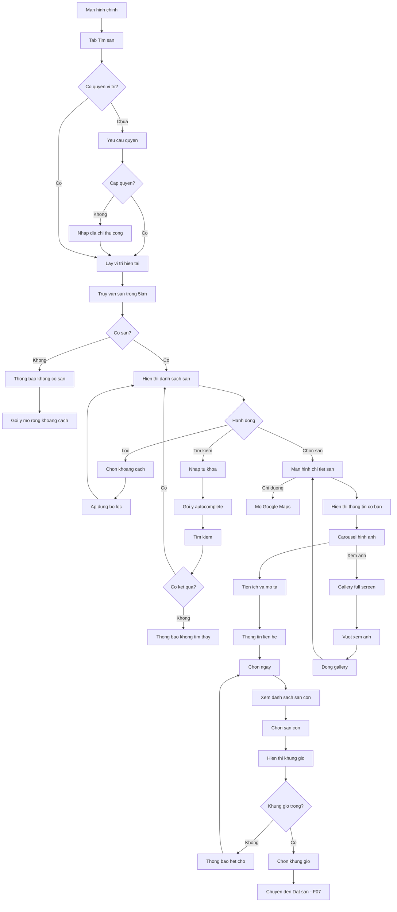

# F06: Tim kiem va Kham pha San

## Mo ta Tong quan

Tinh nang nay cho phep Nguoi choi tim kiem va duyet cac san pickleball co san de choi. Nguoi choi co the tim san theo vi tri hien tai, loc theo khoang cach, tim kiem theo ten san. He thong hien thi thong tin chi tiet san bao gom hinh anh, mo ta, tien ich, san con va cac khung gio con trong.

## Actors (Nguoi tham gia)

- **Nguoi choi**: Tim kiem va xem thong tin san
- **He thong**: Lay du lieu san, tinh toan khoang cach, hien thi ket qua

---

## LUONG 1: XEM DANH SACH SAN GAN VI TRI

### Luong Chinh (Happy Path)

#### Buoc 1: Truy cap man hinh Tim san
- **Actor**: Nguoi choi
- **Action**: Tu man hinh chinh, nhan vao tab "Tim san" hoac icon tim kiem tren navigation
- **System Response**:
  - Yeu cau quyen truy cap vi tri (neu chua co)
  - Lay vi tri hien tai cua nguoi dung
  - Truy van danh sach san trong ban kinh mac dinh (5km)
  - Hien thi danh sach san sap xep theo khoang cach
- **Result**: Danh sach san gan vi tri hien thi

#### Buoc 2: Xem danh sach san
- **Actor**: Nguoi choi
- **Action**: Xem danh sach card san voi thong tin:
  - Anh dai dien san
  - Ten san
  - Dia chi (rut gon)
  - Khoang cach (VD: 1.2 km)
  - So san con
  - Trang thai (Co cho trong / Het cho hom nay)
- **System Response**: Hien thi danh sach dang card hoac list
- **Result**: Nguoi choi thay cac san gan minh

#### Buoc 3: Cuon xem them
- **Actor**: Nguoi choi
- **Action**: Cuon xuong de xem them san
- **System Response**:
  - Tai them san (pagination/infinite scroll)
  - Hien thi loading indicator khi dang tai
- **Result**: Them san duoc hien thi

---

## LUONG 2: LOC SAN THEO KHOANG CACH

### Luong Chinh (Happy Path)

#### Buoc 1: Mo bo loc
- **Actor**: Nguoi choi
- **Action**: Nhan vao icon "Loc" hoac nut "Khoang cach"
- **System Response**: Hien thi bottom sheet hoac dropdown voi cac tuy chon khoang cach
- **Result**: Bo loc hien thi

#### Buoc 2: Chon khoang cach
- **Actor**: Nguoi choi
- **Action**: Chon 1 trong cac tuy chon: 1km, 3km, 5km, 10km, 20km
- **System Response**:
  - Ap dung bo loc
  - Truy van lai danh sach san trong khoang cach moi
  - Cap nhat danh sach san
  - Hien thi so luong ket qua
- **Result**: Danh sach san duoc loc theo khoang cach

#### Buoc 3: Xoa bo loc
- **Actor**: Nguoi choi
- **Action**: Nhan "Xoa bo loc" hoac chon "Tat ca"
- **System Response**: Quay lai danh sach mac dinh (5km)
- **Result**: Bo loc duoc xoa

---

## LUONG 3: TIM KIEM SAN THEO TEN

### Luong Chinh (Happy Path)

#### Buoc 1: Mo thanh tim kiem
- **Actor**: Nguoi choi
- **Action**: Nhan vao thanh tim kiem o dau man hinh
- **System Response**:
  - Focus vao o nhap
  - Hien thi ban phim
  - Hien thi lich su tim kiem (neu co)
- **Result**: O tim kiem san sang

#### Buoc 2: Nhap tu khoa
- **Actor**: Nguoi choi
- **Action**: Nhap ten san hoac tu khoa (VD: "Pickleball Quan 1")
- **System Response**:
  - Tim kiem realtime khi nguoi dung nhap (debounce 300ms)
  - Hien thi goi y autocomplete
- **Result**: Goi y tim kiem hien thi

#### Buoc 3: Xem ket qua
- **Actor**: Nguoi choi
- **Action**: Nhan Enter hoac chon tu goi y
- **System Response**:
  - Thuc hien tim kiem
  - Hien thi ket qua matching
  - Sap xep theo do phu hop + khoang cach
- **Result**: Ket qua tim kiem hien thi

### Alternative Flows (Luong Phu)

#### Alt Flow 1: Khong tim thay ket qua
- **Trigger**: Khong co san nao khop voi tu khoa
- **Steps**:
  1. Hien thi thong bao "Khong tim thay san phu hop"
  2. Goi y: "Thu tim kiem voi tu khoa khac" hoac "Mo rong khoang cach"
  3. Hien thi danh sach san gan nhat (fallback)

---

## LUONG 4: XEM CHI TIET SAN

### Luong Chinh (Happy Path)

#### Buoc 1: Chon san de xem
- **Actor**: Nguoi choi
- **Action**: Nhan vao card san trong danh sach
- **System Response**:
  - Chuyen den man hinh chi tiet san
  - Tai thong tin day du cua san
- **Result**: Man hinh chi tiet san hien thi

#### Buoc 2: Xem thong tin co ban
- **Actor**: Nguoi choi
- **Action**: Xem phan dau man hinh:
  - Carousel hinh anh (vuot trai/phai de xem)
  - Ten san
  - Dia chi day du
  - Khoang cach
  - Nut "Chi duong" (mo Google Maps)
- **System Response**: Hien thi thong tin
- **Result**: Nguoi choi thay thong tin co ban

#### Buoc 3: Xem tien ich
- **Actor**: Nguoi choi
- **Action**: Xem phan "Tien ich":
  - Danh sach icon: Do xe, WC, Nuoc uong, Wifi, Den chieu sang...
- **System Response**: Hien thi cac tien ich bang icon + text
- **Result**: Nguoi choi biet san co nhung tien ich gi

#### Buoc 4: Xem mo ta
- **Actor**: Nguoi choi
- **Action**: Xem phan "Gioi thieu":
  - Mo ta chi tiet ve san
  - Co the expand/collapse neu dai
- **System Response**: Hien thi mo ta
- **Result**: Nguoi choi doc duoc mo ta san

#### Buoc 5: Xem thong tin lien he
- **Actor**: Nguoi choi
- **Action**: Xem phan "Lien he":
  - Nguoi lien he
  - So dien thoai (co the nhan de goi)
- **System Response**: Hien thi thong tin lien he
- **Result**: Nguoi choi co thong tin de lien he

---

## LUONG 5: XEM DANH SACH SAN CON VA KHUNG GIO

### Luong Chinh (Happy Path)

#### Buoc 1: Cuon xuong phan San con
- **Actor**: Nguoi choi
- **Action**: Tu man hinh chi tiet san, cuon xuong phan "San con"
- **System Response**: Hien thi danh sach san con voi:
  - Ten san con (VD: San A, San B)
  - Trang thai (Hoat dong / Bao tri)
- **Result**: Danh sach san con hien thi

#### Buoc 2: Chon ngay muon dat
- **Actor**: Nguoi choi
- **Action**: Nhan vao date picker hoac chon ngay tu thanh ngay ngang (hom nay, mai, cac ngay toi)
- **System Response**:
  - Cap nhat ngay duoc chon
  - Tai danh sach khung gio con trong cho ngay do
- **Result**: Ngay duoc chon

#### Buoc 3: Xem khung gio cua tung san con
- **Actor**: Nguoi choi
- **Action**: Nhan vao 1 san con de xem khung gio
- **System Response**: Hien thi danh sach khung gio cua san con do:
  - Thoi gian (VD: 6:00 - 7:00)
  - Gia (VD: 150,000 VND)
  - Trang thai (Con trong / Da dat)
  - Khung gio da dat se hien thi xam hoac co danh dau
- **Result**: Danh sach khung gio hien thi

#### Buoc 4: Chon khung gio de dat
- **Actor**: Nguoi choi
- **Action**: Nhan vao khung gio con trong
- **System Response**:
  - Highlight khung gio duoc chon
  - Hien thi nut "Dat san" hoac chuyen den man hinh dat san (F07)
- **Result**: Khung gio duoc chon, san sang dat san

### Alternative Flows (Luong Phu)

#### Alt Flow 1: Tat ca khung gio da duoc dat
- **Trigger**: Ngay duoc chon khong con khung gio trong
- **Steps**:
  1. Hien thi thong bao "Khong con khung gio trong cho ngay nay"
  2. Goi y chon ngay khac
  3. Highlight cac ngay con khung gio trong tren lich

#### Alt Flow 2: San con dang bao tri
- **Trigger**: San con o trang thai "Bao tri"
- **Steps**:
  1. Hien thi san con voi trang thai "Bao tri"
  2. Disable khong cho chon san con nay
  3. Goi y chon san con khac

---

## LUONG 6: XEM HINH ANH SAN (GALLERY)

### Luong Chinh (Happy Path)

#### Buoc 1: Mo gallery
- **Actor**: Nguoi choi
- **Action**: Nhan vao hinh anh trong carousel hoac nut "Xem tat ca anh"
- **System Response**: Mo man hinh gallery full screen
- **Result**: Gallery hinh anh hien thi

#### Buoc 2: Xem tung hinh
- **Actor**: Nguoi choi
- **Action**: Vuot trai/phai de xem hinh khac, zoom in/out
- **System Response**:
  - Hien thi hinh lon
  - Ho tro zoom bang pinch gesture
  - Hien thi so thu tu anh (VD: 3/10)
- **Result**: Nguoi choi xem duoc cac hinh anh san

#### Buoc 3: Dong gallery
- **Actor**: Nguoi choi
- **Action**: Nhan nut "X" hoac vuot xuong
- **System Response**: Dong gallery, quay lai man hinh chi tiet san
- **Result**: Quay lai man hinh truoc

---

## LUONG 7: CHI DUONG DEN SAN

### Luong Chinh (Happy Path)

#### Buoc 1: Yeu cau chi duong
- **Actor**: Nguoi choi
- **Action**: Nhan nut "Chi duong" tren man hinh chi tiet san
- **System Response**:
  - Mo ung dung ban do (Google Maps / Apple Maps)
  - Truyen toa do san lam diem den
- **Result**: Ung dung ban do mo voi huong dan duong di

---

## Error Handling

### Error 1: Khong co quyen vi tri
- **Condition**: Nguoi dung khong cap quyen GPS
- **System Response**:
  - Hien thi thong bao "Can quyen truy cap vi tri de tim san gan ban"
  - Nut "Cap quyen" dan den cai dat
  - Fallback: Hien thi form nhap dia chi thu cong
- **User Action**: Cap quyen hoac nhap dia chi

### Error 2: GPS khong hoat dong
- **Condition**: Thiet bi khong the lay vi tri
- **System Response**:
  - Hien thi thong bao "Khong the xac dinh vi tri hien tai"
  - Goi y: Kiem tra GPS, ra ngoai troi
  - Fallback: Tim kiem theo ten san
- **User Action**: Sua loi GPS hoac tim kiem theo ten

### Error 3: Khong co san trong khu vuc
- **Condition**: Khong co san nao trong ban kinh tim kiem
- **System Response**:
  - Hien thi thong bao "Khong co san nao trong khu vuc nay"
  - Goi y mo rong khoang cach
  - Nut "Tim trong pham vi 20km"
- **User Action**: Mo rong khoang cach tim kiem

### Error 4: Mat ket noi mang
- **Condition**: Khong co internet khi tim kiem
- **System Response**:
  - Hien thi thong bao "Khong co ket noi mang"
  - Hien thi du lieu cache (neu co)
  - Nut "Thu lai"
- **User Action**: Kiem tra mang va thu lai

### Error 5: San khong co hinh anh
- **Condition**: San khong co hinh anh nao
- **System Response**:
  - Hien thi placeholder image mac dinh
  - Van hien thi thong tin san binh thuong
- **User Action**: Khong can hanh dong

---

## Validation Rules

1. **Tim kiem**:
   - Tu khoa toi thieu 2 ky tu
   - Debounce 300ms truoc khi tim kiem
   - Ket qua cache 5 phut

2. **Khoang cach**:
   - Tuy chon: 1km, 3km, 5km, 10km, 20km
   - Mac dinh: 5km
   - Toi da: 50km (tranh qua tai)

3. **Pagination**:
   - Moi trang 10-20 san
   - Infinite scroll hoac Load more
   - Cache trang da tai

4. **Khung gio**:
   - Chi hien thi khung gio tuong lai
   - Chi hien thi khung gio cua san con "Hoat dong"
   - Sap xep theo thoi gian bat dau

---

## Dependencies

- **F03**: San phai duoc tao boi chu san
- **F04**: San con phai ton tai
- **F05**: Khung gio phai duoc thiet lap
- **F07 (downstream)**: Sau khi chon khung gio, chuyen sang dat san

---

## Activity Diagram (Mermaid)

---

## Notes

1. **Hien thi khoang cach**:
   - Khoang cach tinh theo duong chim bay (Haversine formula)
   - Hien thi don vi: m (< 1km), km (>= 1km)
   - Lam tron 1 chu so thap phan (VD: 1.2 km)

2. **Trang thai khung gio**:
   - "Con trong" = is_available = true va chua co booking "Da xac nhan"
   - "Da dat" = co booking "Da xac nhan" hoac "Cho xac nhan"
   - Khung gio trong qua khu khong hien thi

3. **Cache**:
   - Cache danh sach san 5 phut
   - Cache chi tiet san 10 phut
   - Cache khung gio 1 phut (can cap nhat thuong xuyen)
   - Khi dat san thanh cong, invalidate cache khung gio

4. **Performance**:
   - Lazy load hinh anh
   - Pagination cho danh sach san
   - Chi tai khung gio khi nguoi dung cuon den
   - Thumbnail cho danh sach, full image cho gallery

5. **UX Tips**:
   - Hien thi skeleton loading khi dang tai
   - Pull-to-refresh de cap nhat danh sach
   - Bookmark san yeu thich (tuy chon - ngoai scope v1)
   - Hien thi "Dat gan day" cho san nguoi dung thuong dat

6. **Goi y**:
   - Uu tien san co nhieu khung gio trong
   - Hien thi badge "Moi" cho san moi tao trong 7 ngay
   - Hien thi badge "Hot" cho san co nhieu luot dat
