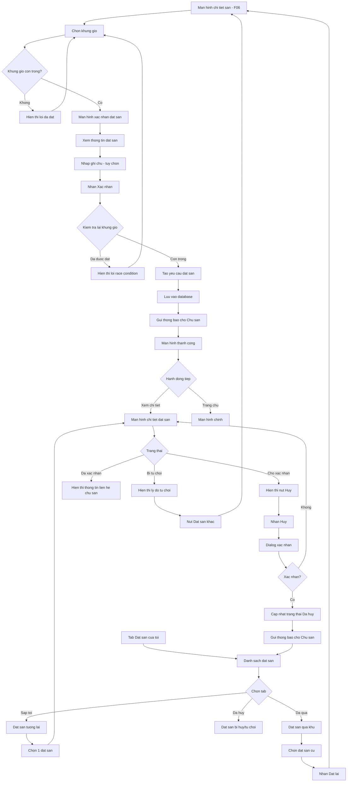

# F07: Dat San

## Mo ta Tong quan

Tinh nang nay cho phep Nguoi choi dat mot khung gio san de choi pickleball. Sau khi chon khung gio tu man hinh Tim san (F06), nguoi choi gui yeu cau dat san. Yeu cau se o trang thai "Cho xac nhan" cho den khi Chu san chap nhan hoac tu choi. Thanh toan thuc hien truc tiep tai san, khong qua ung dung.

## Actors (Nguoi tham gia)

- **Nguoi choi**: Gui yeu cau dat san
- **He thong**: Xu ly yeu cau, gui thong bao
- **Chu san**: Nhan thong bao yeu cau (xu ly trong F08)

---

## LUONG 1: DAT SAN TU MAN HINH TIM SAN

### Luong Chinh (Happy Path)

#### Buoc 1: Chon khung gio
- **Actor**: Nguoi choi
- **Action**: Tu man hinh chi tiet san (F06), chon 1 khung gio con trong
- **System Response**:
  - Highlight khung gio duoc chon
  - Hien thi thong tin tom tat: Ngay, Gio, San con, Gia
  - Hien thi nut "Dat san"
- **Result**: Khung gio duoc chon

#### Buoc 2: Mo man hinh xac nhan dat san
- **Actor**: Nguoi choi
- **Action**: Nhan nut "Dat san"
- **System Response**: Hien thi man hinh xac nhan voi thong tin:
  - **Thong tin san**: Ten san, Dia chi
  - **Chi tiet dat san**: Ngay, Gio, San con
  - **Gia**: Gia khung gio
  - **Ghi chu**: O nhap de nguoi choi ghi chu (tuy chon)
- **Result**: Man hinh xac nhan hien thi

#### Buoc 3: Nhap ghi chu (tuy chon)
- **Actor**: Nguoi choi
- **Action**: Nhap ghi chu neu can (VD: "Toi se den som 15 phut", "Can muon them vot")
- **System Response**: Luu ghi chu
- **Result**: Ghi chu duoc nhap

#### Buoc 4: Xac nhan dat san
- **Actor**: Nguoi choi
- **Action**: Nhan nut "Xac nhan dat san"
- **System Response**:
  - Kiem tra khung gio van con trong (tranh race condition)
  - Tao yeu cau dat san voi trang thai "Cho xac nhan"
  - Gui thong bao den Chu san (F15)
  - Hien thi man hinh thanh cong voi thong tin dat san
- **Result**: Yeu cau dat san duoc tao

#### Buoc 5: Xem xac nhan
- **Actor**: Nguoi choi
- **Action**: Xem man hinh xac nhan thanh cong
- **System Response**: Hien thi:
  - Thong bao "Yeu cau dat san da duoc gui"
  - Ma dat san (VD: #DS001234)
  - Trang thai: "Cho xac nhan"
  - Thong tin: San, Ngay, Gio, Gia
  - Ghi chu: "Chu san se xac nhan trong thoi gian som nhat"
  - Nut "Xem chi tiet" va "Quay lai trang chu"
- **Result**: Nguoi choi biet yeu cau da duoc gui

### Decision Points (Diem Ra quyet dinh)

#### Decision 1: Khung gio con trong?
- **Condition**: Kiem tra khung gio chua co booking "Da xac nhan" hoac "Cho xac nhan"
- **Path A (Da het)**: Hien thi loi "Khung gio nay vua duoc dat boi nguoi khac. Vui long chon khung gio khac"
- **Path B (Con trong)**: Tao yeu cau dat san

---

## LUONG 2: DAT SAN SAU GHEP DOI (TU F09)

### Luong Chinh (Happy Path)

#### Buoc 1: Nhan thong tin ghep doi
- **Actor**: Nguoi choi
- **Action**: Sau khi ghep doi thanh cong (F09), he thong xac dinh khung gio trung
- **System Response**:
  - Neu trung 1 khung gio: Chuyen thang den buoc dat san
  - Neu trung nhieu khung gio: Hien thi danh sach de chon
- **Result**: Khung gio duoc xac dinh

#### Buoc 2: Chon khung gio (neu co nhieu)
- **Actor**: Nguoi choi
- **Action**: Chon 1 trong cac khung gio chung
- **System Response**: Chuyen den man hinh chon san
- **Result**: Khung gio duoc chon

#### Buoc 3: Chon san
- **Actor**: Nguoi choi
- **Action**: Xem danh sach san gan vi tri trung binh cua 2 nguoi, chon san
- **System Response**: Hien thi man hinh chon khung gio cu the cua san
- **Result**: San duoc chon

#### Buoc 4: Xac nhan dat san
- **Actor**: Nguoi choi
- **Action**: Xac nhan thong tin va dat san
- **System Response**:
  - Tao yeu cau dat san
  - Gui thong bao cho ca 2 nguoi choi
  - Gui thong bao cho Chu san
- **Result**: Yeu cau dat san duoc tao

---

## LUONG 3: XEM LICH SU DAT SAN

### Luong Chinh (Happy Path)

#### Buoc 1: Truy cap lich su dat san
- **Actor**: Nguoi choi
- **Action**: Tu man hinh Ho so hoac tab "Dat san cua toi"
- **System Response**: Hien thi danh sach dat san, mac dinh la "Sap toi"
- **Result**: Danh sach dat san hien thi

#### Buoc 2: Xem cac tab
- **Actor**: Nguoi choi
- **Action**: Chuyen giua cac tab:
  - **Sap toi**: Dat san trong tuong lai (Cho xac nhan + Da xac nhan)
  - **Da qua**: Dat san trong qua khu
  - **Da huy**: Dat san bi huy hoac tu choi
- **System Response**: Hien thi danh sach theo trang thai
- **Result**: Danh sach tuong ung hien thi

#### Buoc 3: Xem thong tin dat san
- **Actor**: Nguoi choi
- **Action**: Xem thong tin moi dat san:
  - Ma dat san
  - Ten san, San con
  - Ngay, Gio
  - Trang thai (Cho xac nhan / Da xac nhan / Bi tu choi / Da huy)
  - Gia
- **System Response**: Hien thi danh sach card
- **Result**: Nguoi choi thay thong tin cac dat san

#### Buoc 4: Xem chi tiet dat san
- **Actor**: Nguoi choi
- **Action**: Nhan vao 1 dat san
- **System Response**: Hien thi man hinh chi tiet:
  - Thong tin day du dat san
  - Thong tin san (ten, dia chi, SDT lien he)
  - Trang thai va lich su thay doi
  - Nut hanh dong (Huy, Chat voi chu san...)
- **Result**: Chi tiet dat san hien thi

---

## LUONG 4: HUY DAT SAN

### Luong Chinh (Happy Path)

#### Buoc 1: Chon dat san can huy
- **Actor**: Nguoi choi
- **Action**: Tu chi tiet dat san hoac danh sach, nhan nut "Huy dat san"
- **System Response**: Hien thi dialog xac nhan huy
- **Result**: Dialog xac nhan hien thi

#### Buoc 2: Xac nhan huy
- **Actor**: Nguoi choi
- **Action**: Nhan "Xac nhan huy" trong dialog
- **System Response**:
  - Cap nhat trang thai thanh "Da huy"
  - Gui thong bao cho Chu san
  - Khung gio tro lai trang thai "Con trong"
- **Result**: Dat san bi huy

### Decision Points (Diem Ra quyet dinh)

#### Decision 1: Co the huy?
- **Condition**: Kiem tra trang thai hien tai cua dat san
- **Path A (Cho xac nhan)**: Cho phep huy (khong can xac nhan phuc tap)
- **Path B (Da xac nhan)**: Hien thi canh bao "Dat san da duoc xac nhan. Vui long lien he chu san de huy"
- **Path C (Da bi tu choi / Da huy)**: Khong hien thi nut huy

---

## LUONG 5: THEO DOI TRANG THAI DAT SAN

### Luong Chinh (Happy Path)

#### Buoc 1: Nhan thong bao
- **Actor**: Nguoi choi
- **Action**: Nhan thong bao day (push notification) khi trang thai thay doi
- **System Response**: Hien thi thong bao:
  - "Dat san #DS001234 da duoc xac nhan"
  - "Dat san #DS001234 bi tu choi. Ly do: [...]"
- **Result**: Nguoi choi biet trang thai dat san

#### Buoc 2: Xem chi tiet
- **Actor**: Nguoi choi
- **Action**: Nhan vao thong bao
- **System Response**: Mo man hinh chi tiet dat san
- **Result**: Chi tiet dat san hien thi

#### Buoc 3: Xem ly do tu choi (neu bi tu choi)
- **Actor**: Nguoi choi
- **Action**: Xem ly do Chu san tu choi
- **System Response**: Hien thi ly do trong chi tiet dat san
- **Result**: Nguoi choi biet ly do bi tu choi

---

## LUONG 6: DAT LAI SAN (TU DAT SAN CU)

### Luong Chinh (Happy Path)

#### Buoc 1: Mo dat san cu
- **Actor**: Nguoi choi
- **Action**: Tu lich su dat san, chon 1 dat san da qua hoac da huy
- **System Response**: Hien thi chi tiet dat san
- **Result**: Chi tiet hien thi

#### Buoc 2: Nhan Dat lai
- **Actor**: Nguoi choi
- **Action**: Nhan nut "Dat lai san nay"
- **System Response**:
  - Chuyen den man hinh chi tiet san (F06)
  - Tu dong chon san con tuong ung
  - Hien thi cac khung gio tuong tu (neu co)
- **Result**: Man hinh dat san hien thi

#### Buoc 3: Chon khung gio va dat
- **Actor**: Nguoi choi
- **Action**: Chon khung gio moi va dat san
- **System Response**: Thuc hien luong dat san binh thuong
- **Result**: Yeu cau dat san moi duoc tao

---

## Error Handling

### Error 1: Khung gio da duoc dat
- **Condition**: 2 nguoi dat cung khung gio gan nhu cung luc (race condition)
- **System Response**:
  - Nguoi dat truoc: Thanh cong
  - Nguoi dat sau: Hien thi loi "Khung gio nay vua duoc dat boi nguoi khac"
  - Goi y khung gio khac con trong
- **User Action**: Chon khung gio khac

### Error 2: San tam dong
- **Condition**: San chuyen sang trang thai "Tam dong" sau khi nguoi choi mo chi tiet
- **System Response**: Hien thi thong bao "San hien dang tam dong. Vui long chon san khac"
- **User Action**: Quay lai tim san khac

### Error 3: Mat ket noi khi dat san
- **Condition**: Mat mang khi dang gui yeu cau dat san
- **System Response**:
  - Luu yeu cau vao queue local
  - Hien thi "Dang cho ket noi mang de gui yeu cau"
  - Tu dong gui lai khi co mang
- **User Action**: Cho ket noi mang

### Error 4: Khung gio da qua
- **Condition**: Nguoi choi dat khung gio da qua thoi gian bat dau
- **System Response**: Hien thi loi "Khung gio nay da qua. Vui long chon khung gio khac"
- **User Action**: Chon khung gio trong tuong lai

### Error 5: Dat san loi he thong
- **Condition**: Server gap loi khong xac dinh
- **System Response**: Hien thi "Da co loi xay ra. Vui long thu lai sau"
- **User Action**: Thu lai hoac lien he ho tro

---

## Validation Rules

1. **Khung gio**:
   - Phai la khung gio trong tuong lai
   - Phai con trong (is_available = true, chua co booking)
   - San con phai o trang thai "Hoat dong"

2. **Ngay dat**:
   - Phai >= ngay hien tai
   - Neu cung ngay, gio bat dau phai > gio hien tai

3. **Ghi chu**:
   - Khong bat buoc
   - Toi da 500 ky tu
   - Khong chua noi dung vi pham

4. **Nguoi dat**:
   - Phai dang nhap
   - Vai tro phai la "Nguoi choi"

---

## Trang thai Dat san

| Trang thai | Mo ta | Hanh dong nguoi choi | Hanh dong chu san |
|------------|-------|---------------------|-------------------|
| Cho xac nhan | Yeu cau moi, chua xu ly | Co the huy | Co the Chap nhan / Tu choi |
| Da xac nhan | Chu san da chap nhan | Lien he chu san de huy | - |
| Bi tu choi | Chu san tu choi | Xem ly do, dat san khac | - |
| Da huy | Nguoi choi da huy | - | - |

---

## Dependencies

- **F01**: Nguoi choi phai dang nhap
- **F03-F05**: San, San con, Khung gio phai ton tai
- **F06**: Tim kiem san de chon khung gio
- **F08 (downstream)**: Chu san quan ly dat san
- **F09 (optional)**: Dat san sau khi ghep doi
- **F14 (downstream)**: Chat voi chu san
- **F15 (downstream)**: Thong bao trang thai dat san

---

## Activity Diagram (Mermaid)

---

## Notes

1. **Xung dot dong thoi**:
   - Su dung optimistic locking khi tao dat san
   - Kiem tra khung gio con trong tai thoi diem insert
   - Neu xung dot, rollback va thong bao nguoi dung sau

2. **Thoi gian cho xac nhan**:
   - Khong co gioi han thoi gian cho xac nhan trong v1
   - Chu san duoc khuyen khich xac nhan trong 2 gio
   - Co the them tinh nang tu dong huy sau X gio (Could have)

3. **Dat san sau ghep doi**:
   - Khi ghep doi thanh cong, chi 1 nguoi can dat san
   - Ca 2 nguoi deu nhan thong bao khi dat san thanh cong
   - Nguoi kia co the xem chi tiet dat san trong "Dat san cua toi"

4. **Thanh toan**:
   - Thanh toan truc tiep tai san (khong qua ung dung)
   - Hien thi ro "Thanh toan tai san" trong man hinh xac nhan
   - Khong luu thong tin thanh toan trong he thong

5. **Thong bao**:
   - Push notification khi trang thai thay doi
   - Badge tren tab "Dat san" khi co dat san moi/cap nhat
   - Thong bao nhac lich 1 gio truoc gio danh (F15)

6. **UX Tips**:
   - Hien thi countdown thoi gian con lai truoc khi khung gio bat dau
   - Cho phep them vao Calendar (Google Calendar / Apple Calendar)
   - Hien thi ban do nho voi vi tri san trong chi tiet
   - Quick action: Goi dien cho san, Chi duong

7. **Luu y bao mat**:
   - Chi nguoi dat moi thay chi tiet dat san cua minh
   - Chu san chi thay thong tin can thiet cua nguoi dat
   - Khong hien thi so dien thoai nguoi dat cong khai
