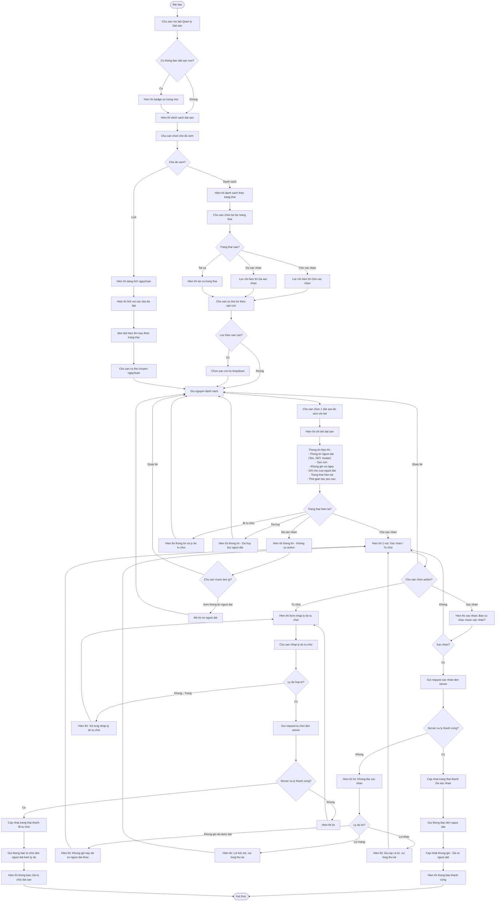
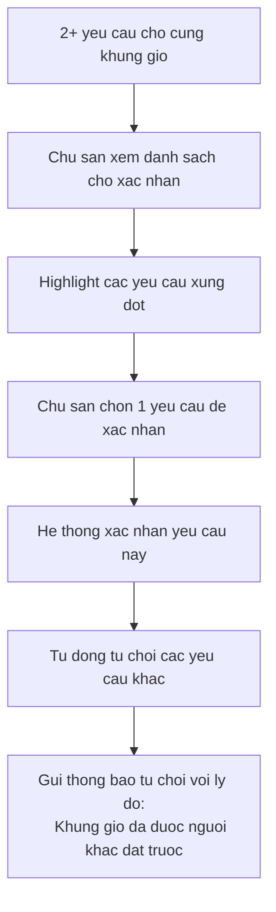
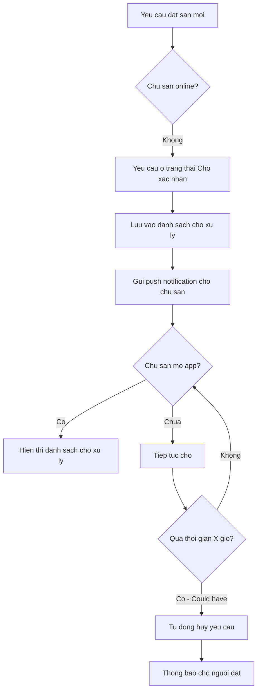
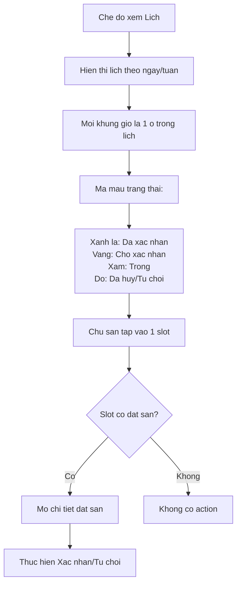
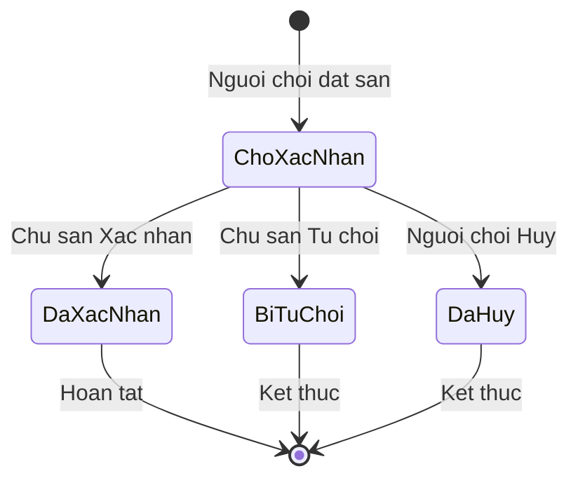

# F08: Quan ly Dat san - Activity Diagram

## Mo ta Tinh nang

Chu san quan ly cac yeu cau dat san: xem danh sach, xac nhan hoac tu choi. Co the xem lich dat san theo ngay/tuan va loc theo san con.

## Phu thuoc

- F07: Dat San (phai co yeu cau dat san de quan ly)

---

## Activity Diagram

---

## Cac Truong hop Dac biet

### 1. Nhieu dat san cho cung khung gio

### 2. Chu san khong truc tuyen

### 3. Xem lich dat san dang Calendar

---

## Luu do Trang thai Dat san (Tu goc nhin Chu san)

---

## Ghi chu Thiet ke

1. **Hien thi trang thai ro rang**: Mau sac va icon khac nhau cho moi trang thai
2. **Uu tien Cho xac nhan**: Mac dinh hien thi danh sach Cho xac nhan truoc
3. **Thong bao real-time**: Khi co yeu cau moi, hien thi badge va push notification
4. **Ly do tu choi bat buoc**: Giup nguoi choi hieu ly do va co the dat lai
5. **Xung dot dong thoi**: Khi xac nhan 1 yeu cau, tu dong xu ly cac yeu cau xung dot

---

## Acceptance Criteria

- [ ] Chu san nhan thong bao khi co yeu cau dat san moi
- [ ] Hien thi danh sach dat san theo trang thai (Cho xac nhan/Da xac nhan/Tat ca)
- [ ] Chu san co the xem chi tiet dat san: Thong tin nguoi dat, San, Khung gio, Ghi chu
- [ ] Chu san co the Chap nhan hoac Tu choi dat san
- [ ] Khi tu choi, chu san co the nhap ly do
- [ ] Xem lich dat san dang Lich theo ngay/tuan
- [ ] Loc dat san theo san con
