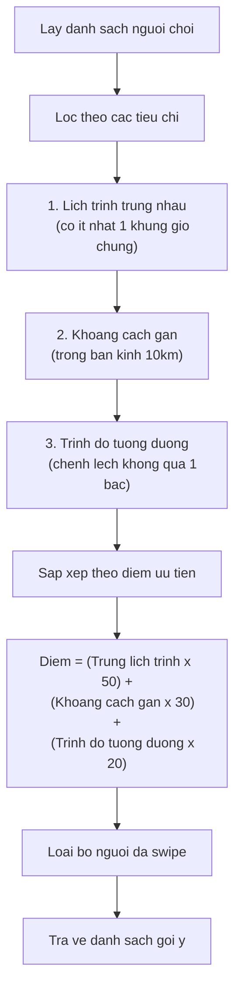
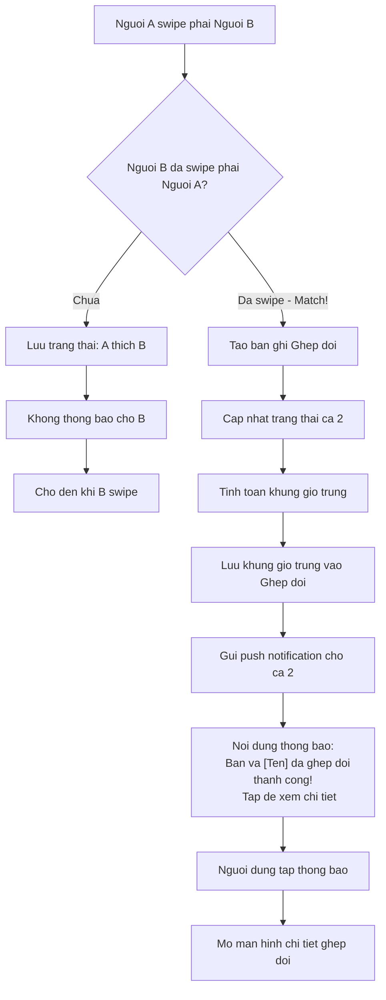
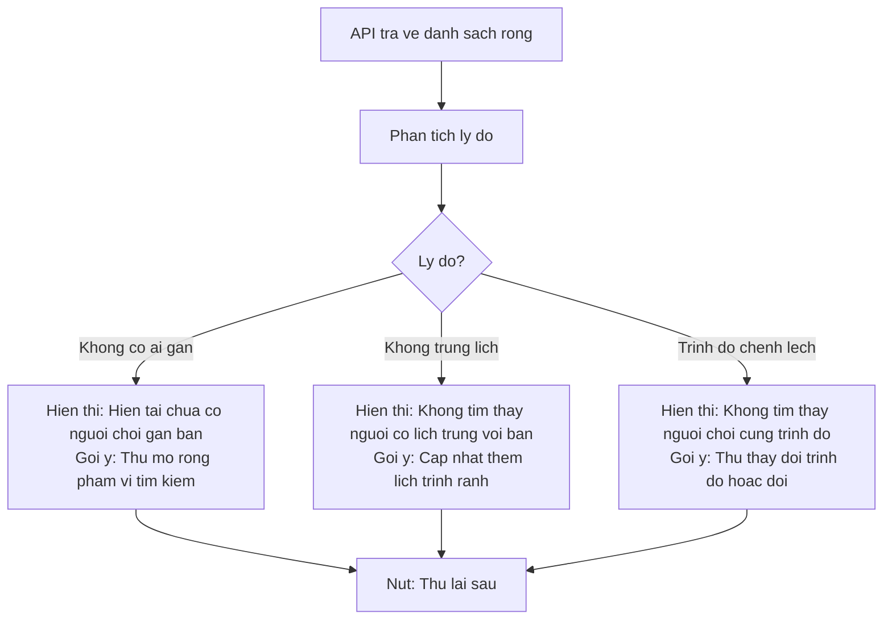
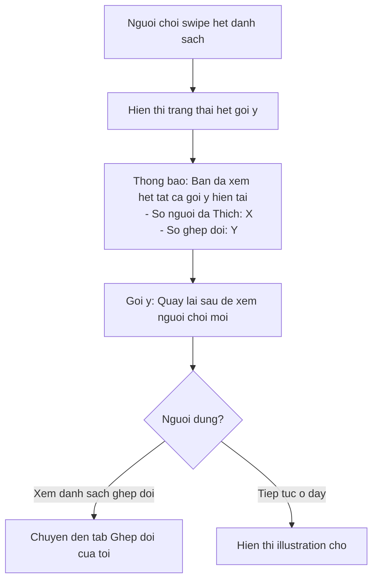
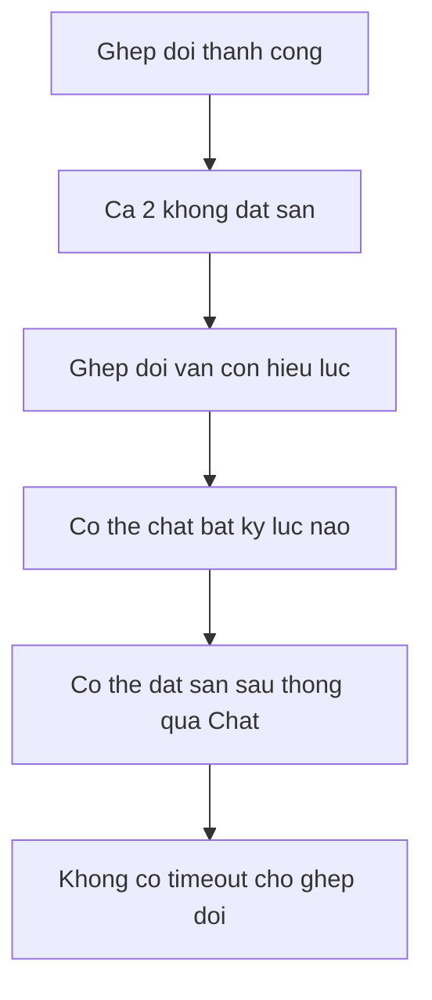

# F09: Ghep doi Nguoi choi - Tim Doi thu (Danh don) - Activity Diagram

## Mo ta Tinh nang

Nguoi choi tim doi thu danh don bang co che swipe. He thong goi y dua tren vi tri, trinh do va lich trinh. Khi ca 2 nguoi cung swipe phai (Thich), tao ghep doi va chuyen den dat san.

## Phu thuoc

- F02: Quan ly Ho so Nguoi dung (can co thong tin trinh do, lich trinh)
- F07: Dat San (sau khi ghep doi thanh cong)

---

## Thuat toan Ghep doi

### Thu tu Uu tien Goi y



### Chi tiet Tinh diem

| Tieu chi | Dieu kien | Diem |
|----------|-----------|------|
| Lich trinh | Trung 3+ khung gio | 50 |
| Lich trinh | Trung 1-2 khung gio | 30 |
| Lich trinh | Khong trung | 0 (loai) |
| Khoang cach | < 3km | 30 |
| Khoang cach | 3-5km | 20 |
| Khoang cach | 5-10km | 10 |
| Khoang cach | > 10km | 0 (loai) |
| Trinh do | Cung bac | 20 |
| Trinh do | Chenh 1 bac | 10 |
| Trinh do | Chenh 2+ bac | 0 (loai) |

---

## Activity Diagram Chinh

```mermaid
flowchart TD
    Start([Bat dau]) --> A[Nguoi choi mo tab Tim Doi thu]

    A --> B{Da thiet lap lich trinh?}
    B -->|Chua| C[Hien thi thong bao: Vui long thiet lap lich trinh de tim doi thu]
    C --> D[Nut: Di den Thiet lap lich trinh]
    D --> E[Chuyen den man hinh Ho so > Lich trinh]
    E --> End1([Ket thuc - Chuyen den Ho so])

    B -->|Da thiet lap| F{Da thiet lap trinh do?}
    F -->|Chua| G[Hien thi thong bao: Vui long khai bao trinh do]
    G --> H[Nut: Di den Khai bao trinh do]
    H --> I[Chuyen den man hinh Ho so > Trinh do]
    I --> End2([Ket thuc - Chuyen den Ho so])

    F -->|Da thiet lap| J[Goi API lay danh sach goi y]

    J --> K{API tra ve ket qua?}
    K -->|Loi mang| L[Hien thi: Loi ket noi, vui long thu lai]
    L --> M[Nut: Thu lai]
    M --> J

    K -->|Thanh cong| N{Co nguoi choi phu hop?}
    N -->|Khong| O[Hien thi: Hien tai khong co nguoi choi phu hop gan ban]
    O --> P[Goi y: Mo rong pham vi tim kiem hoac kiem tra lai sau]
    P --> End3([Ket thuc])

    N -->|Co| Q[Hien thi the nguoi choi dau tien]

    Q --> R["Thong tin tren the:
    - Anh dai dien (lon)
    - Ten
    - Tuoi
    - Trinh do (1-5 sao)
    - Khoang cach (VD: 2.5km)
    - So khung gio trung (VD: 3 khung gio chung)"]

    R --> S[Nguoi choi thuc hien thao tac]

    S --> T{Thao tac?}

    T -->|Swipe trai| U[Ghi nhan: Bo qua nguoi nay]
    T -->|Swipe phai| V[Ghi nhan: Thich nguoi nay]
    T -->|Tap vao the| W[Mo xem chi tiet ho so]

    %% Nhanh Swipe trai
    U --> X[Luu vao lich su da swipe]
    X --> Y{Con nguoi choi khac?}
    Y -->|Co| Z[Hien thi the tiep theo voi animation]
    Y -->|Khong| AA[Hien thi: Ban da xem het goi y]
    Z --> S
    AA --> AB[Goi y: Quay lai sau de xem goi y moi]
    AB --> End4([Ket thuc])

    %% Nhanh Swipe phai
    V --> AC[Gui thong tin Thich den server]
    AC --> AD{Nguoi kia da Thich minh chua?}
    AD -->|Chua| AE[Luu cho xu ly sau]
    AE --> Y

    AD -->|Da Thich - GHEP DOI THANH CONG| AF[Hien thi animation Ghep doi thanh cong!]
    AF --> AG["Hien thi:
    - Anh ca 2 nguoi
    - Chuc mung! Ban va [Ten] da ghep doi
    - Cac khung gio trung nhau"]

    AG --> AH{So khung gio trung?}
    AH -->|Dung 1 khung| AI[Hien thi: Khung gio trung: [Chi tiet]]
    AI --> AJ[Nut: Dat san ngay / Chat truoc]

    AH -->|Nhieu khung gio| AK[Hien thi danh sach khung gio trung]
    AK --> AL[Nguoi dung chon 1 khung gio]
    AL --> AJ

    AJ --> AM{Nguoi dung chon?}
    AM -->|Dat san ngay| AN[Chuyen den man hinh Tim san & Dat san]
    AM -->|Chat truoc| AO[Chuyen den man hinh Chat]
    AM -->|Dong| AP[Dong popup, tiep tuc swipe]

    AN --> End5([Ket thuc - Den Dat san])
    AO --> End6([Ket thuc - Den Chat])
    AP --> Y

    %% Nhanh Xem chi tiet
    W --> AQ["Hien thi ho so day du:
    - Anh dai dien lon
    - Ten, Tuoi, Gioi tinh
    - Trinh do chi tiet
    - Vi tri (khoang cach)
    - Lich trinh ranh
    - So tran da choi (neu co)"]

    AQ --> AR[Cac nut: Thich / Bo qua / Dong]
    AR --> AS{Nguoi dung chon?}
    AS -->|Thich| V
    AS -->|Bo qua| U
    AS -->|Dong| S
```

---

## Luong Thong bao Ghep doi



---

## Xu ly Cac Truong hop Dac biet

### 1. Khong co nguoi choi phu hop



### 2. Da swipe het tat ca goi y



### 3. Ghep doi nhung khong ai dat san



---

## Giao dien The Nguoi choi

```
+----------------------------------+
|                                  |
|                                  |
|        [Anh dai dien lon]        |
|                                  |
|                                  |
+----------------------------------+
|  Ten Nguoi choi, 28              |
|  ★★★★☆ Trinh do 4                |
|  📍 2.5 km                       |
|  🕐 3 khung gio chung            |
+----------------------------------+
|                                  |
|   [X Bo qua]    [❤ Thich]       |
|                                  |
+----------------------------------+
```

---

## Acceptance Criteria

- [ ] Hien thi the ho so nguoi choi voi: Anh dai dien, Ten, Tuoi, Trinh do, Khoang cach
- [ ] Swipe phai = Thich, Swipe trai = Bo qua
- [ ] Ghep doi xay ra khi ca 2 nguoi cung Thich nhau
- [ ] Goi y dua tren: Vi tri (gan nhat), Trinh do (tuong duong), Lich trinh (trung khung gio)
- [ ] Khi ghep doi thanh cong:
  - Neu trung dung 1 khung gio ranh -> Chuyen den man hinh dat san
  - Neu trung nhieu khung gio -> Hien thi danh sach khung gio de chon, sau do dat san
- [ ] Nguoi dung nhan thong bao khi co ghep doi moi
- [ ] Xem danh sach cac ghep doi cua minh

---

## Ghi chu Ky thuat

1. **Pre-loading**: Tai truoc 5-10 the de swipe muot
2. **Animation**: Swipe animation 300ms, Match animation 500ms
3. **Cache**: Cache danh sach goi y, refresh moi 5 phut
4. **Debounce**: Khong cho swipe qua nhanh (min 300ms giua cac swipe)
5. **Undo**: Co the Undo swipe trai trong 3 giay (optional - Could have)
