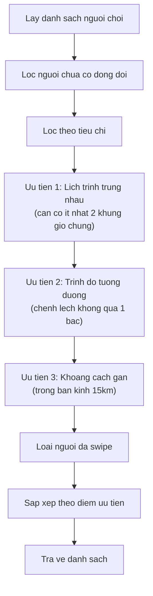
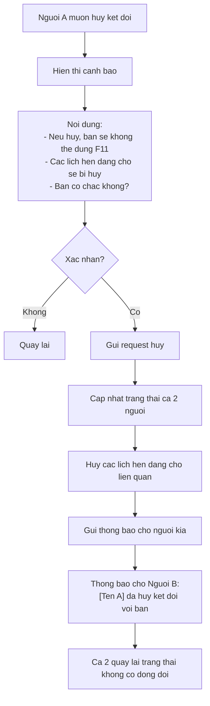
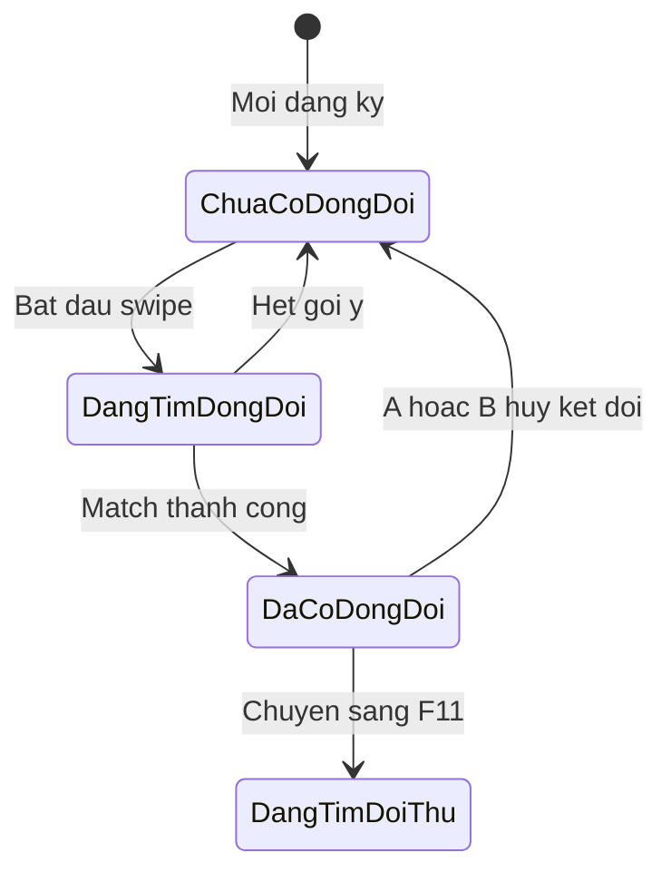
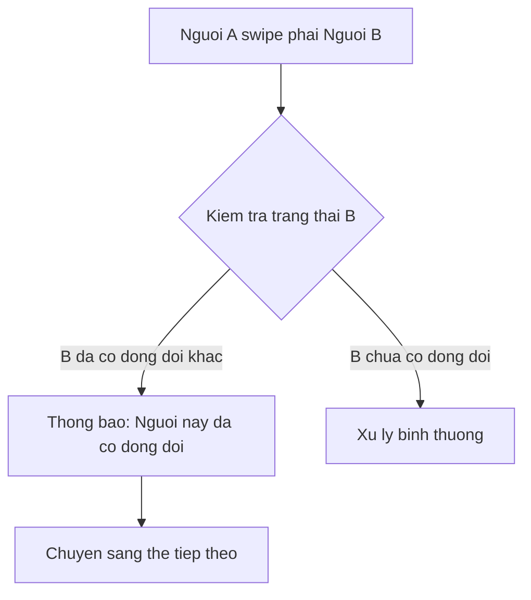
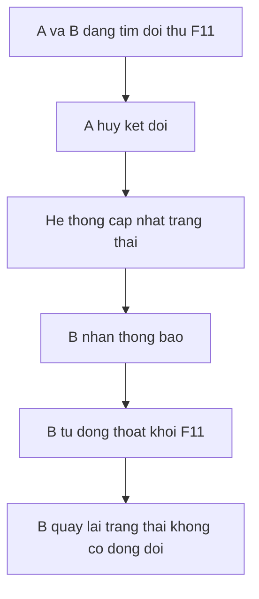

# F10: Ghep doi Nguoi choi - Tim Ban choi - Activity Diagram

## Mo ta Tinh nang

Nguoi choi tim ban choi doi de tao thanh 1 doi (team). Sau khi ghep doi, 2 nguoi tro thanh dong doi va co the cung tim doi thu (F11).

## Phu thuoc

- F02: Quan ly Ho so Nguoi dung (can co thong tin trinh do, lich trinh)

---

## Activity Diagram Chinh

```mermaid
flowchart TD
    Start([Bat dau]) --> A[Nguoi choi mo tab Tim Ban choi]

    A --> B{Nguoi choi da co dong doi?}
    B -->|Co| C[Hien thi thong tin dong doi hien tai]
    C --> D["Thong tin:
    - Anh dai dien dong doi
    - Ten dong doi
    - Trinh do
    - Thoi gian ket doi"]
    D --> E[Nut: Huy ket doi / Chat / Tim doi thu]
    E --> F{Nguoi dung chon?}
    F -->|Huy ket doi| G[Hien thi xac nhan huy]
    F -->|Chat| H[Chuyen den man hinh Chat]
    F -->|Tim doi thu| I[Chuyen den F11 - Tim Doi thi dau]

    G --> J{Xac nhan huy?}
    J -->|Co| K[Gui request huy ket doi]
    J -->|Khong| E

    K --> L{Huy thanh cong?}
    L -->|Co| M[Thong bao cho dong doi]
    L -->|Khong| N[Hien thi loi]

    M --> O[Cap nhat trang thai: Khong co dong doi]
    O --> P[Hien thi: Da huy ket doi voi [Ten]]
    P --> Q[Chuyen sang che do tim ban choi]
    N --> E

    B -->|Chua| Q

    Q --> R{Da thiet lap lich trinh va trinh do?}
    R -->|Chua| S[Hien thi thong bao thieu thong tin]
    S --> T[Nut: Di den Ho so]
    T --> End1([Ket thuc - Chuyen den Ho so])

    R -->|Da thiet lap| U[Goi API lay danh sach goi y ban choi]

    U --> V{API tra ve ket qua?}
    V -->|Loi| W[Hien thi loi ket noi]
    W --> X[Nut: Thu lai]
    X --> U

    V -->|Thanh cong| Y{Co nguoi choi phu hop?}
    Y -->|Khong| Z[Hien thi: Khong tim thay ban choi phu hop]
    Z --> AA[Goi y mo rong pham vi hoac doi]
    AA --> End2([Ket thuc])

    Y -->|Co| AB[Hien thi the nguoi choi dau tien]

    AB --> AC["Thong tin tren the:
    - Anh dai dien
    - Ten, Tuoi
    - Trinh do
    - Khoang cach
    - Lich trung (so khung gio)
    - Trang thai dong doi hien tai"]

    AC --> AD[Nguoi choi thuc hien swipe]

    AD --> AE{Thao tac?}
    AE -->|Swipe trai| AF[Bo qua]
    AE -->|Swipe phai| AG[Thich]
    AE -->|Tap the| AH[Xem chi tiet]

    AF --> AI[Luu vao lich su]
    AI --> AJ{Con nguoi khac?}
    AJ -->|Co| AB
    AJ -->|Khong| AK[Het goi y]
    AK --> End3([Ket thuc])

    AG --> AL[Gui Thich den server]
    AL --> AM{Nguoi kia da Thich?}
    AM -->|Chua| AI

    AM -->|Da Thich - MATCH| AN[Ghep doi thanh cong!]
    AN --> AO["Hien thi:
    - Animation ket doi
    - Anh 2 nguoi
    - Chuc mung! Ban va [Ten] da tro thanh dong doi"]

    AO --> AP[Luu trang thai dong doi cho ca 2]
    AP --> AQ[Gui thong bao cho ca 2]

    AQ --> AR["Tuy chon:
    - Chat voi dong doi
    - Tim doi thu ngay
    - Dong"]

    AR --> AS{Chon?}
    AS -->|Chat| H
    AS -->|Tim doi thu| I
    AS -->|Dong| AT[Hien thi trang thai da co dong doi]
    AT --> E

    AH --> AU[Hien thi ho so chi tiet]
    AU --> AV[Cac nut: Thich / Bo qua / Dong]
    AV --> AW{Chon?}
    AW -->|Thich| AG
    AW -->|Bo qua| AF
    AW -->|Dong| AD

    H --> End4([Ket thuc - Chat])
    I --> End5([Ket thuc - Tim doi thu])
```

---

## Thuat toan Goi y Ban choi



**Luu y**: Tim ban choi doi hoi su tuong thich cao hon tim doi thu, nen tieu chi lich trinh nghiem ngat hon (can 2+ khung gio chung).

---

## Xu ly Huy ket doi



---

## Trang thai Dong doi



---

## Truong hop Dac biet

### 1. Nguoi duoc chon da co dong doi moi



### 2. Dong doi huy ket doi khi dang tim doi thu



---

## Giao dien Trang thai Dong doi

### Khi chua co dong doi
```
+----------------------------------+
|        TIM BAN CHOI DOI          |
+----------------------------------+
|                                  |
|      [Giao dien swipe the]       |
|                                  |
+----------------------------------+
```

### Khi da co dong doi
```
+----------------------------------+
|        DONG DOI CUA BAN          |
+----------------------------------+
|    [Avatar lon cua dong doi]     |
|                                  |
|    Nguyen Van A                  |
|    ★★★★☆ Trinh do 4              |
|    Ket doi tu: 25/12/2024        |
+----------------------------------+
|  [Huy ket doi]  [Chat]  [Tim     |
|                          doi thu]|
+----------------------------------+
```

---

## Acceptance Criteria

- [ ] Giao dien swipe tuong tu F09
- [ ] Goi y dua tren: Vi tri, Trinh do tuong duong, Lich trinh trung
- [ ] Khi ghep doi, 2 nguoi tro thanh "Dong doi" (doi)
- [ ] Moi nguoi chi co the co 1 dong doi tai 1 thoi diem
- [ ] Co the huy lien ket dong doi bat ky luc nao
- [ ] Sau khi co dong doi, co the su dung F11 de tim doi thi dau

---

## Ghi chu Thiet ke

1. **Rang buoc 1 dong doi**: He thong phai dam bao 1 nguoi chi co 1 dong doi
2. **Thong bao dong bo**: Khi huy ket doi, thong bao realtime cho nguoi kia
3. **Lich trinh ket hop**: Khi da co dong doi, lich trinh doi = giao cua 2 lich trinh
4. **Trinh do doi**: Tinh trung binh hoac lay trinh do cao hon
