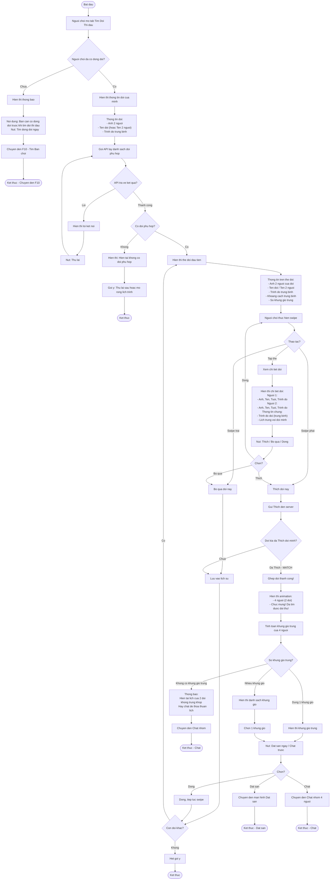
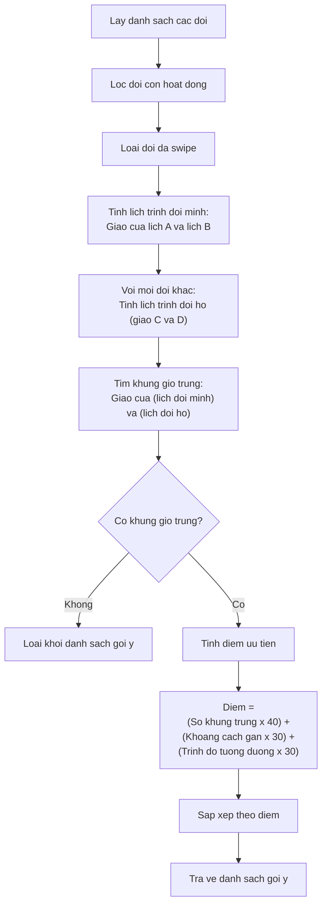
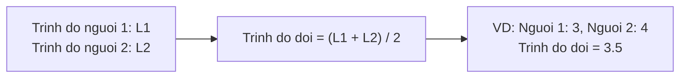
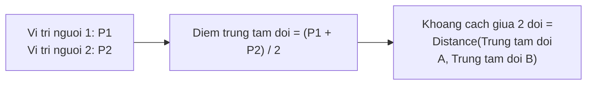
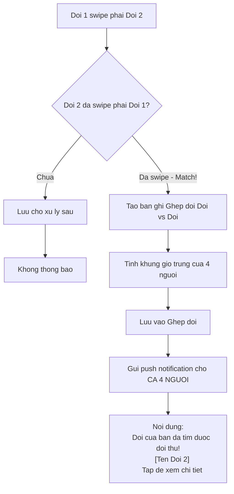
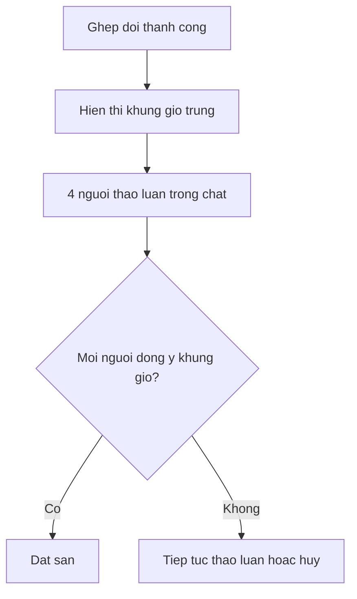
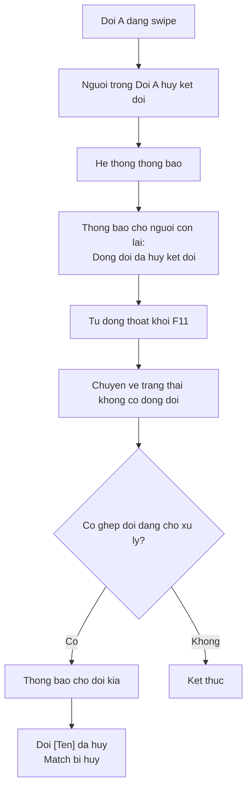
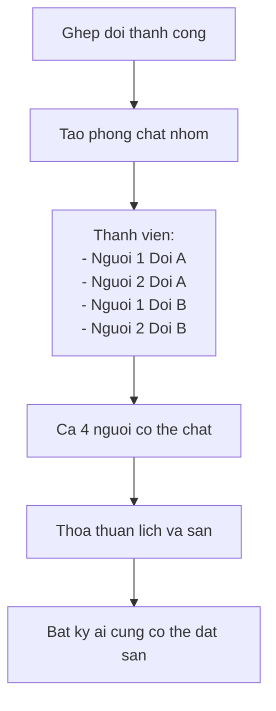
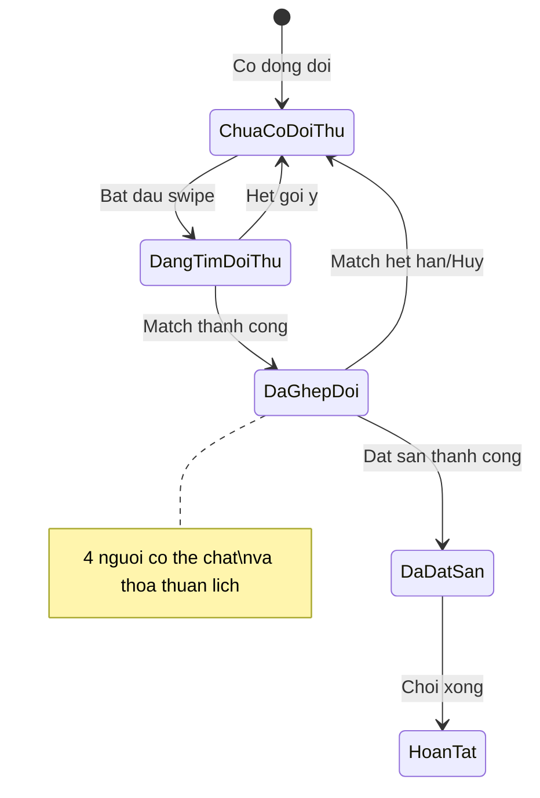

# F11: Ghep doi Nguoi choi - Tim Doi Thi dau (Doi vs Doi) - Activity Diagram

## Mo ta Tinh nang

Sau khi co dong doi (F10), doi co the tim doi thu khac de danh doi. Tuong tu F09 nhung ghep doi giua 2 doi.

## Phu thuoc

- F02: Quan ly Ho so Nguoi dung
- F10: Ghep doi Nguoi choi - Tim Ban choi (phai co dong doi)
- F07: Dat San (sau khi ghep doi thanh cong)

---

## Activity Diagram Chinh



---

## Thuat toan Goi y Doi Thi dau



### Tinh Trinh do Doi



### Tinh Khoang cach Doi



---

## Xu ly Thong bao Ghep doi



---

## Giao dien The Doi

```
+----------------------------------+
|  [Avatar A]     [Avatar B]       |
|      \             /             |
|       \           /              |
|        [Ten Doi]                 |
+----------------------------------+
|  ★★★★☆ Trinh do 3.5              |
|  📍 5 km                         |
|  🕐 2 khung gio chung            |
+----------------------------------+
|                                  |
|   [X Bo qua]    [❤ Thich]       |
|                                  |
+----------------------------------+
```

---

## Truong hop Dac biet

### 1. Mot nguoi trong doi khong ranh khung gio da chon



### 2. Dong doi huy ket doi giua chung



### 3. Chat nhom 4 nguoi



---

## Luong Trang thai Ghep doi Doi vs Doi



---

## Acceptance Criteria

- [ ] Chi kha dung khi nguoi choi da co dong doi
- [ ] Hien thi the ho so cua doi: Anh dai dien 2 nguoi, Ten doi/Ten 2 nguoi, Trinh do trung binh
- [ ] Swipe de tim doi thu
- [ ] Khi ghep doi:
  - Neu trung 1 khung gio -> Dat san
  - Neu trung nhieu khung gio -> Chon khung gio roi dat san
- [ ] Ca 4 nguoi deu nhan thong bao khi ghep doi

---

## Ghi chu Thiet ke

1. **Dong bo lich**: Lich doi = Giao lich cua 2 thanh vien
2. **Chat nhom**: Sau khi match, tao chat nhom 4 nguoi tu dong
3. **Quyen dat san**: Bat ky ai trong 4 nguoi cung co the dat san
4. **Huy match**: Neu 1 nguoi huy ket doi, match voi doi kia cung bi huy
5. **Thong bao**: Gui thong bao cho ca 4 nguoi cung luc
