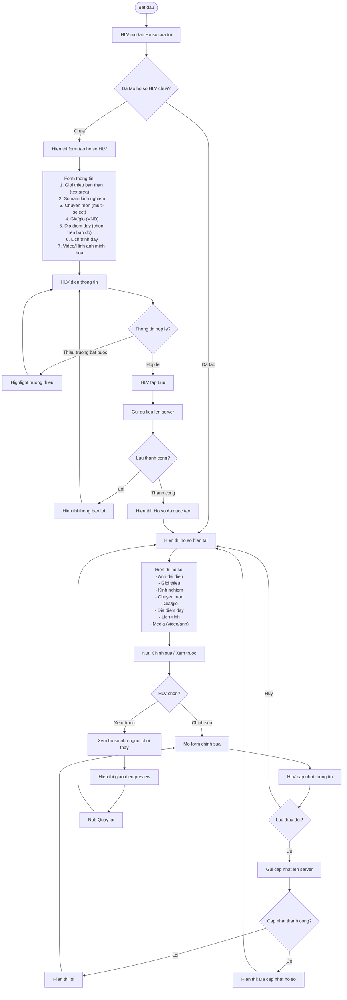
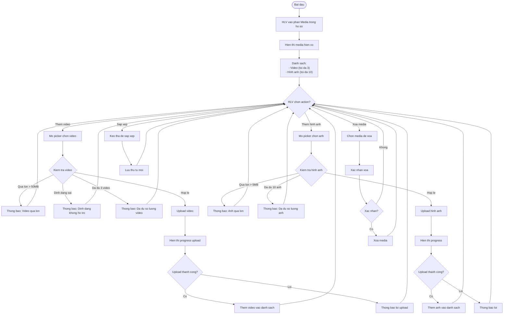
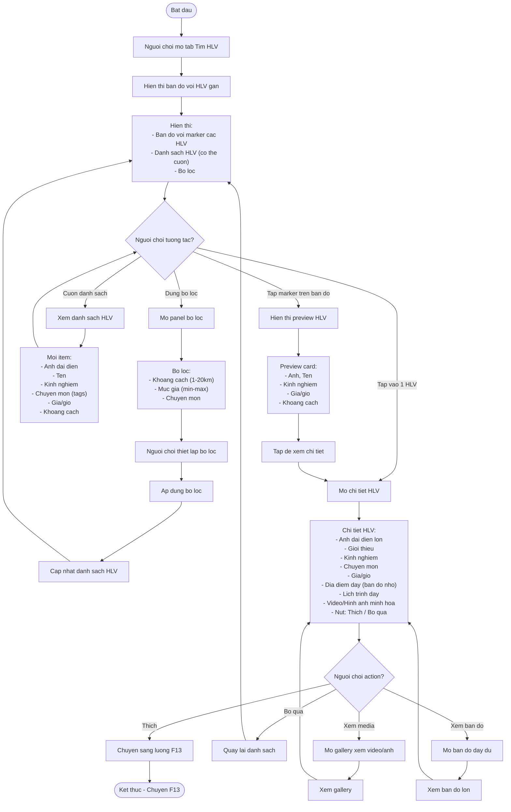
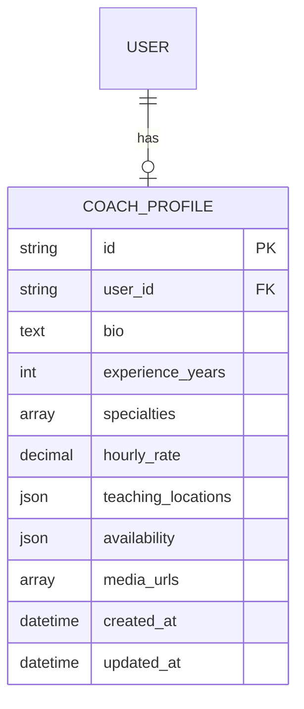
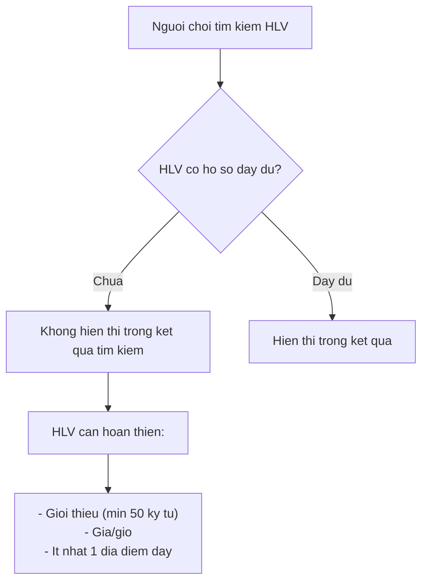
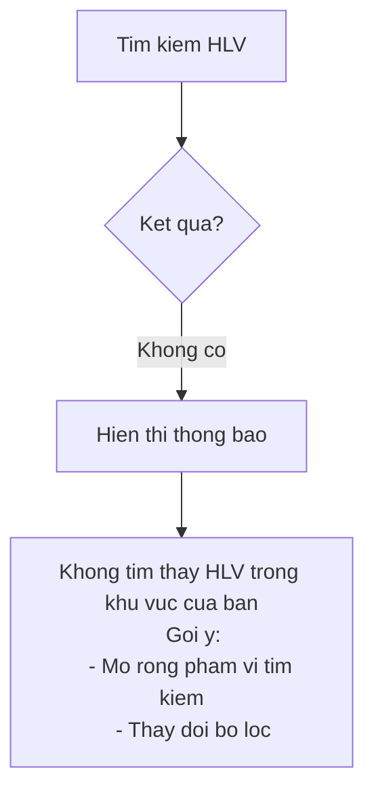

# F12: Ho so HLV va Tim kiem - Activity Diagram

## Mo ta Tinh nang

Huan luyen vien tao ho so voi thong tin chuyen mon. Nguoi choi co the tim kiem va xem ho so HLV.

## Phu thuoc

- F01: Dang ky va Xac thuc Nguoi dung (HLV phai dang ky vai tro HLV)
- F02: Quan ly Ho so Nguoi dung (thong tin co ban)

---

## Activity Diagram - HLV Tao/Cap nhat Ho so

---

## Activity Diagram - HLV Quan ly Media

---

## Activity Diagram - Nguoi choi Tim kiem HLV

---

## Cau truc Du lieu Ho so HLV

### Chi tiet Fields

| Field | Type | Required | Description |
|-------|------|----------|-------------|
| bio | Text | No | Gioi thieu ban than (max 1000 ky tu) |
| experience_years | Integer | No | So nam kinh nghiem (0-50) |
| specialties | Array[String] | No | Chuyen mon: Ky thuat co ban, Chien thuat, The luc... |
| hourly_rate | Decimal | No | Gia/gio (VND) |
| teaching_locations | Array[GeoPoint] | No | Cac dia diem day |
| availability | JSON | No | Lich trinh day theo ngay/gio |
| media | Array[URL] | No | Video (max 3) + Hinh anh (max 10) |

---

## Truong hop Dac biet

### 1. HLV chua hoan thien ho so

### 2. Khong tim thay HLV

---

## Acceptance Criteria

### HLV
- [ ] HLV co the tao ho so voi: Gioi thieu, Kinh nghiem, Chuyen mon, Gia/gio, Dia diem day
- [ ] HLV co the tai len video/hinh anh minh hoa
- [ ] HLV co the thiet lap lich trinh day

### Nguoi choi
- [ ] Nguoi choi co the tim HLV theo vi tri
- [ ] Nguoi choi co the xem chi tiet ho so HLV

---

## Ghi chu Thiet ke

1. **Validation ho so**: HLV can hoan thien ho so truoc khi hien thi trong tim kiem
2. **Media optimization**: Nen video/anh truoc khi upload
3. **Cache**: Cache danh sach HLV, refresh khi thay doi vi tri hoac bo loc
4. **Map clustering**: Nhom cac HLV gan nhau khi zoom out
