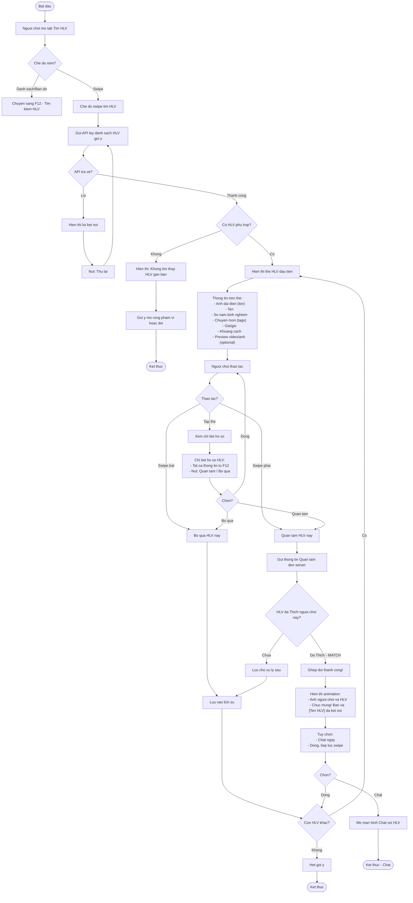
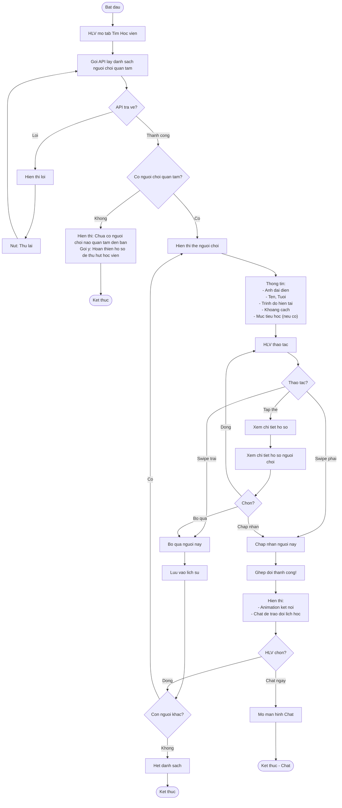
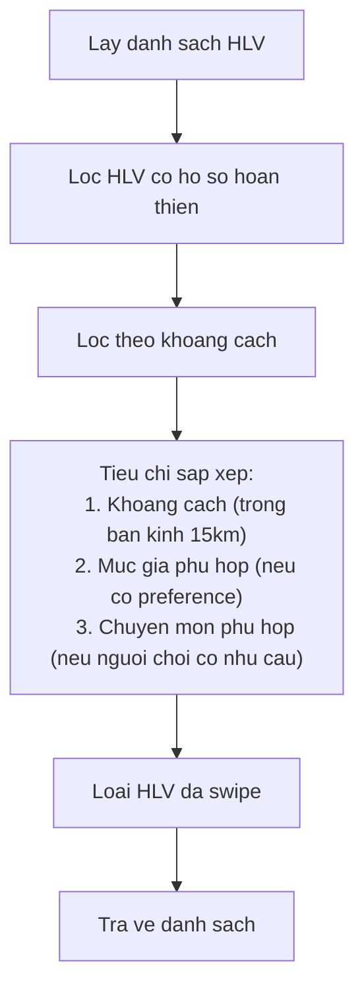
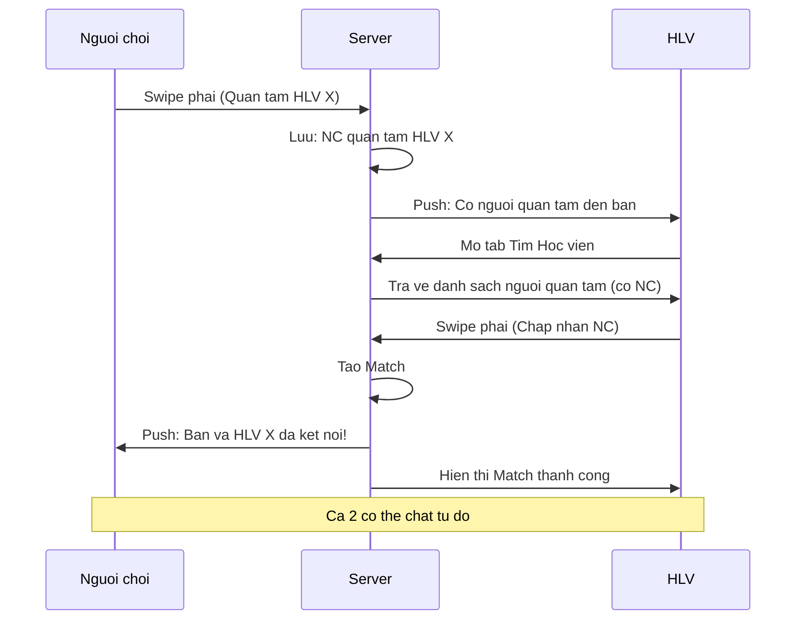
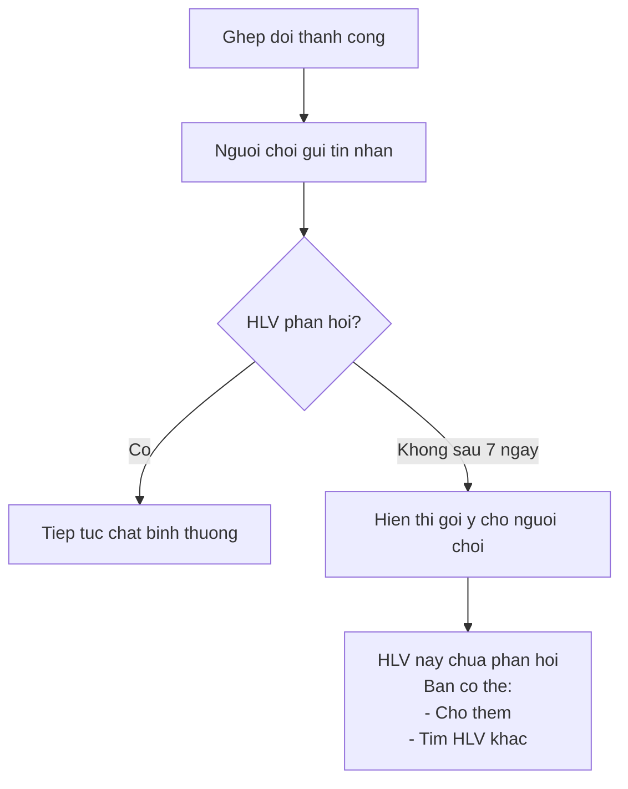
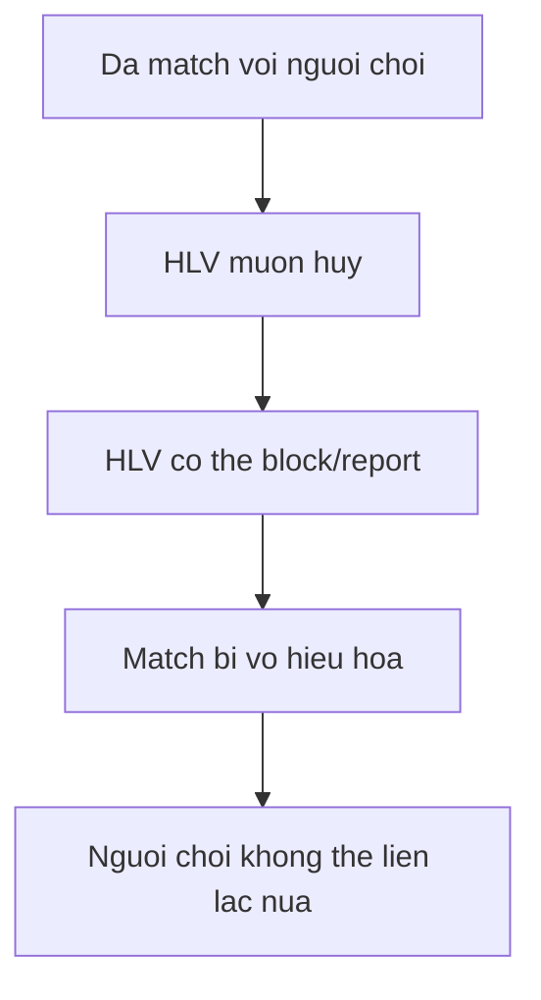

# F13: Ghep doi voi HLV - Activity Diagram

## Mo ta Tinh nang

Nguoi choi tim HLV bang cach swipe. Khi ghep doi, ca 2 co the chat de sap xep lich hoc.

## Phu thuoc

- F12: Ho so HLV va Tim kiem (HLV phai co ho so)
- F02: Quan ly Ho so Nguoi dung

---

## Activity Diagram - Nguoi choi Tim HLV (Swipe)



---

## Activity Diagram - HLV Tim Hoc vien (Swipe)



---

## Thuat toan Goi y HLV cho Nguoi choi



---

## Luong Ghep doi HLV - Nguoi choi



---

## Khac biet voi F09 (Tim Doi thu)

| Tieu chi | F09 - Tim Doi thu | F13 - Tim HLV |
|----------|-------------------|---------------|
| Doi tuong swipe | Nguoi choi <-> Nguoi choi | Nguoi choi -> HLV |
| Hai chieu | Ca 2 swipe nhau | NC swipe truoc, HLV xem va chap nhan |
| Sau match | Dat san | Chat de thoa thuan |
| Lich trinh | Tu dong matching | Tu thoa thuan |
| Muc tieu | Thi dau | Hoc |

---

## Truong hop Dac biet

### 1. HLV khong phan hoi sau khi ghep doi



### 2. HLV muon tu choi sau khi da match



---

## Giao dien The HLV

```
+----------------------------------+
|                                  |
|        [Anh dai dien HLV]        |
|                                  |
+----------------------------------+
|  Nguyen Van A                    |
|  ⏱ 5 nam kinh nghiem            |
|  📍 3.2 km                       |
|  💰 300,000 VND/gio              |
+----------------------------------+
|  #Ky thuat  #Chien thuat        |
+----------------------------------+
|                                  |
|   [X Bo qua]    [❤ Quan tam]    |
|                                  |
+----------------------------------+
```

---

## Acceptance Criteria

- [ ] Hien thi the HLV voi: Anh dai dien, Ten, Kinh nghiem, Gia/gio, Khoang cach
- [ ] Swipe phai = Quan tam, Swipe trai = Bo qua
- [ ] Ghep doi khi ca Nguoi choi va HLV cung Thich nhau
- [ ] Sau khi ghep doi, mo khoa chat de trao doi chi tiet
- [ ] Khong tu dong dat san (tu thoa thuan)

---

## Ghi chu Thiet ke

1. **Uu tien HLV**: HLV la ben cung cap dich vu, nen HLV co quyen xem ai quan tam truoc
2. **Khong ep dat san**: Nguoi choi va HLV tu thoa thuan lich hoc qua chat
3. **Profile match**: Hien thi thong tin phu hop (trinh do nguoi choi, chuyen mon HLV)
4. **Notification**: Thong bao cho HLV khi co nguoi quan tam moi
