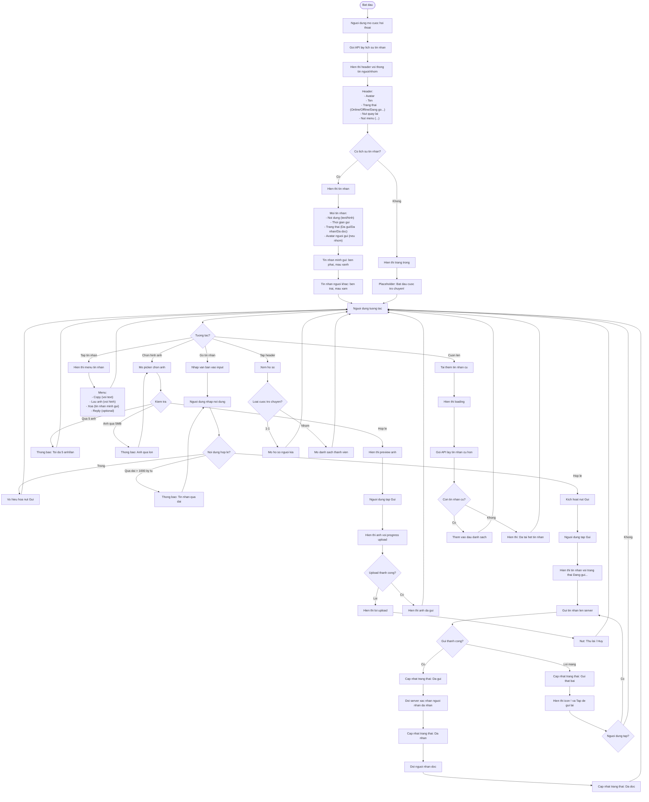
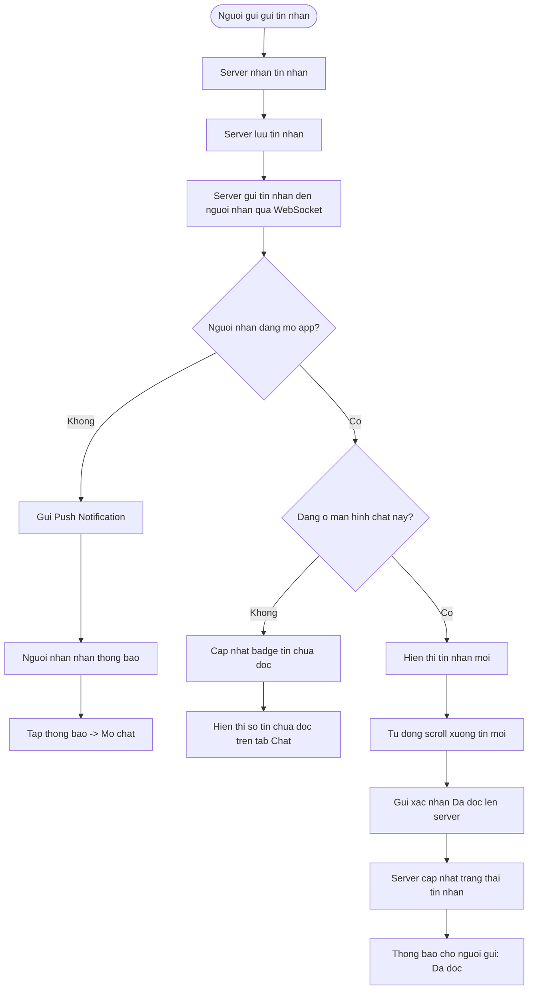
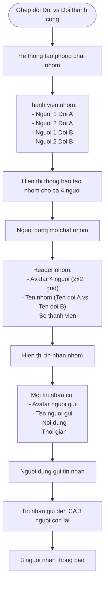
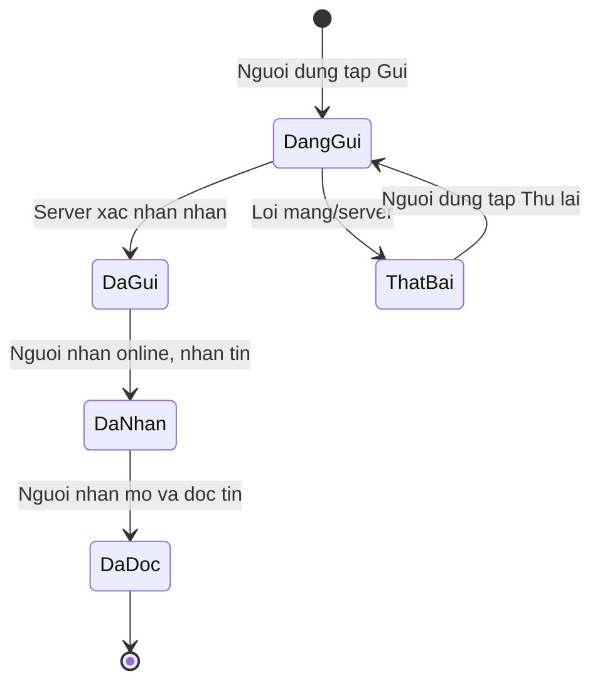
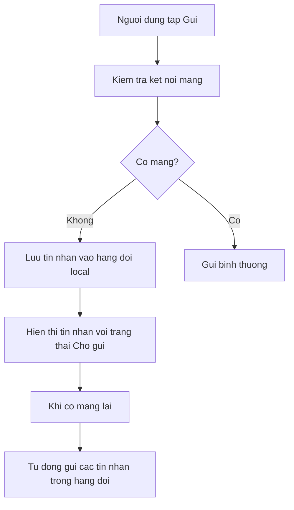
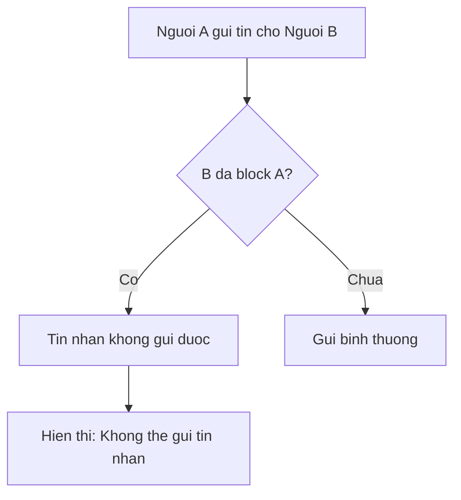
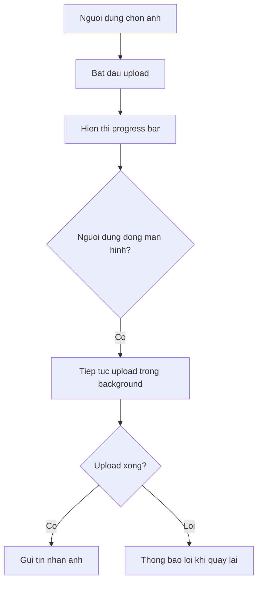

# F14: Chat trong Ung dung - Activity Diagram

## Mo ta Tinh nang

He thong chat cho phep nguoi dung da ghep doi nhan tin voi nhau. Ho tro tin nhan van ban va hinh anh.

## Phu thuoc

- F01: Dang ky va Xac thuc Nguoi dung
- Ghep doi tu: F09, F10, F11, F13 (phai co match truoc khi chat)

---

## Activity Diagram - Danh sach Cuoc hoi thoai

```mermaid
flowchart TD
    Start([Bat dau]) --> A[Nguoi dung mo tab Chat]

    A --> B[Goi API lay danh sach cuoc hoi thoai]

    B --> C{API tra ve?}
    C -->|Loi| D[Hien thi loi ket noi]
    D --> E[Nut: Thu lai]
    E --> B

    C -->|Thanh cong| F{Co cuoc hoi thoai nao?}
    F -->|Khong| G["Hien thi:
    Chua co cuoc tro chuyen nao
    Bat dau tim kiem de ket noi voi nguoi khac!"]
    G --> End1([Ket thuc])

    F -->|Co| H[Hien thi danh sach cuoc hoi thoai]

    H --> I["Moi cuoc hoi thoai hien thi:
    - Avatar nguoi/nhom
    - Ten nguoi/nhom
    - Tin nhan cuoi
    - Thoi gian tin nhan cuoi
    - Badge so tin chua doc (neu co)
    - Trang thai online/offline"]

    I --> J[Sap xep theo thoi gian tin nhan cuoi (moi nhat len dau)]

    J --> K[Nguoi dung tuong tac]
    K --> L{Tuong tac?}

    L -->|Tap vao cuoc hoi thoai| M[Mo man hinh chat]
    L -->|Swipe trai| N[Hien thi tuy chon]
    L -->|Pull to refresh| O[Lam moi danh sach]

    N --> P["Tuy chon:
    - Xoa cuoc tro chuyen
    - Tat thong bao
    - Block/Report"]

    P --> Q{Chon?}
    Q -->|Xoa| R[Xac nhan xoa]
    Q -->|Tat thong bao| S[Toggle thong bao]
    Q -->|Block| T[Block nguoi dung]
    Q -->|Huy| K

    R --> U{Xac nhan?}
    U -->|Co| V[Xoa cuoc tro chuyen khoi danh sach]
    U -->|Khong| K
    V --> K

    S --> W[Cap nhat trang thai thong bao]
    W --> K

    T --> X[Xac nhan block]
    X --> Y{Xac nhan?}
    Y -->|Co| Z[Block nguoi dung]
    Y -->|Khong| K
    Z --> AA[Xoa cuoc tro chuyen]
    AA --> K

    O --> B

    M --> End2([Ket thuc - Mo chat])
```

---

## Activity Diagram - Chat Chi tiet



---

## Activity Diagram - Nhan tin nhan (Realtime)



---

## Activity Diagram - Chat Nhom (4 nguoi - Doi vs Doi)



---

## Trang thai Tin nhan



### Icon Trang thai

| Trang thai | Icon | Mau |
|------------|------|-----|
| Dang gui | Dong ho | Xam |
| Da gui | 1 dau tick | Xam |
| Da nhan | 2 dau tick | Xam |
| Da doc | 2 dau tick | Xanh |
| That bai | Dau cham than | Do |

---

## Truong hop Dac biet

### 1. Mat mang khi gui tin nhan



### 2. Nguoi nhan block hoac report



### 3. Hinh anh chua upload xong



---

## Giao dien Chat

### Danh sach cuoc hoi thoai
```
+----------------------------------+
|         TIN NHAN                 |
+----------------------------------+
| [Avatar] Nguyen Van A            |
|          Chao ban!       10:30   |
|                          • 2     |
+----------------------------------+
| [Avatar] Nhom: Doi A vs Doi B    |
|          A: OK, hen gap    09:15 |
+----------------------------------+
| [Avatar] HLV Tran Van B          |
|          Tuan sau hoc nhe  Hom qua|
+----------------------------------+
```

### Man hinh chat chi tiet
```
+----------------------------------+
| <  Nguyen Van A           Online |
+----------------------------------+
|                                  |
|              Chao ban!     10:30 |
|              [tin nhan minh gui] |
|                                  |
| [Avatar]                         |
| Chao, ban khoe khong?      10:31 |
| [tin nhan nguoi khac]            |
|                                  |
|              Minh khoe!    10:32 |
|              [2 dau tick xanh]   |
+----------------------------------+
| [+] [_____Nhap tin nhan_____] [>]|
+----------------------------------+
```

---

## Acceptance Criteria

- [ ] Chi mo chat giua nhung nguoi da ghep doi
- [ ] Gui va nhan tin nhan van ban
- [ ] Gui hinh anh (toi da 5 anh/lan, moi anh toi da 5MB)
- [ ] Hien thi trang thai tin nhan: Da gui, Da nhan, Da doc
- [ ] Hien thi thoi gian gui tin nhan
- [ ] Thong bao day khi co tin nhan moi (khi ung dung o nen)
- [ ] Hien thi so tin nhan chua doc tren bieu tuong chat

---

## Ghi chu Ky thuat

1. **WebSocket**: Su dung WebSocket de nhan tin nhan realtime
2. **Offline queue**: Luu tin nhan chua gui vao local, tu dong gui khi co mang
3. **Image compression**: Nen anh truoc khi upload (max 1MB sau nen)
4. **Pagination**: Tai 20 tin nhan moi lan, cuon len de tai them
5. **Read receipts**: Gui read receipt khi nguoi dung scroll den tin nhan
6. **Typing indicator**: Hien thi "Dang go..." khi nguoi kia dang go (optional)
