# F15: Thong bao Day - Activity Diagram

## Mo ta Tinh nang

He thong gui thong bao day cho cac su kien quan trong: ghep doi, tin nhan, dat san, nhac lich.

## Phu thuoc

- F01: Dang ky va Xac thuc Nguoi dung

---

## Cac Loai Thong bao

| Ma | Loai | Nguoi nhan | Su kien kich hoat | Uu tien |
|----|------|------------|-------------------|---------|
| N01 | GHEP_DOI_MOI | Nguoi choi/HLV | 2 nguoi ghep doi thanh cong | Cao |
| N02 | TIN_NHAN_MOI | Tat ca | Nhan tin nhan moi | Cao |
| N03 | DAT_SAN_MOI | Chu san | Co yeu cau dat san moi | Cao |
| N04 | DAT_SAN_XAC_NHAN | Nguoi choi | Dat san duoc xac nhan | Cao |
| N05 | DAT_SAN_TU_CHOI | Nguoi choi | Dat san bi tu choi | Cao |
| N06 | NHAC_LICH_DANH | Nguoi choi | 1 gio truoc gio danh | Trung binh |
| N07 | DONG_DOI_HUY | Nguoi choi | Dong doi huy ket doi | Cao |

---

## Activity Diagram - Gui Thong bao

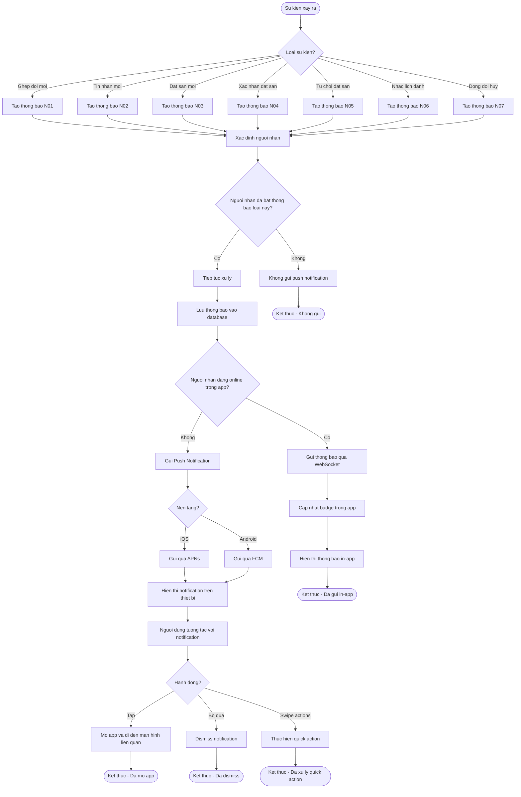

---

## Activity Diagram - Nguoi dung Quan ly Thong bao

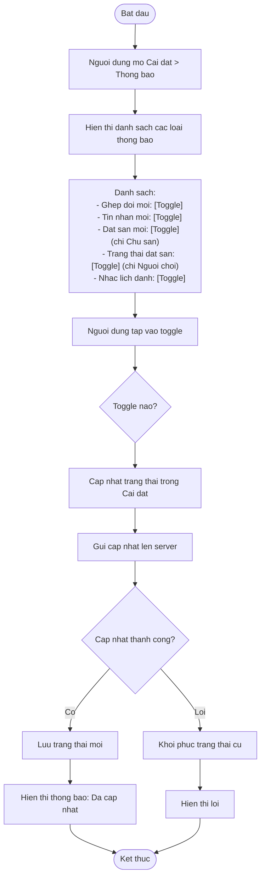

---

## Activity Diagram - Nhan Thong bao trong App

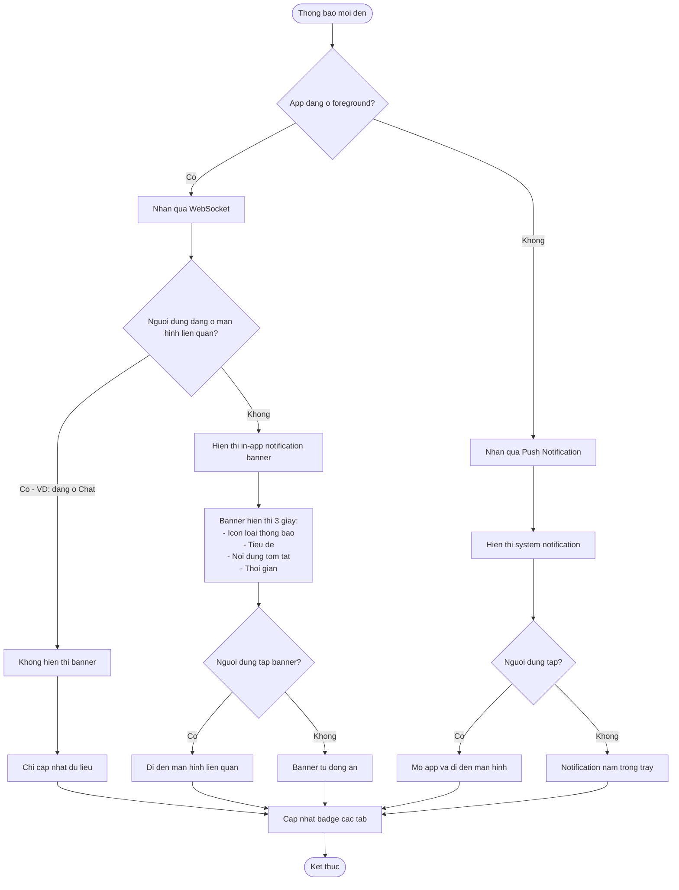

---

## Chi tiet Noi dung Thong bao

### N01: Ghep doi Moi

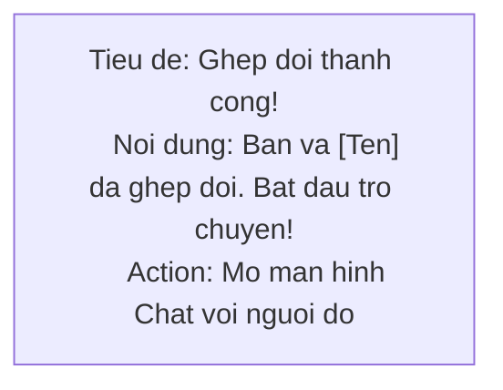

### N02: Tin nhan Moi

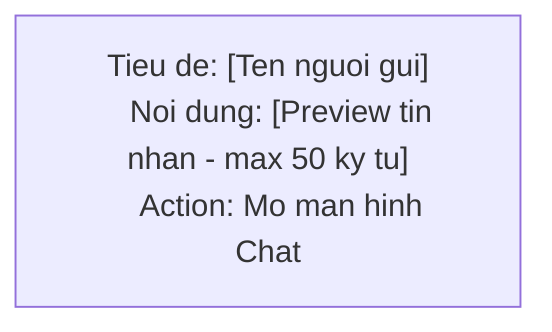

### N03: Dat san Moi (Chu san)

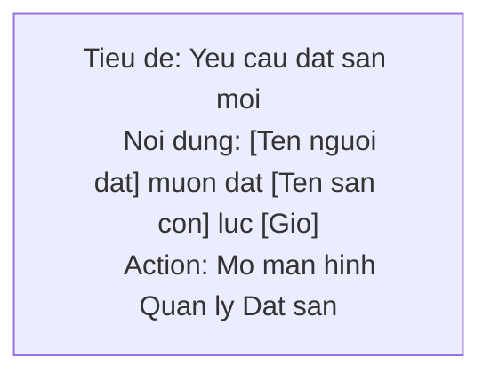

### N04: Dat san Xac nhan

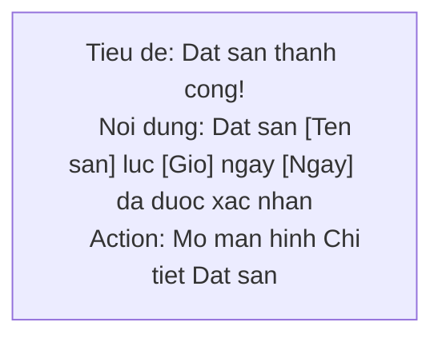

### N05: Dat san Tu choi

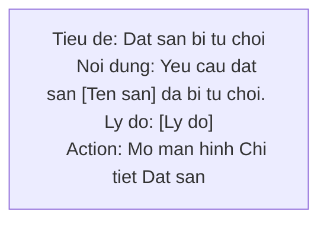

### N06: Nhac Lich danh

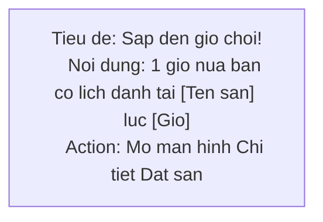

### N07: Dong doi Huy

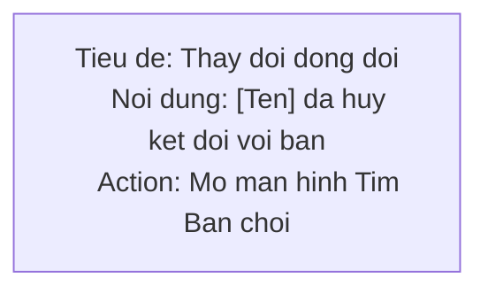

---

## Luong Scheduler - Nhac Lich danh

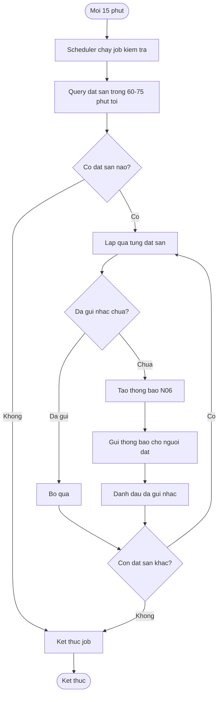

---

## Truong hop Dac biet

### 1. Nguoi dung tat thong bao

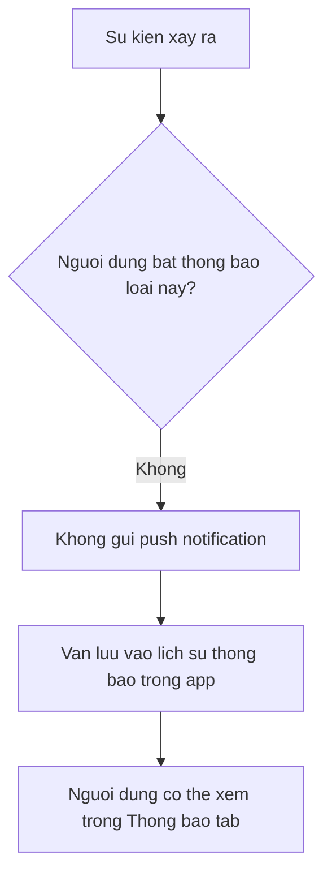

### 2. Gui nhieu thong bao cung luc

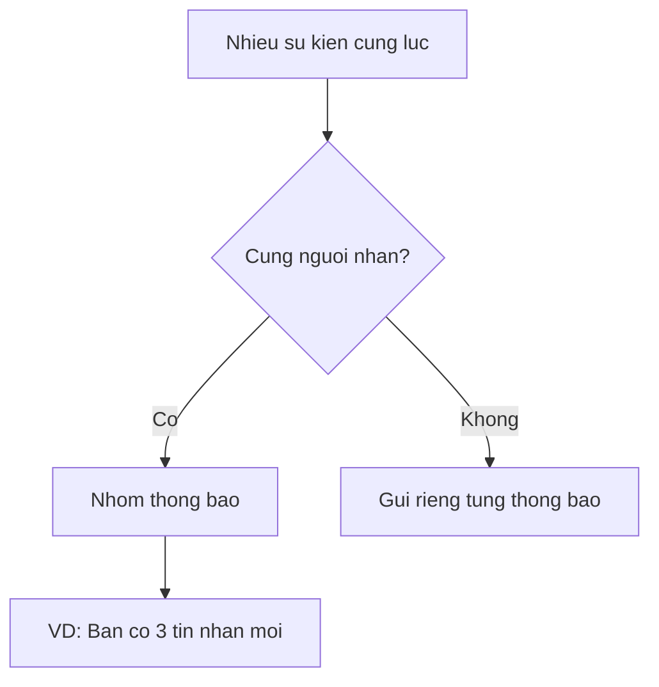

### 3. App bi kill/Thiet bi tat

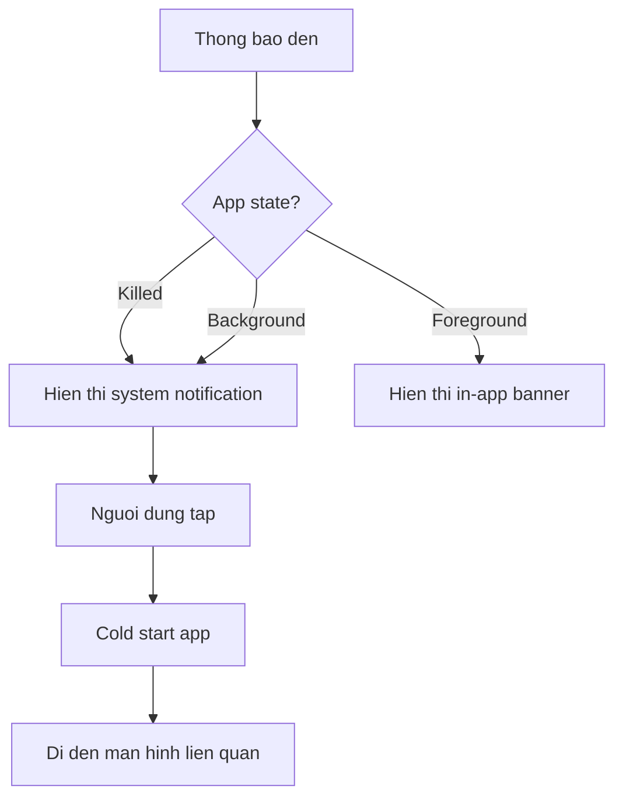

---

## Cau truc Du lieu Thong bao

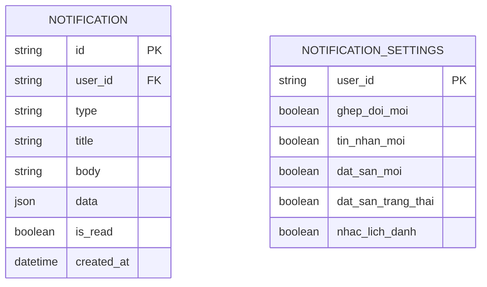

---

## Acceptance Criteria

- [ ] Thong bao khi co ghep doi moi
- [ ] Thong bao khi co tin nhan moi
- [ ] Thong bao khi co yeu cau dat san moi (cho chu san)
- [ ] Thong bao khi dat san duoc xac nhan/tu choi (cho nguoi choi)
- [ ] Thong bao nhac lich danh truoc 1 gio
- [ ] Nguoi dung co the bat/tat tung loai thong bao trong Cai dat

---

## Ghi chu Ky thuat

1. **APNs/FCM**: Dung Firebase Cloud Messaging cho Android, APNs cho iOS
2. **Token management**: Luu device token khi dang nhap, xoa khi dang xuat
3. **Background processing**: Su dung background service de xu ly notification
4. **Deep linking**: Su dung deep link de navigate den man hinh cu the
5. **Rate limiting**: Gioi han so notification/phut de tranh spam
6. **Batching**: Gop nhieu thong bao cung loai thanh 1 (VD: 5 tin nhan moi)
