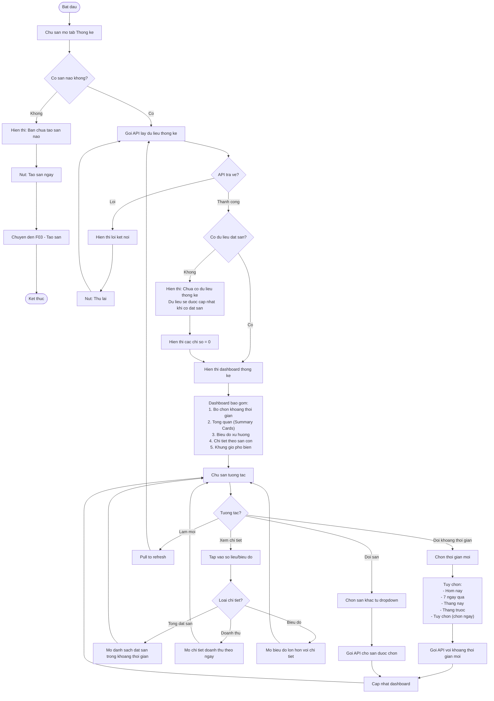
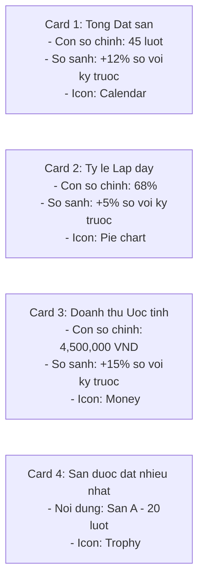
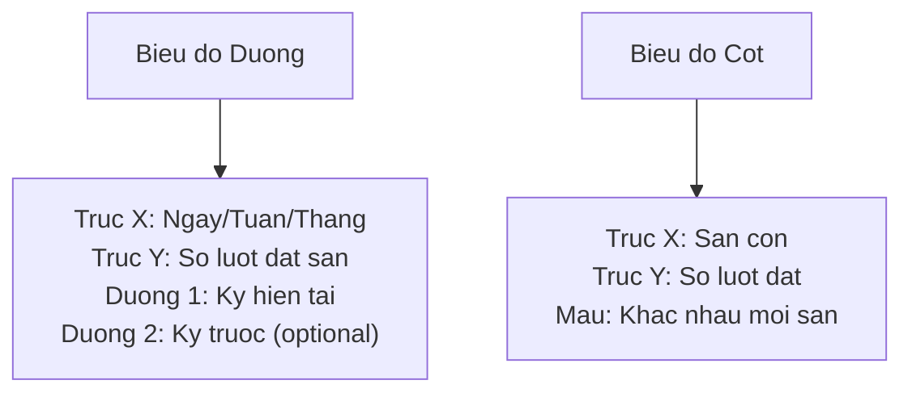
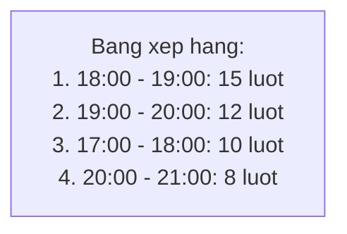
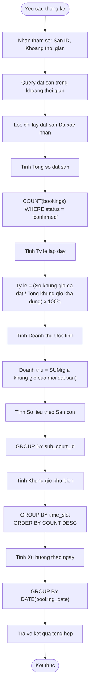
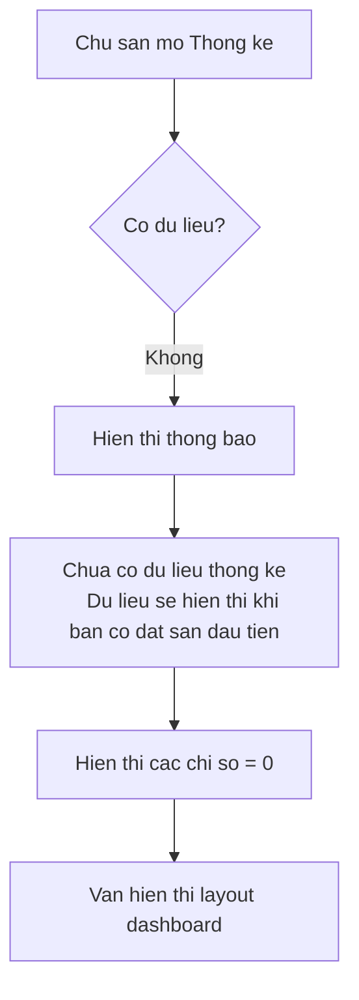
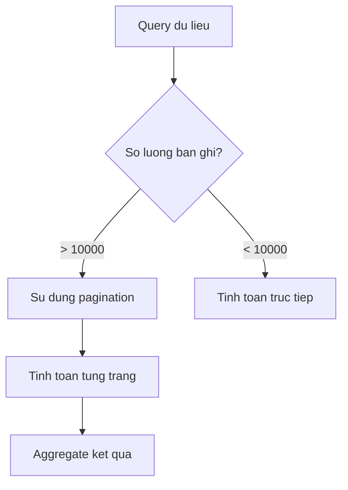
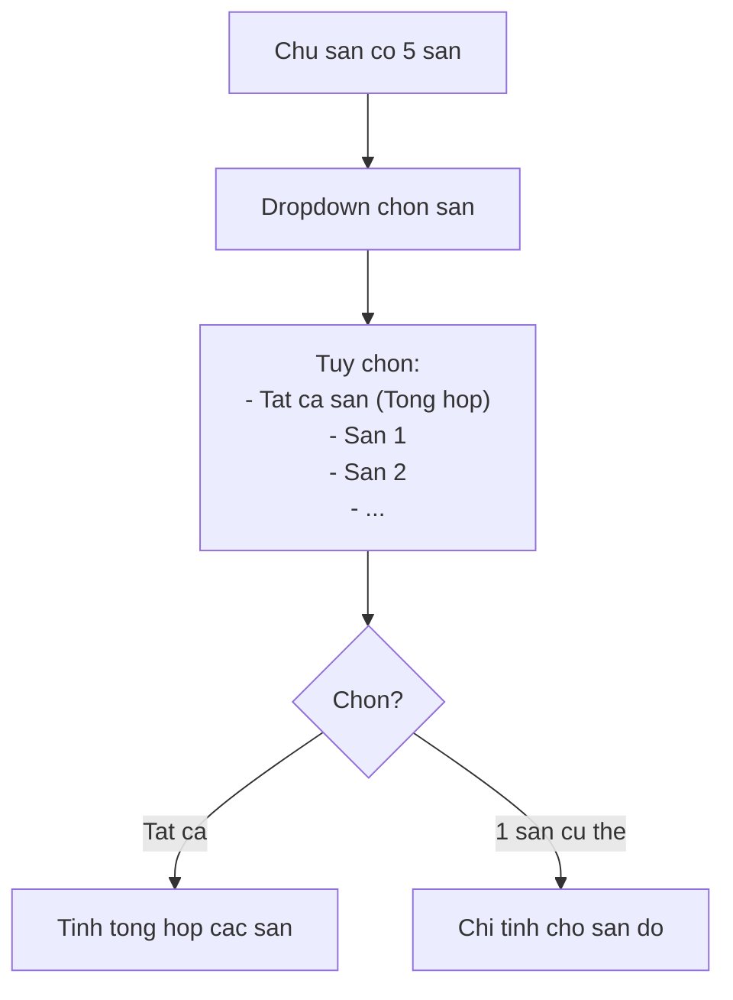

# F16: Bang Thong ke - Activity Diagram

## Mo ta Tinh nang

Bang dieu khien hien thi cac so lieu thong ke cho chu san: so luot dat san, ty le lap day, doanh thu uoc tinh, xu huong.

## Phu thuoc

- F07: Dat San (can co du lieu dat san)
- F08: Quan ly Dat san (du lieu xac nhan/tu choi)

---

## Activity Diagram - Xem Thong ke



---

## Cac Chi so Thong ke

### 1. Summary Cards (Tong quan)



### 2. Bieu do Xu huong



### 3. Chi tiet theo San con

| San con | So luot dat | Doanh thu | Ty le lap day |
|---------|-------------|-----------|---------------|
| San A | 20 | 2,000,000 VND | 75% |
| San B | 15 | 1,500,000 VND | 60% |
| San C | 10 | 1,000,000 VND | 50% |

### 4. Khung gio Pho bien



---

## Activity Diagram - Tinh toan Thong ke



---

## Cong thuc Tinh toan

### Ty le Lap day

```
Ty le lap day = (So khung gio da dat / Tong khung gio kha dung) x 100%

Trong do:
- So khung gio da dat: COUNT bookings co status = 'confirmed'
- Tong khung gio kha dung: SUM tat ca khung gio cua cac san con trong khoang thoi gian
```

**Vi du:**
- San A co 10 khung gio/ngay, trong 7 ngay = 70 khung gio kha dung
- Da dat duoc 50 khung gio
- Ty le lap day = 50/70 x 100% = 71.4%

### Doanh thu Uoc tinh

```
Doanh thu = SUM(gia cua moi khung gio da dat va xac nhan)

Luu y:
- Chi tinh dat san Da xac nhan
- Khong tinh dat san Cho xac nhan/Tu choi/Huy
```

### So sanh voi Ky truoc

```
Thay doi (%) = ((Gia tri ky nay - Gia tri ky truoc) / Gia tri ky truoc) x 100%

Vi du:
- Thang nay: 45 dat san
- Thang truoc: 40 dat san
- Thay doi = ((45 - 40) / 40) x 100% = +12.5%
```

---

## Giao dien Dashboard

```
+----------------------------------+
|     THONG KE         [San: A ▼]  |
|     [Thang nay ▼]                |
+----------------------------------+
| +------+  +------+  +------+     |
| |  45  |  | 68%  |  | 4.5M |     |
| |dat san|  |lap day|  | VND  |     |
| | +12% |  | +5%  |  | +15% |     |
| +------+  +------+  +------+     |
+----------------------------------+
|    [Bieu do xu huong dat san]    |
|    ___/\___/\___/\               |
|   /                              |
+----------------------------------+
|  THEO SAN CON                    |
|  San A: ████████ 20 (45%)        |
|  San B: ██████ 15 (33%)          |
|  San C: ████ 10 (22%)            |
+----------------------------------+
|  KHUNG GIO PHO BIEN              |
|  1. 18:00-19:00  15 luot         |
|  2. 19:00-20:00  12 luot         |
|  3. 17:00-18:00  10 luot         |
+----------------------------------+
```

---

## Truong hop Dac biet

### 1. San moi tao, chua co du lieu



### 2. Du lieu qua nhieu



### 3. Nhieu san



---

## Acceptance Criteria

- [ ] Tong so luot dat san (theo thang/tuan)
- [ ] Ty le san duoc dat (ty le lap day)
- [ ] Doanh thu uoc tinh (dua tren gia khung gio)
- [ ] San con duoc dat nhieu nhat
- [ ] Khung gio duoc dat nhieu nhat
- [ ] Bieu do xu huong theo thoi gian

---

## Ghi chu Ky thuat

1. **Caching**: Cache ket qua thong ke, refresh moi 15 phut hoac khi co dat san moi
2. **Background job**: Tinh toan thong ke tong hop moi ngay vao luc 00:00
3. **Indexing**: Index theo court_id, booking_date, status de query nhanh
4. **Aggregation**: Su dung database aggregation thay vi tinh toan trong app
5. **Export**: Ho tro xuat bao cao ra file (optional - Could have)
6. **Real-time update**: Cap nhat khi co dat san moi duoc xac nhan
