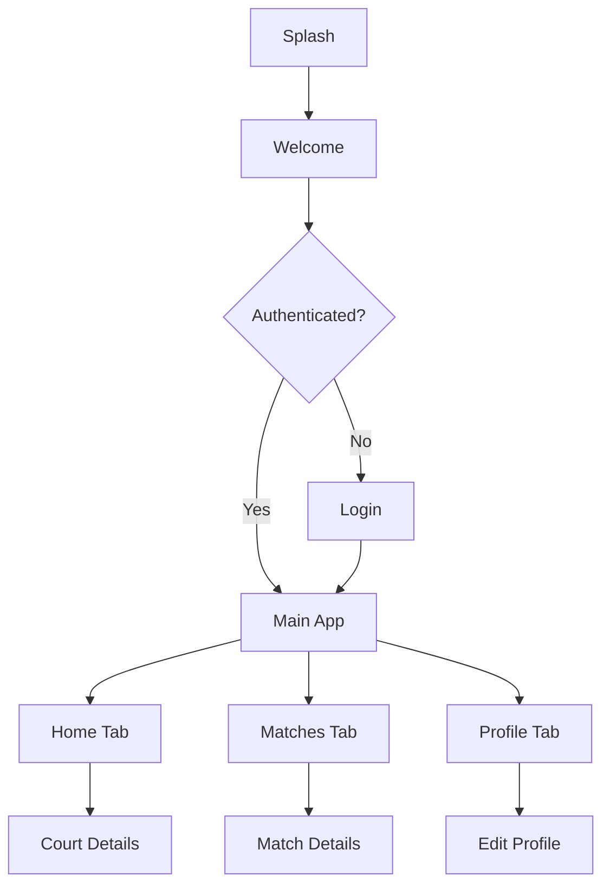

# Frontend Specification

> **Mục đích**: Document này được agent-uiux tạo SAU KHI hoàn thành frontend prototype. Nó là handoff document quan trọng cho agent-backend ở giai đoạn Backend Development.

**Created by**: agent-uiux
**Date**: [YYYY-MM-DD]
**Project**: PickleBallDating

---

## Tổng quan

- **Tổng số screens**: [số screens đã implement]
- **Navigation structure**: [mô tả navigation pattern - Tab/Stack/Drawer]
- **State management**: [Context API / Zustand / Redux / MobX]
- **Mock data location**: `data/mockData.ts`
- **Design reference**: [link hoặc file reference nếu có]

---

## Screens Implemented

### Onboarding Flow

- [ ] **Splash Screen** - `src/screens/SplashScreen.tsx`
  - Mục đích: [mô tả ngắn]
  - Mock behavior: [mô tả mock logic]

- [ ] **Welcome Screen** - `src/screens/WelcomeScreen.tsx`
  - Mục đích: [mô tả ngắn]
  - Mock behavior: [mô tả mock logic]

### Authentication Flow

- [ ] **Login Screen** - `src/screens/auth/LoginScreen.tsx`
  - Mục đích: [mô tả ngắn]
  - Mock behavior: Always successful login

- [ ] **Register Screen** - `src/screens/auth/RegisterScreen.tsx`
  - Mục đích: [mô tả ngắn]
  - Mock behavior: Always successful registration

### Main App Flow

- [ ] **Home/Match List** - `src/screens/HomeScreen.tsx`
  - Mục đích: [mô tả ngắn]
  - Mock behavior: Display MOCK_MATCHES

- [ ] **Court Details** - `src/screens/CourtDetailsScreen.tsx`
  - Mục đích: [mô tả ngắn]
  - Mock behavior: Display court from MOCK_COURTS

- [ ] **Profile Screen** - `src/screens/ProfileScreen.tsx`
  - Mục đích: [mô tả ngắn]
  - Mock behavior: Display current user from MOCK_USERS

[... Liệt kê TẤT CẢ screens với file paths và mock behaviors ...]

---

## Component Library

### Atoms (Basic Components)

- **Button** - `src/components/atoms/Button.tsx`
  - Variants: primary, secondary, outline, text
  - States: default, pressed, disabled, loading
  - Props: `title`, `onPress`, `variant`, `disabled`, `loading`

- **Input** - `src/components/atoms/Input.tsx`
  - Types: text, password, email, number
  - States: default, focused, error, disabled
  - Props: `value`, `onChangeText`, `placeholder`, `type`, `error`

- **Avatar** - `src/components/atoms/Avatar.tsx`
  - Sizes: small (40px), medium (60px), large (100px)
  - Props: `imageUrl`, `name`, `size`, `online`

[... Liệt kê tất cả atomic components ...]

### Molecules (Composite Components)

- **CourtCard** - `src/components/molecules/CourtCard.tsx`
  - Mục đích: Display court info in list
  - Props: `court` (Court object), `onPress`

- **MatchCard** - `src/components/molecules/MatchCard.tsx`
  - Mục đích: Display match suggestion
  - Props: `match` (Match object), `onLike`, `onPass`

[... Liệt kê tất cả composite components ...]

### Organisms (Complex Components)

- **Header** - `src/components/organisms/Header.tsx`
- **TabBar** - `src/components/organisms/TabBar.tsx`

---

## Navigation Map



**Navigation setup**:
- **Root Navigator**: Stack Navigator
- **Main App Navigator**: Bottom Tab Navigator
- **Deep linking**: [có/không - mô tả structure nếu có]

---

## Mock Data Structure

### Location: `data/mockData.ts`

```typescript
// User
export interface User {
  id: string;
  name: string;
  email: string;
  avatar: string;
  age: number;
  gender: 'male' | 'female' | 'other';
  level: 'Beginner' | 'Intermediate' | 'Advanced' | 'Pro';
  bio: string;
  location: {
    lat: number;
    lng: number;
    address: string;
  };
  createdAt: string;
}

export const MOCK_USERS: User[] = [
  {
    id: '1',
    name: 'Nguyễn Văn A',
    email: 'vana@example.com',
    avatar: 'https://...',
    // ... other fields
  },
  // ... more users
];

// Court
export interface Court {
  id: string;
  name: string;
  description: string;
  images: string[];
  rating: number;
  totalReviews: number;
  location: {
    lat: number;
    lng: number;
    address: string;
  };
  amenities: string[];
  pricePerHour: number;
  openingHours: {
    open: string;
    close: string;
  };
  createdAt: string;
}

export const MOCK_COURTS: Court[] = [
  // ... courts data
];

// Match
export interface Match {
  id: string;
  userId: string;
  courtId: string;
  scheduledAt: string;
  status: 'pending' | 'confirmed' | 'completed' | 'cancelled';
  participants: string[]; // user IDs
  createdAt: string;
}

export const MOCK_MATCHES: Match[] = [
  // ... matches data
];

// Message
export interface Message {
  id: string;
  conversationId: string;
  senderId: string;
  content: string;
  createdAt: string;
  read: boolean;
}

export const MOCK_MESSAGES: Message[] = [
  // ... messages data
];

// ... other data types
```

---

## Dependencies Added

### Core Dependencies
- `react-navigation/native`: ^6.x
- `react-navigation/stack`: ^6.x
- `react-navigation/bottom-tabs`: ^6.x
- `react-native-reanimated`: ^4.x
- `react-native-gesture-handler`: ^2.x

### State Management
- `zustand`: ^4.x (hoặc Context API built-in)

### UI Libraries
- `expo-linear-gradient`: For gradient backgrounds
- `@expo/vector-icons`: Icon library
- `expo-image`: Optimized image component

### Utilities
- `date-fns`: Date formatting
- [... other dependencies ...]

**Installation command**:
```bash
npx expo install react-navigation/native react-navigation/stack ...
```

---

## Known Limitations (Mock Behaviors)

### Authentication
- **Login**: Always returns success, no actual validation
- **Register**: Always succeeds, doesn't check email uniqueness
- **Token**: Fake JWT stored in AsyncStorage (not secure)
- **Session**: No real session management, no expiration

### Data Fetching
- **API calls**: Simulated with `setTimeout()` (500ms delay)
- **Pagination**: Mock implementation, returns all data at once
- **Search/Filter**: Client-side filtering on mock data
- **Real-time updates**: No actual real-time, data is static

### Court Management
- **Court list**: Static 10 courts from MOCK_COURTS
- **Court details**: No dynamic loading, just array lookup
- **Favorite/Bookmark**: Local state only, not persisted

### Matching System
- **Match suggestions**: Random shuffle of MOCK_USERS
- **Match algorithm**: No real algorithm, just randomization
- **Swipe actions**: Local state only, not saved

### Chat/Messaging
- **Messages**: Static mock messages, no real-time
- **Send message**: Adds to local state only, not persisted
- **Typing indicators**: Fake implementation

### User Profile
- **Profile edit**: Updates local state only, not saved to backend
- **Image upload**: No actual upload, uses placeholder URLs
- **Location**: Hardcoded coordinates, no GPS

---

## State Management Implementation

### Global State (Context/Zustand)

```typescript
// src/store/authStore.ts (if using Zustand)
interface AuthState {
  user: User | null;
  isAuthenticated: boolean;
  login: (email: string, password: string) => Promise<void>;
  logout: () => void;
}

// src/store/matchStore.ts
interface MatchState {
  matches: Match[];
  fetchMatches: () => Promise<void>;
  // ...
}
```

### Local State
- Screen-level state using `useState`
- Form state using `useState` hoặc `useReducer`

---

## Handoff Notes for Backend

### Priority 1: Authentication System
**Replace**:
- `data/mockData.ts` → `MOCK_USERS[0]` (fake current user)
- `src/screens/auth/LoginScreen.tsx` → Mock login function
- `src/store/authStore.ts` → Mock authentication state

**Implement**:
- Real API endpoints: `POST /auth/login`, `POST /auth/register`, `POST /auth/logout`
- JWT token management (secure storage)
- Session handling and refresh tokens
- Password validation and hashing

**Files to update**:
- `src/api/auth.ts` (create new)
- `src/store/authStore.ts`
- `src/screens/auth/LoginScreen.tsx`
- `src/screens/auth/RegisterScreen.tsx`

---

### Priority 2: Court Management
**Replace**:
- `data/mockData.ts` → `MOCK_COURTS`
- `src/screens/HomeScreen.tsx` → Mock court fetching

**Implement**:
- API endpoints: `GET /courts`, `GET /courts/:id`, `POST /courts/favorite`
- Database queries with pagination
- Search and filter functionality
- Image uploads for court photos

**Files to update**:
- `src/api/courts.ts` (create new)
- `src/screens/HomeScreen.tsx`
- `src/screens/CourtDetailsScreen.tsx`

---

### Priority 3: Matching System
**Replace**:
- `data/mockData.ts` → `MOCK_MATCHES`
- Mock matching algorithm

**Implement**:
- API endpoints: `GET /matches`, `POST /matches`, `PUT /matches/:id`
- Real matching algorithm (based on location, level, availability)
- Match status management
- Notifications for new matches

**Files to update**:
- `src/api/matches.ts` (create new)
- `src/screens/MatchesScreen.tsx`

---

### Priority 4: Chat/Messaging
**Replace**:
- `data/mockData.ts` → `MOCK_MESSAGES`
- `src/screens/ChatScreen.tsx` → Mock message sending

**Implement**:
- API endpoints: `GET /messages`, `POST /messages`
- Real-time messaging (WebSocket or Firebase)
- Push notifications
- Message read receipts

**Files to update**:
- `src/api/messages.ts` (create new)
- `src/screens/ChatScreen.tsx`
- Add WebSocket client setup

---

### Priority 5: User Profile Management
**Replace**:
- `src/screens/ProfileScreen.tsx` → Mock profile data
- `src/screens/EditProfileScreen.tsx` → Mock profile update

**Implement**:
- API endpoints: `GET /users/:id`, `PUT /users/:id`, `POST /users/avatar`
- Image upload for avatar
- Profile validation
- Location services integration

**Files to update**:
- `src/api/users.ts` (create new)
- `src/screens/ProfileScreen.tsx`
- `src/screens/EditProfileScreen.tsx`

---

## Environment Variables Needed

Create `.env` file:
```bash
# API Configuration
API_BASE_URL=https://api.pickleballdating.com
API_TIMEOUT=10000

# Authentication
JWT_SECRET=[to be provided by backend]

# Firebase (if using)
FIREBASE_API_KEY=[...]
FIREBASE_PROJECT_ID=[...]

# Image Upload
CLOUDINARY_CLOUD_NAME=[...]
CLOUDINARY_UPLOAD_PRESET=[...]

# Maps (if using)
GOOGLE_MAPS_API_KEY=[...]
```

---

## Testing Checklist

### Before Backend Integration
- [ ] All screens render correctly
- [ ] Navigation flows work
- [ ] Mock authentication flow completes
- [ ] Forms validate correctly
- [ ] Animations are smooth
- [ ] Loading states display properly
- [ ] Images load correctly

### After Backend Integration
- [ ] Real authentication works
- [ ] Real data loads from API
- [ ] CRUD operations work correctly
- [ ] Error states display properly
- [ ] Loading states work with real latency
- [ ] Offline handling (if implemented)
- [ ] Push notifications (if implemented)

---

## Performance Notes

### Current Performance
- **Startup time**: ~2-3 seconds
- **Screen transitions**: 60 FPS
- **List scrolling**: Smooth with mock data (10-50 items)

### Considerations for Backend
- **Pagination**: Implement for lists with >50 items
- **Image caching**: Implement proper caching strategy
- **API response time**: Target <500ms for most endpoints
- **Bundle size**: Currently ~15MB, monitor after adding API client

---

## Screenshots/Recording

[Optional: Add screenshots or demo video links if available]

---

## Contact

**Agent**: agent-uiux
**For questions about**:
- UI implementation details
- Component usage
- Design decisions
- Animation specifications

**Handoff to**: agent-backend

---

**End of Frontend Specification**
